## Index {#Index}
- [`Rasters.Rasters`](#Rasters.Rasters)
- [`Rasters.AbstractProjected`](#Rasters.AbstractProjected)
- [`Rasters.AbstractRaster`](#Rasters.AbstractRaster)
- [`Rasters.AbstractRasterSeries`](#Rasters.AbstractRasterSeries)
- [`Rasters.AbstractRasterStack`](#Rasters.AbstractRasterStack)
- [`Rasters.Band`](#Rasters.Band)
- [`Rasters.FileArray`](#Rasters.FileArray)
- [`Rasters.FileStack`](#Rasters.FileStack)
- [`Rasters.Mapped`](#Rasters.Mapped)
- [`Rasters.OpenStack`](#Rasters.OpenStack)
- [`Rasters.Projected`](#Rasters.Projected)
- [`Rasters.Raster`](#Rasters.Raster)
- [`Rasters.RasterDiskArray`](#Rasters.RasterDiskArray)
- [`Rasters.RasterSeries`](#Rasters.RasterSeries)
- [`Rasters.RasterStack`](#Rasters.RasterStack)
- [`Rasters.Source`](#Rasters.Source)
- [`Rasters.aggregate`](#Rasters.aggregate)
- [`Rasters.aggregate!`](#Rasters.aggregate!-Tuple{Locus,%20AbstractRaster,%20Any,%20Any})
- [`Rasters.boolmask`](#Rasters.boolmask)
- [`Rasters.cellarea`](#Rasters.cellarea-Tuple{Any})
- [`Rasters.checkmem!`](#Rasters.checkmem!-Tuple{Bool})
- [`Rasters.classify`](#Rasters.classify)
- [`Rasters.classify!`](#Rasters.classify!-Tuple{AbstractRaster,%20Pair,%20Vararg{Pair}})
- [`Rasters.combine`](#Rasters.combine-Tuple{AbstractRasterSeries})
- [`Rasters.convertlookup`](#Rasters.convertlookup-Tuple{Type{<:Lookup},%20AbstractDimArray})
- [`Rasters.coverage`](#Rasters.coverage-Tuple{Any})
- [`Rasters.coverage!`](#Rasters.coverage!-Tuple{Union{typeof(sum),%20typeof(union)},%20AbstractRaster,%20Any})
- [`Rasters.create`](#Rasters.create)
- [`Rasters.crop`](#Rasters.crop)
- [`Rasters.disaggregate`](#Rasters.disaggregate)
- [`Rasters.disaggregate!`](#Rasters.disaggregate!-Tuple{AbstractRaster,%20Any,%20Any})
- [`Rasters.extend`](#Rasters.extend)
- [`Rasters.extract`](#Rasters.extract)
- [`Rasters.mappedbounds`](#Rasters.mappedbounds)
- [`Rasters.mappedcrs`](#Rasters.mappedcrs)
- [`Rasters.mappedindex`](#Rasters.mappedindex)
- [`Rasters.mask`](#Rasters.mask-Tuple{Any})
- [`Rasters.mask!`](#Rasters.mask!)
- [`Rasters.missingmask`](#Rasters.missingmask-Tuple{Any})
- [`Rasters.missingval`](#Rasters.missingval)
- [`Rasters.mosaic`](#Rasters.mosaic-Tuple{Function,%20Union{AbstractRaster,%20AbstractRasterStack},%20Vararg{Union{AbstractRaster,%20AbstractRasterStack}}})
- [`Rasters.mosaic!`](#Rasters.mosaic!-Tuple{Function,%20Union{AbstractRaster,%20AbstractRasterStack},%20Vararg{Union{AbstractRaster,%20AbstractRasterStack}}})
- [`Rasters.points`](#Rasters.points-Tuple{AbstractRaster})
- [`Rasters.rasterize`](#Rasters.rasterize)
- [`Rasters.rasterize!`](#Rasters.rasterize!)
- [`Rasters.replace_missing`](#Rasters.replace_missing-Tuple{Any})
- [`Rasters.reproject`](#Rasters.reproject-Tuple{Any})
- [`Rasters.reproject`](#Rasters.reproject-NTuple{4,%20Any})
- [`Rasters.resample`](#Rasters.resample-Tuple)
- [`Rasters.rplot`](#Rasters.rplot-Tuple)
- [`Rasters.rplot`](#Rasters.rplot)
- [`Rasters.sample`](#Rasters.sample-Tuple)
- [`Rasters.setcrs`](#Rasters.setcrs-Tuple{Union{AbstractRaster,%20AbstractRasterStack},%20Any})
- [`Rasters.setmappedcrs`](#Rasters.setmappedcrs-Tuple{Union{AbstractRaster,%20AbstractRasterStack},%20Any})
- [`Rasters.slice`](#Rasters.slice-Tuple{Union{AbstractRaster,%20AbstractRasterStack},%20Any})
- [`Rasters.trim`](#Rasters.trim-Tuple{Union{AbstractRaster,%20AbstractRasterStack}})
- [`Rasters.warp`](#Rasters.warp-Tuple)
- [`Rasters.zonal`](#Rasters.zonal-Tuple{Any,%20RasterStack})


## Reference - Exported functions {#Reference-Exported-functions}
<details class='jldocstring custom-block' open>
<summary><a id='Rasters.Rasters' href='#Rasters.Rasters'><span class="jlbinding">Rasters.Rasters</span></a> <Badge type="info" class="jlObjectType jlModule" text="Module" /></summary>


<Badge type="info" class="source-link" text="source"><a href="https://github.com/rafaqz/Rasters.jl/blob/e21dbeaa6368c96cbd80ad39da2f44ca66031437/src/Rasters.jl#L4" target="_blank" rel="noreferrer">source</a></Badge>

</details>

<details class='jldocstring custom-block' open>
<summary><a id='Rasters.AbstractRaster' href='#Rasters.AbstractRaster'><span class="jlbinding">Rasters.AbstractRaster</span></a> <Badge type="info" class="jlObjectType jlType" text="Type" /></summary>


```julia
AbstractRaster <: DimensionalData.AbstractDimArray
```


Abstract supertype for objects that wrap an array (or location of an array) and metadata about its contents. It may be memory or hold a `FileArray`, which holds the filename, and is only opened when required.

`AbstractRaster`s inherit from [`AbstractDimArray`](https://rafaqz.github.io/DimensionalData.jl/stable/api/reference#DimensionalData.AbstractDimArray) from DimensionalData.jl. They can be indexed as regular Julia arrays or with DimensionalData.jl [`Dimension`](https://rafaqz.github.io/DimensionalData.jl/stable/api/reference#DimensionalData.Dimensions.Dimension)s. They will plot as a heatmap in Plots.jl with correct coordinates and labels, even after slicing with `getindex` or `view`. `getindex` on a `AbstractRaster` will always return a memory-backed `Raster`.


<Badge type="info" class="source-link" text="source"><a href="https://github.com/rafaqz/Rasters.jl/blob/e21dbeaa6368c96cbd80ad39da2f44ca66031437/src/array.jl#L22-L35" target="_blank" rel="noreferrer">source</a></Badge>

</details>

<details class='jldocstring custom-block' open>
<summary><a id='Rasters.AbstractRasterSeries' href='#Rasters.AbstractRasterSeries'><span class="jlbinding">Rasters.AbstractRasterSeries</span></a> <Badge type="info" class="jlObjectType jlType" text="Type" /></summary>


```julia
AbstractRasterSeries <: DimensionalData.AbstractDimensionalArray
```


Abstract supertype for high-level `DimensionalArray` that hold `RasterStacks`, `Rasters`, or the paths they can be loaded from. `RasterSeries` are indexed with dimensions as with a `AbstractRaster`. This is useful when you have multiple files containing rasters or stacks of rasters spread over dimensions like time and elevation.

As much as possible, implementations should facilitate loading entire directories and detecting the dimensions from metadata.

This allows syntax like below for a series of stacks of arrays:

```julia
RasterSeries[Time(Near(DateTime(2001, 1))][:temp][Y(Between(70, 150)), X(Between(-20,20))] |> plot`
```


[`RasterSeries`](/api#Rasters.RasterSeries) is the concrete implementation.


<Badge type="info" class="source-link" text="source"><a href="https://github.com/rafaqz/Rasters.jl/blob/e21dbeaa6368c96cbd80ad39da2f44ca66031437/src/series.jl#L1-L19" target="_blank" rel="noreferrer">source</a></Badge>

</details>

<details class='jldocstring custom-block' open>
<summary><a id='Rasters.AbstractRasterStack' href='#Rasters.AbstractRasterStack'><span class="jlbinding">Rasters.AbstractRasterStack</span></a> <Badge type="info" class="jlObjectType jlType" text="Type" /></summary>


```julia
AbstractRasterStack
```


Abstract supertype for objects that hold multiple [`AbstractRaster`](/api#Rasters.AbstractRaster)s that share spatial dimensions.

They are `NamedTuple`-like structures that may either contain `NamedTuple` of [`AbstractRaster`](/api#Rasters.AbstractRaster)s, string paths that will load [`AbstractRaster`](/api#Rasters.AbstractRaster)s, or a single path that points to a file containing multiple layers, like NetCDF or HDF5. Use and syntax is similar or identical for all cases.

`AbstractRasterStack` can hold layers that share some or all of their dimensions. They cannot have the same dimension with different length or spatial extent as another layer.

`getindex` on an `AbstractRasterStack` generally returns a memory backed standard [`Raster`](/api#Rasters.Raster). `raster[:somelayer] |> plot` plots the layers array, while `raster[:somelayer, X(1:100), Band(2)] |> plot` will plot the subset without loading the whole array.

`getindex` on an `AbstractRasterStack` with a key returns another stack with `getindex` applied to all the arrays in the stack.


<Badge type="info" class="source-link" text="source"><a href="https://github.com/rafaqz/Rasters.jl/blob/e21dbeaa6368c96cbd80ad39da2f44ca66031437/src/stack.jl#L6-L28" target="_blank" rel="noreferrer">source</a></Badge>

</details>

<details class='jldocstring custom-block' open>
<summary><a id='Rasters.Band' href='#Rasters.Band'><span class="jlbinding">Rasters.Band</span></a> <Badge type="info" class="jlObjectType jlType" text="Type" /></summary>


```julia
Band <: Dimension

Band(val=:)
```


Band [`Dimension`](https://rafaqz.github.io/DimensionalData.jl/stable/api/reference#DimensionalData.Dimensions.Dimension) for multi-band rasters.

**Example:**

```julia
banddim = Band(10:10:100)
# Or
val = A[Band(1)]
# Or
mean(A; dims=Band)
```


<Badge type="info" class="source-link" text="source"><a href="https://github.com/rafaqz/Rasters.jl/blob/e21dbeaa6368c96cbd80ad39da2f44ca66031437/src/dimensions.jl#L4-L19" target="_blank" rel="noreferrer">source</a></Badge>

</details>

<details class='jldocstring custom-block' open>
<summary><a id='Rasters.Mapped' href='#Rasters.Mapped'><span class="jlbinding">Rasters.Mapped</span></a> <Badge type="info" class="jlObjectType jlType" text="Type" /></summary>


```julia
Mapped <: AbstractProjected

Mapped(order, span, sampling, crs, mappedcrs)
Mapped(; order=AutoOrder(), span=AutoSpan(), sampling=AutoSampling(), crs=nothing, mappedcrs)
```


An [`AbstractSampled`](https://rafaqz.github.io/DimensionalData.jl/stable/api/reference#DimensionalData.Dimensions.Lookups.AbstractSampled) `Lookup`, where the dimension index has been mapped to another projection, usually lat/lon or `EPSG(4326)`. `Mapped` matches the dimension format commonly used in netcdf files.

Fields and behaviours are identical to [`Sampled`](https://rafaqz.github.io/DimensionalData.jl/stable/api/reference#DimensionalData.Dimensions.Lookups.Sampled) with the addition of `crs` and `mappedcrs` fields.

The mapped dimension index will be used as for [`Sampled`](https://rafaqz.github.io/DimensionalData.jl/stable/api/reference#DimensionalData.Dimensions.Lookups.Sampled), but to save in another format the underlying `crs` may be used to convert it.


<Badge type="info" class="source-link" text="source"><a href="https://github.com/rafaqz/Rasters.jl/blob/e21dbeaa6368c96cbd80ad39da2f44ca66031437/src/lookup.jl#L114-L129" target="_blank" rel="noreferrer">source</a></Badge>

</details>

<details class='jldocstring custom-block' open>
<summary><a id='Rasters.Projected' href='#Rasters.Projected'><span class="jlbinding">Rasters.Projected</span></a> <Badge type="info" class="jlObjectType jlType" text="Type" /></summary>


```julia
Projected <: AbstractProjected

Projected(order, span, sampling, crs, mappedcrs)
Projected(; order=AutoOrder(), span=AutoSpan(), sampling=AutoSampling(), crs, mappedcrs=nothing)
```


An [`AbstractSampled`](https://rafaqz.github.io/DimensionalData.jl/stable/api/reference#DimensionalData.Dimensions.Lookups.AbstractSampled) `Lookup` with projections attached.

Fields and behaviours are identical to [`Sampled`](https://rafaqz.github.io/DimensionalData.jl/stable/api/reference#DimensionalData.Dimensions.Lookups.Sampled) with the addition of `crs` and `mappedcrs` fields.

If both `crs` and `mappedcrs` fields contain CRS data (in a `GeoFormat` wrapper from GeoFormatTypes.jl) the selector inputs and plot axes will be converted from and to the specified `mappedcrs` projection automatically. A common use case would be to pass `mappedcrs=EPSG(4326)` to the constructor when loading eg. a GDALarray:

```julia
GDALarray(filename; mappedcrs=EPSG(4326))
```


The underlying `crs` will be detected by GDAL.

If `mappedcrs` is not supplied (ie. `mappedcrs=nothing`), the base index will be shown on plots, and selectors will need to use whatever format it is in.


<Badge type="info" class="source-link" text="source"><a href="https://github.com/rafaqz/Rasters.jl/blob/e21dbeaa6368c96cbd80ad39da2f44ca66031437/src/lookup.jl#L32-L56" target="_blank" rel="noreferrer">source</a></Badge>

</details>

<details class='jldocstring custom-block' open>
<summary><a id='Rasters.Raster' href='#Rasters.Raster'><span class="jlbinding">Rasters.Raster</span></a> <Badge type="info" class="jlObjectType jlType" text="Type" /></summary>


```julia
Raster <: AbstractRaster

Raster(filepath::String; kw...)
Raster(A::AbstractDimArray; kw...)
Raster(A::AbstractArray, dims; kw...)
```


A generic [`AbstractRaster`](/api#Rasters.AbstractRaster) for spatial/raster array data. It can hold either memory-backed arrays or, if `lazy=true`, a [`FileArray`](/api#Rasters.FileArray), which stores the `String` path to an unopened file.

If `lazy=true`, the file will only be opened lazily when it is indexed with `getindex` or when `read(A)` is called. Broadcasting, taking a view, reversing, and most other methods will _not_ load data from disk; they will be applied later, lazily.

**Arguments**
- `dims`: `Tuple` of `Dimension`s needed when an `AbstractArray` is used.
  

**Keywords**
- `name`: a `Symbol` name for a Raster, which will also retrieve the    a named layer if `Raster` is used on a multi-layered file like a NetCDF. 
  
- `group`: the group in the dataset where `name` can be found. Only needed for nested datasets.   A `String` or `Symbol` will select a single group. Pairs can also used to access groups   at any nested depth, i.e `group=:group1 => :group2 => :group3`.
  
- `missingval`: value representing missing data, normally detected from the file and    automatically converted to `missing`. Setting to an alternate value, such as `0`    or `NaN` may be desirable for improved perfomance. `nothing` specifies no missing value.    Using the same `missingval` the file already has removes the overhead of replacing it,   this can be done by passing the `missingval` function as `missingval`.    If the file has an incorrect value, we can manually define the transformation   as a pair like `correct_value => missing` or `correct_value => NaN`.   `correct_value => correct_value` will keep remove the overhead of changing it.    Note: When `raw=true` is set, `missingval` is not changed from the value specified   in the file.
  
- `metadata`: `Dict` or `Metadata` object for the array, or `NoMetadata()`.
  
- `crs`: the coordinate reference system of  the objects `XDim`/`YDim` dimensions.   Only set this if you know the detected crs is incorrect, or it is not present in   the file. The `crs` is expected to be a GeoFormatTypes.jl `CRS` or `Mixed` mode `GeoFormat` object,   like `EPSG(4326)`.
  
- `mappedcrs`: the mapped coordinate reference system of the objects `XDim`/`YDim` dimensions.   for `Mapped` lookups these are the actual values of the index. For `Projected` lookups   this can be used to index in eg. `EPSG(4326)` lat/lon values, having it converted automatically.   Only set this if the detected `mappedcrs` in incorrect, or the file does not have a `mappedcrs`,   e.g. a tiff. The `mappedcrs` is expected to be a GeoFormatTypes.jl `CRS` or `Mixed` mode `GeoFormat` type.
  
- `refdims`: `Tuple of` position `Dimension`s the array was sliced from, defaulting to `()`.   Usually not needed.
  

When a filepath `String` is used:
- `dropband`: drop single band dimensions when creating stacks from filenames. `true` by default.
  
- `lazy`: A `Bool` specifying if to load data lazily from disk. `false` by default.
  
- `source`: Usually automatically detected from filepath extension.    To manually force, a `Symbol` can be passed `:gdal`, `:netcdf`, `:grd`, `:grib`.   The internal [`Rasters.Source`](/api#Rasters.Source) objects, such as `Rasters.GDALsource()`,    `Rasters.GRIBsource()` or `Rasters.NCDsource()` can also be used.
  
- `scaled`: apply scale and offset as `x * scale + offset` where    `scale` and/or `offset` are found in file metadata. `true` by default.   This is common where data has been convert to e.g. UInt8 to save disk space.   To ignore `scale` and `offset` metadata, use `scaled=false`.    Note 1: If `scale` and `offset` are `1.0` and `0.0` they will be ignored and the    original type will be used even when `scaled=true`. This is because these values    may be fallback defaults and we do not want to convert every `Real` array to larger   `Float64` values.    Note 2: `raw=true` will ignore `scaled` and `missingval` and return   the raw values.
  
- `raw`: turn of all scaling and masking and load the raw values from disk.   `false` by default. If `true`, `scaled` will be set to `false` and `missingval`   will to the existing missing value in the file. A warning will be printed if    `scaled` or `missingval` are manually set to another value.
  

When A is an `AbstractDimArray`:
- `data`: can replace the data in an existing `AbstractRaster`
  


<Badge type="info" class="source-link" text="source"><a href="https://github.com/rafaqz/Rasters.jl/blob/e21dbeaa6368c96cbd80ad39da2f44ca66031437/src/array.jl#L188-L226" target="_blank" rel="noreferrer">source</a></Badge>

</details>

<details class='jldocstring custom-block' open>
<summary><a id='Rasters.RasterSeries' href='#Rasters.RasterSeries'><span class="jlbinding">Rasters.RasterSeries</span></a> <Badge type="info" class="jlObjectType jlType" text="Type" /></summary>


```julia
RasterSeries <: AbstractRasterSeries

RasterSeries(rasters::AbstractArray{<:AbstractRaster}, dims; [refdims])
RasterSeries(stacks::AbstractArray{<:AbstractRasterStack}, dims; [refdims]) 

RasterSeries(paths::AbstractArray{<:AbstractString}, dims; child, duplicate_first, kw...)
RasterSeries(path:::AbstractString, dims; ext, separator, child, duplicate_first, kw...)

RasterSeries(objects::AbstractBasicDimArray; kw...)
```


Concrete implementation of [`AbstractRasterSeries`](/api#Rasters.AbstractRasterSeries).

A `RasterSeries` is an array of `Raster`s or `RasterStack`s, along some dimension(s).

Existing `Raster` `RasterStack` can be wrapped in a `RasterSeries`, or new files  can be loaded from an array of `String` or from a single `String`.

A single `String` can refer to a whole directory, or the name of a series of files in a directory, sharing a common stem. The differnce between the filenames can be used as the lookup for the series. 

For example, with some tifs at these paths : 

```
"series_dir/myseries_2001-01-01T00:00:00.tif"
"series_dir/myseries_2002-01-01T00:00:00.tif"
```


We can load a `RasterSeries` with a `DateTime` lookup:

```julia
julia> ser = RasterSeries("series_dir/myseries.tif", Ti(DateTime))
2-element RasterSeries{Raster,1} with dimensions: 
  Ti Sampled{DateTime} DateTime[DateTime("2001-01-01T00:00:00"), DateTime("2002-01-01T00:00:00")] ForwardOrdered Irregular Points
```


The `DateTime` suffix is parsed from the filenames. Using `Ti(Int)` would try to parse integers instead.

Just using the directory will also work, unless there are other files mixed in it:

```julia
julia> ser = RasterSeries("series_dir", Ti(DateTime))
2-element RasterSeries{Raster,1} with dimensions: 
  Ti Sampled{DateTime} DateTime[DateTime("2001-01-01T00:00:00"), DateTime("2002-01-01T00:00:00")] ForwardOrdered Irregular Points
```


**Arguments**
- `dims`: series dimension/s.
  

**Keywords**

When loading a series from a Vector of `String` paths or a single `String` path:
- `child`: constructor of child objects for use when filenames are passed in,   can be `Raster` or `RasterStack`. Defaults to `Raster`.
  
- `duplicate_first::Bool`: wether to duplicate the dimensions and metadata of the   first file with all other files. This can save load time with a large   series where dimensions are identical. `false` by default.
  
- `lazy`: A `Bool` specifying if to load data lazily from disk. `false` by default.
  
- `kw`: keywords passed to the child constructor [`Raster`](/api#Rasters.Raster) or [`RasterStack`](/api#Rasters.RasterStack).
  

When loading a series from a single `String` path:
- `separator`: separator used to split lookup elements from the rest of a filename. &#39;_&#39; by default.
  

Others:
- `refdims`: existing reference dimension/s, normally not required.
  


<Badge type="info" class="source-link" text="source"><a href="https://github.com/rafaqz/Rasters.jl/blob/e21dbeaa6368c96cbd80ad39da2f44ca66031437/src/series.jl#L47-L116" target="_blank" rel="noreferrer">source</a></Badge>

</details>

<details class='jldocstring custom-block' open>
<summary><a id='Rasters.RasterStack' href='#Rasters.RasterStack'><span class="jlbinding">Rasters.RasterStack</span></a> <Badge type="info" class="jlObjectType jlType" text="Type" /></summary>


```julia
RasterStack <: AbstrackRasterStack

RasterStack(data...; name, kw...)
RasterStack(data::Union{Vector,Tuple}; name, kw...)
RasterStack(data::NamedTuple; kw...))
RasterStack(data::RasterStack; kw...)
RasterStack(data::Raster; layersfrom=Band, kw...)
RasterStack(filepath::AbstractString; kw...)
```


Load a file path or a `NamedTuple` of paths as a `RasterStack`, or convert arguments, a `Vector` or `NamedTuple` of `Raster`s to `RasterStack`.

**Arguments**
- `data`: A `NamedTuple` of [`Raster`](/api#Rasters.Raster)s or `String`, or a `Vector`, `Tuple` or splatted   arguments of [`Raster`](/api#Rasters.Raster). The latter options must pass a `name` keyword argument.
  
- `filepath`: A file (such as netcdf or tif) to be loaded as a stack, or a directory path   containing multiple files.
  

**Keywords**
- `name`: Used as stack layer names when a `Tuple`, `Vector` or splat of `Raster` is passed in.   Has no effect when `NameTuple` is used - the `NamedTuple` keys are the layer names.
  
- `group`: the group in the dataset where `name` can be found. Only needed for nested datasets.   A `String` or `Symbol` will select a single group. Pairs can also used to access groups   at any nested depth, i.e `group=:group1 => :group2 => :group3`.
  
- `metadata`: A `Dict` or `DimensionalData.Metadata` object.
  
- `missingval`: value representing missing data, normally detected from the file and    automatically converted to `missing`. Setting to an alternate value, such as `0`    or `NaN` may be desirable for improved perfomance. `nothing` specifies no missing value.    Using the same `missingval` the file already has removes the overhead of replacing it,   this can be done by passing the `missingval` function as `missingval`.    If the file has an incorrect value, we can manually define the transformation   as a pair like `correct_value => missing` or `correct_value => NaN`.   `correct_value => correct_value` will keep remove the overhead of changing it.    Note: When `raw=true` is set, `missingval` is not changed from the value specified   in the file.
  For `RasterStack` a `NamedTuple` can also be passed if layers   should have different `missingval`.
  
- `crs`: the coordinate reference system of  the objects `XDim`/`YDim` dimensions.   Only set this if you know the detected crs is incorrect, or it is not present in   the file. The `crs` is expected to be a GeoFormatTypes.jl `CRS` or `Mixed` mode `GeoFormat` object,   like `EPSG(4326)`.
  
- `mappedcrs`: the mapped coordinate reference system of the objects `XDim`/`YDim` dimensions.   for `Mapped` lookups these are the actual values of the index. For `Projected` lookups   this can be used to index in eg. `EPSG(4326)` lat/lon values, having it converted automatically.   Only set this if the detected `mappedcrs` in incorrect, or the file does not have a `mappedcrs`,   e.g. a tiff. The `mappedcrs` is expected to be a GeoFormatTypes.jl `CRS` or `Mixed` mode `GeoFormat` type.
  
- `refdims`: `Tuple` of `Dimension` that the stack was sliced from.
  

For when one or multiple filepaths are used:
- `dropband`: drop single band dimensions when creating stacks from filenames. `true` by default.
  
- `lazy`: A `Bool` specifying if to load data lazily from disk. `false` by default.
  
- `raw`: turn of all scaling and masking and load the raw values from disk.   `false` by default. If `true`, `scaled` will be set to `false` and `missingval`   will to the existing missing value in the file. A warning will be printed if    `scaled` or `missingval` are manually set to another value.
  
- `scaled`: apply scale and offset as `x * scale + offset` where    `scale` and/or `offset` are found in file metadata. `true` by default.   This is common where data has been convert to e.g. UInt8 to save disk space.   To ignore `scale` and `offset` metadata, use `scaled=false`.    Note 1: If `scale` and `offset` are `1.0` and `0.0` they will be ignored and the    original type will be used even when `scaled=true`. This is because these values    may be fallback defaults and we do not want to convert every `Real` array to larger   `Float64` values.    Note 2: `raw=true` will ignore `scaled` and `missingval` and return   the raw values.
  
- `source`: Usually automatically detected from filepath extension.    To manually force, a `Symbol` can be passed `:gdal`, `:netcdf`, `:grd`, `:grib`.   The internal [`Rasters.Source`](/api#Rasters.Source) objects, such as `Rasters.GDALsource()`,    `Rasters.GRIBsource()` or `Rasters.NCDsource()` can also be used.
  

For when a single `Raster` is used:
- `layersfrom`: `Dimension` to source stack layers from if the file is not already multi-layered.   `nothing` is default, so that a single `RasterStack(raster)` is a single layered stack.   `RasterStack(raster; layersfrom=Band)` will use the bands as layers.
  

```julia
files = (temp="temp.tif", pressure="pressure.tif", relhum="relhum.tif")
stack = RasterStack(files; mappedcrs=EPSG(4326))
stack[:relhum][Lat(Contains(-37), Lon(Contains(144))
```


<Badge type="info" class="source-link" text="source"><a href="https://github.com/rafaqz/Rasters.jl/blob/e21dbeaa6368c96cbd80ad39da2f44ca66031437/src/stack.jl#L146-L198" target="_blank" rel="noreferrer">source</a></Badge>

</details>

<details class='jldocstring custom-block' open>
<summary><a id='DimensionalData.modify-Tuple{Any, AbstractRasterSeries}' href='#DimensionalData.modify-Tuple{Any, AbstractRasterSeries}'><span class="jlbinding">DimensionalData.modify</span></a> <Badge type="info" class="jlObjectType jlMethod" text="Method" /></summary>


```julia
modify(f, series::AbstractRasterSeries)
```


Apply function `f` to the data of the child object. If the child is an `AbstractRasterStack` the function will be passed on to its child `AbstractRaster`s.

`f` must return an identically sized array.

This method triggers a complete rebuild of all objects, and disk based objects will be transferred to memory.

An example of the usefulnesss of this is for swapping out array backend for an entire series to `CuArray` from CUDA.jl to copy data to a GPU.


<Badge type="info" class="source-link" text="source"><a href="https://github.com/rafaqz/Rasters.jl/blob/e21dbeaa6368c96cbd80ad39da2f44ca66031437/src/series.jl#L30-L44" target="_blank" rel="noreferrer">source</a></Badge>

</details>

<details class='jldocstring custom-block' open>
<summary><a id='GeoInterface.crs-Tuple{Union{Tuple{Dimension, Vararg{Dimension}}, AbstractRaster, AbstractRasterSeries, AbstractRasterStack}}' href='#GeoInterface.crs-Tuple{Union{Tuple{Dimension, Vararg{Dimension}}, AbstractRaster, AbstractRasterSeries, AbstractRasterStack}}'><span class="jlbinding">GeoInterface.crs</span></a> <Badge type="info" class="jlObjectType jlMethod" text="Method" /></summary>


```julia
crs(x::Raster)
```


Get the projected coordinate reference system of a `Y` or `X` `Dimension`, or of the `Y`/`X` dims of an `AbstractRaster`.

For [`Mapped`](/api#Rasters.Mapped) lookup this may be `nothing` as there may be no projected coordinate reference system at all. See [`setcrs`](/api#Rasters.setcrs-Tuple{Union{AbstractRaster,%20AbstractRasterStack},%20Any}) to set it manually.


<Badge type="info" class="source-link" text="source"><a href="https://github.com/rafaqz/Rasters.jl/blob/e21dbeaa6368c96cbd80ad39da2f44ca66031437/src/crs.jl#L1-L10" target="_blank" rel="noreferrer">source</a></Badge>

</details>

<details class='jldocstring custom-block' open>
<summary><a id='Rasters.aggregate' href='#Rasters.aggregate'><span class="jlbinding">Rasters.aggregate</span></a> <Badge type="info" class="jlObjectType jlFunction" text="Function" /></summary>


```julia
aggregate(method, object, scale; kw...)
```


Aggregate a `Raster`, or all arrays in a `RasterStack` or `RasterSeries`, by `scale` using `method`.

**Arguments**
- `method`: a function such as `mean` or `sum` that can combine the value of multiple cells to generate the aggregated cell, or a [`Locus`](https://rafaqz.github.io/DimensionalData.jl/stable/api/reference#DimensionalData.Dimensions.Lookups.locus) like `Start()` or `Center()` that species where to sample from in the interval.
  
- `object`: Object to aggregate, like `AbstractRasterSeries`, `AbstractStack`, `AbstractRaster` or `Dimension`.
  
- `scale`: the aggregation factor, which can be an `Int`, a `Tuple` of `Int` for each dimension, or a `:` colon to mean the whole dimension.  You can also use any `Dimension`, `Selector` or `Int` combination you can usually use in `getindex`. `Tuple` of `Pair` or `NamedTuple` where keys are dimension names will also work. Using a `Selector` will determine the scale by the distance from the start  of the index. Selectors will find the first offset and repeat the same aggregation size for the rest.
  

When the aggregation `scale` of is larger than the array axis, the length of the axis is used.

**Keywords**
- `skipmissing`: if `true`, any `missingval` will be skipped during aggregation, so that   only areas of all missing values will be aggregated to `missingval(dst)`. If `false`,   aggregated areas containing one or more `missingval` will be assigned `missingval`.    `false` by default. `skipmissing` behaviour is independent of function `f`, which is   only applied to completely non-missing values.
  
- `filename`: a filename to write to directly, useful for large files.
  
- `suffix`: a string or value to append to the filename.   A tuple of `suffix` will be applied to stack layers. `keys(stack)` are the default.
  
- `progress`: show a progress bar, `true` by default, `false` to hide.
  
- `threaded`: run operations in parallel, `false` by default. In some circumstances `threaded`    can give large speedups over single-threaded operation. This can be true for complicated    geometries written into low-resolution rasters, but may not be for simple geometries with    high-resolution rasters. With very large rasters threading may be counter productive due    to excessive memory use. Caution should also be used: `threaded` should not be used in in-place    functions writing to `BitArray` or other arrays where race conditions can occur. 
  
- `vebose`: whether to print messages about potential problems. `true` by default.
  

**Example**

```julia
using Rasters, RasterDataSources, Statistics, Plots
import ArchGDAL
using Rasters: Center
st = RasterStack(WorldClim{Climate}; month=1)
ag = aggregate(Center(), st, (Y(20), X(20)); skipmissingval=true, progress=false)
plot(ag)
savefig("build/aggregate_example.png"); nothing
# output

```


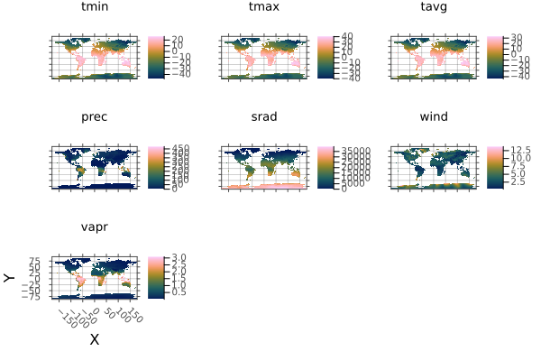


Note: currently it is faster to aggregate over memory-backed arrays. Use [`read`](/api#Base.read-Tuple{Union{AbstractRaster,%20AbstractRasterSeries,%20AbstractRasterStack}}) on `src` before use where required.


<Badge type="info" class="source-link" text="source"><a href="https://github.com/rafaqz/Rasters.jl/blob/e21dbeaa6368c96cbd80ad39da2f44ca66031437/src/methods/aggregate.jl#L29-L71" target="_blank" rel="noreferrer">source</a></Badge>

</details>

<details class='jldocstring custom-block' open>
<summary><a id='Rasters.aggregate!-Tuple{Locus, AbstractRaster, Any, Any}' href='#Rasters.aggregate!-Tuple{Locus, AbstractRaster, Any, Any}'><span class="jlbinding">Rasters.aggregate!</span></a> <Badge type="info" class="jlObjectType jlMethod" text="Method" /></summary>


```julia
aggregate!(method, dst::AbstractRaster, src::AbstractRaster, scale; skipmissing=false)
```


Aggregate raster `src` to raster `dst` by `scale`, using `method`.

**Arguments**
- `method`: a function such as `mean` or `sum` that can combine the value of multiple cells to generate the aggregated cell, or a [`Locus`](https://rafaqz.github.io/DimensionalData.jl/stable/api/reference#DimensionalData.Dimensions.Lookups.locus) like `Start()` or `Center()` that species where to sample from in the interval.
  
- `scale`: the aggregation factor, which can be an `Int`, a `Tuple` of `Int` for each dimension, or a `:` colon to mean the whole dimension.  You can also use any `Dimension`, `Selector` or `Int` combination you can usually use in `getindex`. `Tuple` of `Pair` or `NamedTuple` where keys are dimension names will also work. Using a `Selector` will determine the scale by the distance from the start  of the index. Selectors will find the first offset and repeat the same aggregation size for the rest.
  

When the aggregation `scale` of is larger than the array axis, the length of the axis is used.

**Keywords**
- `skipmissing`: if `true`, any `missingval` will be skipped during aggregation, so that   only areas of all missing values will be aggregated to `missingval(dst)`. If `false`,   aggregated areas containing one or more `missingval` will be assigned `missingval`.    `false` by default. `skipmissing` behaviour is independent of function `f`, which is   only applied to completely non-missing values.
  
- `progress`: show a progress bar, `true` by default, `false` to hide.
  
- `vebose`: whether to print messages about potential problems. `true` by default.
  

Note: currently it is _much_ faster to aggregate over memory-backed source arrays. Use [`read`](/api#Base.read-Tuple{Union{AbstractRaster,%20AbstractRasterSeries,%20AbstractRasterStack}}) on `src` before use where required.


<Badge type="info" class="source-link" text="source"><a href="https://github.com/rafaqz/Rasters.jl/blob/e21dbeaa6368c96cbd80ad39da2f44ca66031437/src/methods/aggregate.jl#L123-L143" target="_blank" rel="noreferrer">source</a></Badge>

</details>

<details class='jldocstring custom-block' open>
<summary><a id='Rasters.boolmask' href='#Rasters.boolmask'><span class="jlbinding">Rasters.boolmask</span></a> <Badge type="info" class="jlObjectType jlFunction" text="Function" /></summary>


```julia
boolmask(obj::Raster; [missingval])
boolmask(obj; [to, res, size])
boolmask(obj::RasterStack; alllayers=true, kw...)
```


Create a mask array of `Bool` values, from another `Raster`. `AbstractRasterStack` or `AbstractRasterSeries` are also accepted. 

The array returned from calling `boolmask` on a `AbstractRaster` is a [`Raster`](/api#Rasters.Raster) with the same dimensions as the original array and a `missingval` of `false`.

**Arguments**
- a [`Raster`](/api#Rasters.Raster) or one or multiple geometries. Geometries can be   a GeoInterface.jl `AbstractGeometry`, a nested `Vector` of `AbstractGeometry`,   or a Tables.jl compatible object containing a `:geometry` column or points and values columns,   in which case `geometrycolumn` must be specified.
  

**`Raster` / `RasterStack` Keywords**
- `invert`: invert the mask, so that areas no missing in `with` are   masked, and areas missing in `with` are masked.
  
- `missingval`: The missing value of the source array, with default `missingval(raster)`.
  

**Keywords**
- `alllayers`: if `true` a mask is taken for all layers, otherwise only the first layer is used. Defaults to `true`
  
- `to`: a `Raster`, `RasterStack`, `Tuple` of `Dimension` or `Extents.Extent`.   If no `to` object is provided the extent will be calculated from the geometries,   Additionally, when no `to` object or an `Extent` is passed for `to`, the `size`   or `res` keyword must also be used.
  
- `res`: the resolution of the dimensions (often in meters or degrees), a `Real` or `Tuple{<:Real,<:Real}`.   Only required when `to` is not used or is an `Extents.Extent`, and `size` is not used.
  
- `size`: the size of the output array, as a `Tuple{Int,Int}` or single `Int` for a square.   Only required when `to` is not used or is an `Extents.Extent`, and `res` is not used.
  
- `crs`: a `crs` which will be attached to the resulting raster when `to` not passed  or is an `Extent`. Otherwise the crs from `to` is used.
  
- `boundary`: for polygons, include pixels where the `:center` is inside the polygon,   where the polygon `:touches` the pixel, or that are completely `:inside` the polygon.   The default is `:center`.
  
- `shape`: Force `data` to be treated as `:polygon`, `:line` or `:point` geometries.   using points or lines as polygons may have unexpected results.
  
- `geometrycolumn`: `Symbol` to manually select the column the geometries are in   when `data` is a Tables.jl compatible table, or a tuple of `Symbol` for columns of   point coordinates.
  
- `threaded`: run operations in parallel, `false` by default. In some circumstances `threaded`    can give large speedups over single-threaded operation. This can be true for complicated    geometries written into low-resolution rasters, but may not be for simple geometries with    high-resolution rasters. With very large rasters threading may be counter productive due    to excessive memory use. Caution should also be used: `threaded` should not be used in in-place    functions writing to `BitArray` or other arrays where race conditions can occur. 
  
- `progress`: show a progress bar, `true` by default, `false` to hide.
  

For tabular data, feature collections and other iterables
- `collapse`: if `true`, collapse all geometry masks into a single mask. Otherwise   return a Raster with an additional `geometry` dimension, so that each slice   along this axis is the mask of the `geometry` opbject of each row of the   table, feature in the feature collection, or just each geometry in the iterable.
  

**Example**

```julia
using Rasters, RasterDataSources, ArchGDAL, Plots, Dates
wc = Raster(WorldClim{Climate}, :prec; month=1)
boolmask(wc) |> plot

savefig("build/boolmask_example.png"); nothing

# output
```


WARNING: This feature is experimental. It may change in future versions, and may not be 100% reliable in all cases. Please file github issues if problems occur.


<Badge type="info" class="source-link" text="source"><a href="https://github.com/rafaqz/Rasters.jl/blob/e21dbeaa6368c96cbd80ad39da2f44ca66031437/src/methods/mask.jl#L215-L264" target="_blank" rel="noreferrer">source</a></Badge>

</details>

<details class='jldocstring custom-block' open>
<summary><a id='Rasters.cellarea-Tuple{Any}' href='#Rasters.cellarea-Tuple{Any}'><span class="jlbinding">Rasters.cellarea</span></a> <Badge type="info" class="jlObjectType jlMethod" text="Method" /></summary>


```julia
cellarea([method], x)
```


Gives the approximate area of each gridcell of `x`. By assuming the earth is a sphere, it approximates the true size to about 0.1%, depending on latitude. 

Run `using ArchGDAL` or `using Proj` to make this method fully available.
- `method`: You can specify whether you want to compute the area in the plane of your projection `Planar()` or on a sphere of some radius `Spherical(; radius=...)`(the default).
  
- `Spherical` will compute cell area on the sphere, by transforming all points back to long-lat.  You can specify the radius by the `radius` keyword argument here.  By default, this is `6371008.8`, the mean radius of the Earth.
  
- `Planar` will compute cell area in the plane of the CRS you have chosen.  Be warned that this will likely be incorrect for non-equal-area projections.
  

Returns a Raster with the same x and y dimensions as the input,  where each value in the raster encodes the area of the cell (in meters by default).

**Example**

```julia
using Rasters, Proj, Rasters.Lookups
xdim = X(Projected(90.0:10.0:120; sampling=Intervals(Start()), crs=EPSG(4326)))
ydim = Y(Projected(0.0:10.0:50; sampling=Intervals(Start()), crs=EPSG(4326)))
myraster = rand(xdim, ydim)
cs = cellarea(myraster)

# output
╭───────────────────────╮
│ 4×6 Raster{Float64,2} │
├───────────────────────┴─────────────────────────────────────────────────── dims ┐
  ↓ X Projected{Float64} 90.0:10.0:120.0 ForwardOrdered Regular Intervals{Start},
  → Y Projected{Float64} 0.0:10.0:50.0 ForwardOrdered Regular Intervals{Start}
├───────────────────────────────────────────────────────────────────────── raster ┤
  extent: Extent(X = (90.0, 130.0), Y = (0.0, 60.0))

  crs: EPSG:4326
└─────────────────────────────────────────────────────────────────────────────────┘
   ↓ →  0.0        10.0        20.0        30.0            40.0      50.0
  90.0  1.23017e6   1.19279e6   1.11917e6   1.01154e6  873182.0  708290.0
 100.0  1.23017e6   1.19279e6   1.11917e6   1.01154e6  873182.0  708290.0
 110.0  1.23017e6   1.19279e6   1.11917e6   1.01154e6  873182.0  708290.0
 120.0  1.23017e6   1.19279e6   1.11917e6   1.01154e6  873182.0  708290.0
```


WARNING: This feature is experimental. It may change in future versions, and may not be 100% reliable in all cases. Please file github issues if problems occur.


<Badge type="info" class="source-link" text="source"><a href="https://github.com/rafaqz/Rasters.jl/blob/e21dbeaa6368c96cbd80ad39da2f44ca66031437/src/extensions.jl#L165-L209" target="_blank" rel="noreferrer">source</a></Badge>

</details>

<details class='jldocstring custom-block' open>
<summary><a id='Rasters.classify' href='#Rasters.classify'><span class="jlbinding">Rasters.classify</span></a> <Badge type="info" class="jlObjectType jlFunction" text="Function" /></summary>


```julia
classify(x, pairs; lower=(>=), upper=(<), others=nothing)
classify(x, pairs...; lower, upper, others)
```


Create a new array with values in `x` classified by the values in `pairs`.

`pairs` can hold tuples fo values `(2, 3)`, a `Fix2` function e.g. `<=(1)`, a `Tuple` of `Fix2` e.g. `(>=(4), <(7))`, or an IntervalSets.jl interval, e.g. `3..9` or `OpenInterval(10, 12)`. `pairs` can also be a `n * 3` matrix where each row is lower bounds, upper bounds, replacement.

If tuples or a `Matrix` are used, the `lower` and `upper` keywords define how the lower and upper boundaries are chosen.

If `others` is set other values not covered in `pairs` will be set to that values.

**Arguments**
- `x`: a `Raster` or `RasterStack`
  
- `pairs`: each pair contains a value and a replacement, a tuple of lower and upper   range and a replacement, or a Tuple of `Fix2` like `(>(x), <(y)`.
  

**Keywords**
- `lower`: Which comparison (`<` or `<=`) to use for lower values, if `Fix2` are not used.
  
- `upper`: Which comparison (`>` or `>=`) to use for upper values, if `Fix2` are not used.
  
- `others`: A value to assign to all values not included in `pairs`.   Passing `nothing` (the default) will leave them unchanged.
  

**Example**

```julia
using Rasters, RasterDataSources, ArchGDAL, Plots
A = Raster(WorldClim{Climate}, :tavg; month=1)
classes = <=(15) => 10,
          15..25 => 20,
          25..35 => 30,
          >(35) => 40
classified = classify(A, classes; others=0, missingval=0)
plot(classified; c=:magma)

savefig("build/classify_example.png"); nothing

# output
```


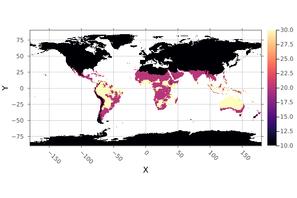


WARNING: This feature is experimental. It may change in future versions, and may not be 100% reliable in all cases. Please file github issues if problems occur.


<Badge type="info" class="source-link" text="source"><a href="https://github.com/rafaqz/Rasters.jl/blob/e21dbeaa6368c96cbd80ad39da2f44ca66031437/src/methods/classify.jl#L1-L49" target="_blank" rel="noreferrer">source</a></Badge>

</details>

<details class='jldocstring custom-block' open>
<summary><a id='Rasters.classify!-Tuple{AbstractRaster, Pair, Vararg{Pair}}' href='#Rasters.classify!-Tuple{AbstractRaster, Pair, Vararg{Pair}}'><span class="jlbinding">Rasters.classify!</span></a> <Badge type="info" class="jlObjectType jlMethod" text="Method" /></summary>


```julia
classify!(x, pairs...; lower, upper, others)
classify!(x, pairs; lower, upper, others)
```


Classify the values of `x` in-place, by the values in `pairs`.

If `Fix2` is not used, the `lower` and `upper` keywords

If `others` is set other values not covered in `pairs` will be set to that values.

**Arguments**
- `x`: a `Raster` or `RasterStack`
  
- `pairs`: each pair contains a value and a replacement, a tuple of lower and upper   range and a replacement, or a Tuple of `Fix2` like `(>(x), <(y)`.
  

**Keywords**
- `lower`: Which comparison (`<` or `<=`) to use for lower values, if `Fix2` are not used.
  
- `upper`: Which comparison (`>` or `>=`) to use for upper values, if `Fix2` are not used.
  
- `others`: A value to assign to all values not included in `pairs`.   Passing `nothing` (the default) will leave them unchanged.
  

**Example**

`classify!` to disk, with key steps:
- copying a tempory file so we don&#39;t write over the RasterDataSources.jl version.
  
- use `open` with `write=true` to open the file with disk-write permissions.
  
- use `Float32` like `10.0f0` for all our replacement values and `other`, because   the file is stored as `Float32`. Attempting to write some other type will fail.
  

```julia
using Rasters, RasterDataSources, ArchGDAL, Plots
# Download and copy the file
filename = getraster(WorldClim{Climate}, :tavg; month=6)
tempfile = tempname() * ".tif"
cp(filename, tempfile)
# Define classes
classes = (5, 15) => 10,
          (15, 25) => 20,
          (25, 35) => 30,
          >=(35) => 40
# Open the file with write permission
open(Raster(tempfile); write=true) do A
    classify!(A, classes; others=0)
end
# Open it again to plot the changes
plot(Raster(tempfile); c=:magma)

savefig("build/classify_bang_example.png"); nothing

# output
```


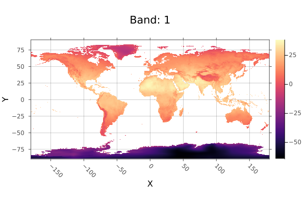


WARNING: This feature is experimental. It may change in future versions, and may not be 100% reliable in all cases. Please file github issues if problems occur.


<Badge type="info" class="source-link" text="source"><a href="https://github.com/rafaqz/Rasters.jl/blob/e21dbeaa6368c96cbd80ad39da2f44ca66031437/src/methods/classify.jl#L82-L139" target="_blank" rel="noreferrer">source</a></Badge>

</details>

<details class='jldocstring custom-block' open>
<summary><a id='Rasters.combine-Tuple{AbstractRasterSeries}' href='#Rasters.combine-Tuple{AbstractRasterSeries}'><span class="jlbinding">Rasters.combine</span></a> <Badge type="info" class="jlObjectType jlMethod" text="Method" /></summary>


```julia
combine(A::AbstracRasterSeries; [dims], [lazy]) => Raster
```


Combine a `RasterSeries` along some dimension/s, creating a new `Raster` or `RasterStack`, depending on the contents of the series.

If `dims` are passed, only the specified dimensions will be combined with a `RasterSeries` returned, unless `dims` is all the dims in the series.

If `lazy`, concatenate lazily. The default is to concatenate lazily for lazy `Raster`s and eagerly otherwise.

WARNING: This feature is experimental. It may change in future versions, and may not be 100% reliable in all cases. Please file github issues if problems occur.


<Badge type="info" class="source-link" text="source"><a href="https://github.com/rafaqz/Rasters.jl/blob/e21dbeaa6368c96cbd80ad39da2f44ca66031437/src/methods/slice_combine.jl#L32-L44" target="_blank" rel="noreferrer">source</a></Badge>

</details>

<details class='jldocstring custom-block' open>
<summary><a id='Rasters.convertlookup-Tuple{Type{<:Lookup}, AbstractDimArray}' href='#Rasters.convertlookup-Tuple{Type{<:Lookup}, AbstractDimArray}'><span class="jlbinding">Rasters.convertlookup</span></a> <Badge type="info" class="jlObjectType jlMethod" text="Method" /></summary>


```julia
convertlookup(dstlookup::Type{<:Lookup}, x)
```


Convert the dimension lookup between `Projected` and `Mapped`. Other dimension lookups pass through unchanged.

This is used to e.g. save a netcdf file to GeoTiff.


<Badge type="info" class="source-link" text="source"><a href="https://github.com/rafaqz/Rasters.jl/blob/e21dbeaa6368c96cbd80ad39da2f44ca66031437/src/lookup.jl#L165-L172" target="_blank" rel="noreferrer">source</a></Badge>

</details>

<details class='jldocstring custom-block' open>
<summary><a id='Rasters.coverage!-Tuple{Union{typeofsum, typeofunion}, AbstractRaster, Any}' href='#Rasters.coverage!-Tuple{Union{typeofsum, typeofunion}, AbstractRaster, Any}'><span class="jlbinding">Rasters.coverage!</span></a> <Badge type="info" class="jlObjectType jlMethod" text="Method" /></summary>


```julia
coverage!(A, geom; [mode, scale])
```


Calculate the area of a raster covered by GeoInterface.jl compatible geometry `geom`, as a fraction.

Each pixel is assigned a grid of points (by default 10 x 10) that are each checked to be inside the geometry. The sum divided by the number of points to give coverage.

In practice, most pixel coverage is not calculated this way - shortcuts that  produce the same result are taken wherever possible.

If `geom` is an `AbstractVector` or table, the `mode` keyword will determine how coverage is combined.

**Keywords**
- `mode`: method for combining multiple geometries - `union` or `sum`. 
  - `union` (the default) gives the areas covered by all geometries. Usefull in spatial coverage where overlapping regions should not be counted twice. The returned raster will contain `Float64` values between `0.0` and `1.0`.
    
  - `sum` gives the summed total of the areas covered by all geometries, as in taking the sum of running `coverage` separately on all geometries. The returned values are positive `Float64`.
    
  For a single geometry, the `mode` keyword has no effect - the result is the same.
  
- `scale`: `Integer` scale of pixel subdivision. The default of `10` means each pixel has    10 x 10 or 100 points that contribute to coverage. Using `100` means 10,000 points   contribute. Performance will decline as `scale` increases. Memory use will grow    by `scale^2` when `mode=:union`.
  
- `threaded`: run operations in parallel, `false` by default. In some circumstances `threaded`    can give large speedups over single-threaded operation. This can be true for complicated    geometries written into low-resolution rasters, but may not be for simple geometries with    high-resolution rasters. With very large rasters threading may be counter productive due    to excessive memory use. Caution should also be used: `threaded` should not be used in in-place    functions writing to `BitArray` or other arrays where race conditions can occur. 
  
- `progress`: show a progress bar, `true` by default, `false` to hide.
  
- `vebose`: whether to print messages about potential problems. `true` by default.
  


<Badge type="info" class="source-link" text="source"><a href="https://github.com/rafaqz/Rasters.jl/blob/e21dbeaa6368c96cbd80ad39da2f44ca66031437/src/methods/coverage.jl#L64-L72" target="_blank" rel="noreferrer">source</a></Badge>

</details>

<details class='jldocstring custom-block' open>
<summary><a id='Rasters.coverage-Tuple{Any}' href='#Rasters.coverage-Tuple{Any}'><span class="jlbinding">Rasters.coverage</span></a> <Badge type="info" class="jlObjectType jlMethod" text="Method" /></summary>


```julia
coverage(mode, geom; [to, res, size, scale, verbose, progress])
coverage(geom; [to, mode, res, size, scale, verbose, progress])
```


Calculate the area of a raster covered by GeoInterface.jl compatible geometry `geom`, as a fraction.

Each pixel is assigned a grid of points (by default 10 x 10) that are each checked to be inside the geometry. The sum divided by the number of points to give coverage.

In practice, most pixel coverage is not calculated this way - shortcuts that  produce the same result are taken wherever possible.

If `geom` is an `AbstractVector` or table, the `mode` keyword will determine how coverage is combined.

**Keywords**
- `mode`: method for combining multiple geometries - `union` or `sum`. 
  - `union` (the default) gives the areas covered by all geometries. Usefull in spatial coverage where overlapping regions should not be counted twice. The returned raster will contain `Float64` values between `0.0` and `1.0`.
    
  - `sum` gives the summed total of the areas covered by all geometries, as in taking the sum of running `coverage` separately on all geometries. The returned values are positive `Float64`.
    
  For a single geometry, the `mode` keyword has no effect - the result is the same.
  
- `scale`: `Integer` scale of pixel subdivision. The default of `10` means each pixel has    10 x 10 or 100 points that contribute to coverage. Using `100` means 10,000 points   contribute. Performance will decline as `scale` increases. Memory use will grow    by `scale^2` when `mode=:union`.
  
- `threaded`: run operations in parallel, `false` by default. In some circumstances `threaded`    can give large speedups over single-threaded operation. This can be true for complicated    geometries written into low-resolution rasters, but may not be for simple geometries with    high-resolution rasters. With very large rasters threading may be counter productive due    to excessive memory use. Caution should also be used: `threaded` should not be used in in-place    functions writing to `BitArray` or other arrays where race conditions can occur. 
  
- `progress`: show a progress bar, `true` by default, `false` to hide.
  
- `vebose`: whether to print messages about potential problems. `true` by default.
  
- `to`: a `Raster`, `RasterStack`, `Tuple` of `Dimension` or `Extents.Extent`.   If no `to` object is provided the extent will be calculated from the geometries,   Additionally, when no `to` object or an `Extent` is passed for `to`, the `size`   or `res` keyword must also be used.
  
- `geometrycolumn`: `Symbol` to manually select the column the geometries are in   when `data` is a Tables.jl compatible table, or a tuple of `Symbol` for columns of   point coordinates.
  
- `size`: the size of the output array, as a `Tuple{Int,Int}` or single `Int` for a square.   Only required when `to` is not used or is an `Extents.Extent`, and `res` is not used.
  
- `res`: the resolution of the dimensions (often in meters or degrees), a `Real` or `Tuple{<:Real,<:Real}`.   Only required when `to` is not used or is an `Extents.Extent`, and `size` is not used.
  


<Badge type="info" class="source-link" text="source"><a href="https://github.com/rafaqz/Rasters.jl/blob/e21dbeaa6368c96cbd80ad39da2f44ca66031437/src/methods/coverage.jl#L32-L45" target="_blank" rel="noreferrer">source</a></Badge>

</details>

<details class='jldocstring custom-block' open>
<summary><a id='Rasters.crop' href='#Rasters.crop'><span class="jlbinding">Rasters.crop</span></a> <Badge type="info" class="jlObjectType jlFunction" text="Function" /></summary>


```julia
crop(x; to, touches=false, atol=0, [geometrycolumn])
crop(xs...; to)
```


Crop one or multiple [`AbstractRaster`](/api#Rasters.AbstractRaster) or [`AbstractRasterStack`](/api#Rasters.AbstractRasterStack) `x` to match the size of the object `to`, or smallest of any dimensions that are shared.

`crop` is lazy, using a `view` into the object rather than allocating new memory.

**Keywords**
- `to`: the object to crop to. This can be a [`Raster`](/api#Rasters.Raster) or one or multiple geometries. Geometries can be   a GeoInterface.jl `AbstractGeometry`, a nested `Vector` of `AbstractGeometry`,   or a Tables.jl compatible object containing a `:geometry` column or points and values columns,   in which case `geometrycolumn` must be specified. If no `to` keyword is passed, the smallest shared area of all `xs` is used.
  
- `touches`: `true` or `false`. Whether to use `Touches` wraper on the object extent.  When lines need to be included in e.g. zonal statistics, `true` should be used.
  
- `atol`: the absolute tolerance to use when cropping to an extent. If edges are less than   `atol` away from the extent of `to`, they are included.
  
- `geometrycolumn`: `Symbol` to manually select the column the geometries are in   when `data` is a Tables.jl compatible table, or a tuple of `Symbol` for columns of   point coordinates.
  

As `crop` is lazy, `filename` and `suffix` keywords are not used.

**Example**

Crop to another raster:

```julia
using Rasters, RasterDataSources, Plots
evenness = Raster(EarthEnv{HabitatHeterogeneity}, :evenness)
rnge = Raster(EarthEnv{HabitatHeterogeneity}, :range)

# Roughly cut out New Zealand from the evenness raster
nz_bounds = X(165 .. 180), Y(-50 .. -32)
nz_evenness = evenness[nz_bounds...]

# Crop range to match evenness
nz_range = crop(rnge; to=nz_evenness)
plot(nz_range)

savefig("build/nz_crop_example.png");
nothing

# output
```


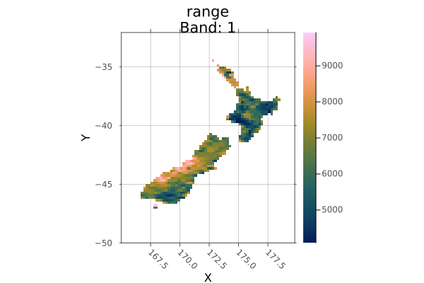


Crop to a polygon:

```julia
using Rasters, RasterDataSources, Plots, Dates, Shapefile, Downloads

# Download a borders shapefile
shapefile_url = "https://github.com/nvkelso/natural-earth-vector/raw/master/10m_cultural/ne_10m_admin_0_countries.shp"
shapefile_name = "boundary.shp"
isfile(shapefile_name) || Downloads.download(shapefile_url, shapefile_name)
shp = Shapefile.Handle(shapefile_name).shapes[6]

evenness = Raster(EarthEnv{HabitatHeterogeneity}, :evenness)
argentina_evenness = crop(evenness; to=shp)
plot(argentina_evenness)

savefig("build/argentina_crop_example.png"); nothing

# output
```


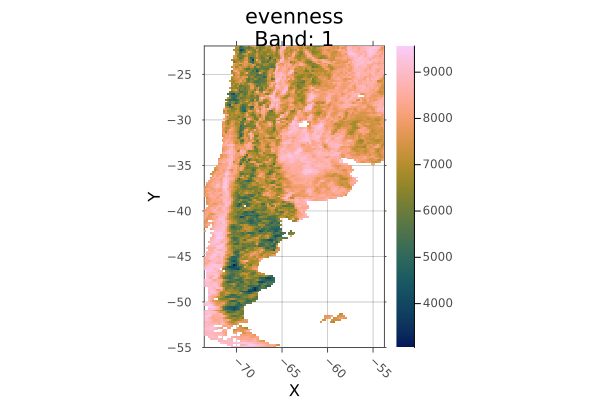


WARNING: This feature is experimental. It may change in future versions, and may not be 100% reliable in all cases. Please file github issues if problems occur.


<Badge type="info" class="source-link" text="source"><a href="https://github.com/rafaqz/Rasters.jl/blob/e21dbeaa6368c96cbd80ad39da2f44ca66031437/src/methods/crop_extend.jl#L1-L70" target="_blank" rel="noreferrer">source</a></Badge>

</details>

<details class='jldocstring custom-block' open>
<summary><a id='Rasters.disaggregate' href='#Rasters.disaggregate'><span class="jlbinding">Rasters.disaggregate</span></a> <Badge type="info" class="jlObjectType jlFunction" text="Function" /></summary>


```julia
disaggregate(object, scale; kw...)
```


Disaggregate array, or all arrays in a stack or series, by some scale.

**Arguments**
- `object`: Object to aggregate, like `AbstractRasterSeries`, `AbstractStack`, `AbstractRaster`, `Dimension` or `Lookup`.
  
- `scale`: the aggregation factor, which can be an `Int`, a `Tuple` of `Int` for each dimension, or a `:` colon to mean the whole dimension.  You can also use any `Dimension`, `Selector` or `Int` combination you can usually use in `getindex`. `Tuple` of `Pair` or `NamedTuple` where keys are dimension names will also work. Using a `Selector` will determine the scale by the distance from the start  of the index. Selectors will find the first offset and repeat the same aggregation size for the rest.
  

**Keywords**
- `filename`: a filename to write to directly, useful for large files.
  
- `suffix`: a string or value to append to the filename.   A tuple of `suffix` will be applied to stack layers. `keys(stack)` are the default.
  
- `progress`: show a progress bar, `true` by default, `false` to hide.
  
- `threaded`: run operations in parallel, `false` by default. In some circumstances `threaded`    can give large speedups over single-threaded operation. This can be true for complicated    geometries written into low-resolution rasters, but may not be for simple geometries with    high-resolution rasters. With very large rasters threading may be counter productive due    to excessive memory use. Caution should also be used: `threaded` should not be used in in-place    functions writing to `BitArray` or other arrays where race conditions can occur. 
  
- `lazy`: A `Bool` specifying if to disaggregate lazily. Defaults to `false`
  

Note: currently it is _much_ faster to disaggregate over a memory-backed  source array. Use [`read`](/api#Base.read-Tuple{Union{AbstractRaster,%20AbstractRasterSeries,%20AbstractRasterStack}}) on `src` before use where required.


<Badge type="info" class="source-link" text="source"><a href="https://github.com/rafaqz/Rasters.jl/blob/e21dbeaa6368c96cbd80ad39da2f44ca66031437/src/methods/aggregate.jl#L205-L226" target="_blank" rel="noreferrer">source</a></Badge>

</details>

<details class='jldocstring custom-block' open>
<summary><a id='Rasters.disaggregate!-Tuple{AbstractRaster, Any, Any}' href='#Rasters.disaggregate!-Tuple{AbstractRaster, Any, Any}'><span class="jlbinding">Rasters.disaggregate!</span></a> <Badge type="info" class="jlObjectType jlMethod" text="Method" /></summary>


```julia
disaggregate!(dst::AbstractRaster, src::AbstractRaster, scale)
```


Disaggregate array `src` to array `dst` by some scale.
- `scale`: the aggregation factor, which can be an `Int`, a `Tuple` of `Int` for each dimension, or a `:` colon to mean the whole dimension.  You can also use any `Dimension`, `Selector` or `Int` combination you can usually use in `getindex`. `Tuple` of `Pair` or `NamedTuple` where keys are dimension names will also work. Using a `Selector` will determine the scale by the distance from the start  of the index. Selectors will find the first offset and repeat the same aggregation size for the rest.
  


<Badge type="info" class="source-link" text="source"><a href="https://github.com/rafaqz/Rasters.jl/blob/e21dbeaa6368c96cbd80ad39da2f44ca66031437/src/methods/aggregate.jl#L285-L291" target="_blank" rel="noreferrer">source</a></Badge>

</details>

<details class='jldocstring custom-block' open>
<summary><a id='Rasters.extend' href='#Rasters.extend'><span class="jlbinding">Rasters.extend</span></a> <Badge type="info" class="jlObjectType jlFunction" text="Function" /></summary>


```julia
extend(xs...; [to])
extend(xs; [to])
extend(x::Union{AbstractRaster,AbstractRasterStack}; to, kw...)
```


Extend one or multiple [`AbstractRaster`](/api#Rasters.AbstractRaster) to match the area covered by all `xs`, or by the keyword argument `to`.

**Keywords**
- `to`: the Raster or dims to extend to. If no `to` keyword is passed, the largest   shared area of all `xs` is used.
  
- `touches`: `true` or `false`. Whether to use `Touches` wrapper on the object extent.  When lines need to be included in e.g. zonal statistics, `true` shoudle be used.
  
- `filename`: a filename to write to directly, useful for large files.
  
- `suffix`: a string or value to append to the filename.   A tuple of `suffix` will be applied to stack layers. `keys(stack)` are the default.
  

```julia
using Rasters, RasterDataSources, Plots
evenness = Raster(EarthEnv{HabitatHeterogeneity}, :evenness)
rnge = Raster(EarthEnv{HabitatHeterogeneity}, :range)

# Roughly cut out South America
sa_bounds = X(-88 .. -32), Y(-57 .. 13)
sa_evenness = evenness[sa_bounds...]

# Extend range to match the whole-world raster
sa_range = extend(sa_evenness; to=rnge)
plot(sa_range)

savefig("build/extend_example.png");
nothing
# output
```


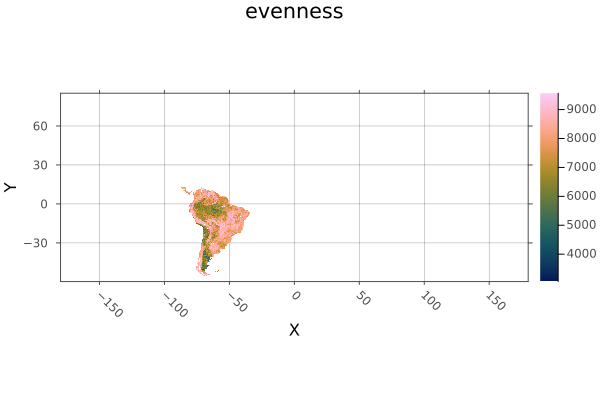


WARNING: This feature is experimental. It may change in future versions, and may not be 100% reliable in all cases. Please file github issues if problems occur.


<Badge type="info" class="source-link" text="source"><a href="https://github.com/rafaqz/Rasters.jl/blob/e21dbeaa6368c96cbd80ad39da2f44ca66031437/src/methods/crop_extend.jl#L119-L157" target="_blank" rel="noreferrer">source</a></Badge>

</details>

<details class='jldocstring custom-block' open>
<summary><a id='Rasters.extract' href='#Rasters.extract'><span class="jlbinding">Rasters.extract</span></a> <Badge type="info" class="jlObjectType jlFunction" text="Function" /></summary>


```julia
extract(x, geometries; kw...)
```


Extracts the value of `Raster` or `RasterStack` for the passed in geometries, returning an `Vector{NamedTuple}` with properties for `:geometry` and `Raster` or `RasterStack` layer values.

For lines, linestrings and linear rings points are extracted for each pixel that the line touches.

For polygons, all cells witih centers covered by the polygon are returned.

Note that if objects have more dimensions than the length of the point tuples, sliced arrays or stacks will be returned instead of single values.

**Arguments**
- `x`: a `Raster` or `RasterStack` to extract values from.
  
- `data`: a GeoInterface.jl `AbstractGeometry`, a nested `Vector` of `AbstractGeometry`,   or a Tables.jl compatible object containing a `:geometry` column or points and values columns,   in which case `geometrycolumn` must be specified.
  

**Keywords**
- `geometry`: include a `:geometry` field in rows, which will be a   tuple point. Either the original point for points or the pixel   center point for line and polygon extract. `true` by default.
  
- `index`: include `:index` field of extracted points in rows, `false` by default.
  
- `name`: a `Symbol` or `Tuple` of `Symbol` corresponding to layer/s   of a `RasterStack` to extract. All layers are extracted by default.
  
- `skipmissing`: skip missing points automatically.
  
- `flatten`: flatten extracted points from multiple    geometries into a single vector. `true` by default.    Unmixed point geometries are always flattened.   Flattening is slow and single threaded, `flatten=false` may be a    large performance improvement in combination with `threaded=true`.
  
- `atol`: a tolerance for floating point lookup values for when the `Lookup`   contains `Points`. `atol` is ignored for `Intervals`.
  
- `boundary`: for polygons, include pixels where the `:center` is inside the polygon,   where the polygon `:touches` the pixel, or that are completely `:inside` the polygon.   The default is `:center`.
  
- `geometrycolumn`: `Symbol` to manually select the column the geometries are in   when `data` is a Tables.jl compatible table, or a tuple of `Symbol` for columns of   point coordinates.
  

**Example**

Here we extract points matching the occurrence of the Mountain Pygmy Possum, _Burramis parvus_. This could be used to fit a species distribution model.

```julia
using Rasters, RasterDataSources, ArchGDAL, GBIF2, CSV

# Get a stack of BioClim layers, and replace missing values with `missing`
st = RasterStack(WorldClim{BioClim}, (1, 3, 5, 7, 12)) |> replace_missing

# Download some occurrence data
obs = GBIF2.occurrence_search("Burramys parvus"; limit=5, year="2009")

# use `extract` to get values for all layers at each observation point.
# We `collect` to get a `Vector` from the lazy iterator.
extract(st, obs; skipmissing=true)

# output
5-element Vector{NamedTuple{(:geometry, :bio1, :bio3, :bio5, :bio7, :bio12)}}:
 (geometry = (0.21, 40.07), bio1 = 17.077084f0, bio3 = 41.20417f0, bio5 = 30.1f0, bio7 = 24.775f0, bio12 = 446.0f0)
 (geometry = (0.03, 39.97), bio1 = 17.076923f0, bio3 = 39.7983f0, bio5 = 29.638462f0, bio7 = 24.153847f0, bio12 = 441.0f0)
 (geometry = (0.03, 39.97), bio1 = 17.076923f0, bio3 = 39.7983f0, bio5 = 29.638462f0, bio7 = 24.153847f0, bio12 = 441.0f0)
 (geometry = (0.52, 40.37), bio1 = missing, bio3 = missing, bio5 = missing, bio7 = missing, bio12 = missing)
 (geometry = (0.32, 40.24), bio1 = 16.321388f0, bio3 = 41.659454f0, bio5 = 30.029825f0, bio7 = 25.544561f0, bio12 = 480.0f0)
```


Note: passing in arrays, geometry collections or feature collections containing a mix of points and other geometries has undefined results.


<Badge type="info" class="source-link" text="source"><a href="https://github.com/rafaqz/Rasters.jl/blob/e21dbeaa6368c96cbd80ad39da2f44ca66031437/src/methods/extract.jl#L82-L150" target="_blank" rel="noreferrer">source</a></Badge>

</details>

<details class='jldocstring custom-block' open>
<summary><a id='Rasters.mappedbounds' href='#Rasters.mappedbounds'><span class="jlbinding">Rasters.mappedbounds</span></a> <Badge type="info" class="jlObjectType jlFunction" text="Function" /></summary>


```julia
mappedbounds(x)
```


Get the bounds converted to the [`mappedcrs`](/api#Rasters.mappedcrs) value.

Without ArchGDAL loaded, this is just the regular bounds.


<Badge type="info" class="source-link" text="source"><a href="https://github.com/rafaqz/Rasters.jl/blob/e21dbeaa6368c96cbd80ad39da2f44ca66031437/src/lookup.jl#L227-L233" target="_blank" rel="noreferrer">source</a></Badge>

</details>

<details class='jldocstring custom-block' open>
<summary><a id='Rasters.mappedcrs' href='#Rasters.mappedcrs'><span class="jlbinding">Rasters.mappedcrs</span></a> <Badge type="info" class="jlObjectType jlFunction" text="Function" /></summary>


```julia
mappedcrs(x)
```


Get the mapped coordinate reference system for the `Y`/`X` dims of an array.

In [`Projected`](/api#Rasters.Projected) lookup this is used to convert [`Selector`](https://rafaqz.github.io/DimensionalData.jl/stable/api/reference#DimensionalData.Dimensions.Lookups.Selector) values form the mappedcrs defined projection to the underlying projection, and to show plot axes in the mapped projection.

In `Mapped` lookup this is the coordinate reference system of the index values. See [`setmappedcrs`](/api#Rasters.setmappedcrs-Tuple{Union{AbstractRaster,%20AbstractRasterStack},%20Any}) to set it manually.


<Badge type="info" class="source-link" text="source"><a href="https://github.com/rafaqz/Rasters.jl/blob/e21dbeaa6368c96cbd80ad39da2f44ca66031437/src/crs.jl#L22-L33" target="_blank" rel="noreferrer">source</a></Badge>

</details>

<details class='jldocstring custom-block' open>
<summary><a id='Rasters.mappedindex' href='#Rasters.mappedindex'><span class="jlbinding">Rasters.mappedindex</span></a> <Badge type="info" class="jlObjectType jlFunction" text="Function" /></summary>


```julia
mappedindex(x)
```


Get the index value of a dimension converted to the `mappedcrs` value.

Without ArchGDAL loaded, this is just the regular dim value.


<Badge type="info" class="source-link" text="source"><a href="https://github.com/rafaqz/Rasters.jl/blob/e21dbeaa6368c96cbd80ad39da2f44ca66031437/src/lookup.jl#L256-L262" target="_blank" rel="noreferrer">source</a></Badge>

</details>

<details class='jldocstring custom-block' open>
<summary><a id='Rasters.mask!' href='#Rasters.mask!'><span class="jlbinding">Rasters.mask!</span></a> <Badge type="info" class="jlObjectType jlFunction" text="Function" /></summary>


```julia
mask!(x; with, missingval=missingval(A))
```


Mask `A` by the missing values of `with`, or by all values outside `with` if it is a polygon.

If `with` is a polygon, creates a new array where points falling outside the polygon have been replaced by `missingval(A)`.

Return a new array with values of `A` masked by the missing values of `with`, or by a polygon.

**Arguments**
- `x`: a `Raster` or `RasterStack`.
  

**Keywords**
- `with`: another `AbstractRaster`, a `AbstractVector` of `Tuple` points,   or any GeoInterface.jl `AbstractGeometry`. The coordinate reference system   of the point must match `crs(A)`.
  
- `invert`: invert the mask, so that areas no missing in `with` are   masked, and areas missing in `with` are masked.
  
- `missingval`: the missing value to write to A in masked areas,   by default `missingval(A)`.
  

**Example**

Mask an unmasked AWAP layer with a masked WorldClim layer, by first resampling the mask to match the size and projection.

```julia
using Rasters, RasterDataSources, ArchGDAL, Plots, Dates

# Load and plot the file
awap = read(RasterStack(AWAP, (:tmin, :tmax); date=DateTime(2001, 1, 1)))
a = plot(awap; clims=(10, 45), c=:imola)

# Create a mask my resampling a worldclim file
wc = Raster(WorldClim{Climate}, :prec; month=1)
wc_mask = resample(wc; to=awap)

# Mask
mask!(awap; with=wc_mask)
b = plot(awap; clims=(10, 45))

savefig(a, "build/mask_bang_example_before.png");
savefig(b, "build/mask_bang_example_after.png"); nothing

# output

```


**Before `mask!`:**

**After `mask!`:**

WARNING: This feature is experimental. It may change in future versions, and may not be 100% reliable in all cases. Please file github issues if problems occur.


<Badge type="info" class="source-link" text="source"><a href="https://github.com/rafaqz/Rasters.jl/blob/e21dbeaa6368c96cbd80ad39da2f44ca66031437/src/methods/mask.jl#L105-L163" target="_blank" rel="noreferrer">source</a></Badge>

</details>

<details class='jldocstring custom-block' open>
<summary><a id='Rasters.mask-Tuple{Any}' href='#Rasters.mask-Tuple{Any}'><span class="jlbinding">Rasters.mask</span></a> <Badge type="info" class="jlObjectType jlMethod" text="Method" /></summary>


```julia
mask(A:AbstractRaster; with, missingval=missingval(A))
mask(x; with)
```


Return a new array with values of `A` masked by the missing values of `with`, or by the shape of `with`, if `with` is a geometric object.

**Arguments**
- `x`: a `Raster` or `RasterStack`
  

**Keywords**
- `with`: an `AbstractRaster`, or any GeoInterface.jl compatible objects   or table. The coordinate reference system of the point must match `crs(A)`.
  
- `invert`: invert the mask, so that areas no missing in `with` are   masked, and areas missing in `with` are masked.
  
- `missingval`: the missing value to use in the returned file.
  
- `filename`: a filename to write to directly, useful for large files.
  
- `suffix`: a string or value to append to the filename.   A tuple of `suffix` will be applied to stack layers. `keys(stack)` are the default.
  

**Geometry keywords**

These can be used when `with` is a GeoInterface.jl compatible object:
- `shape`: Force `data` to be treated as `:polygon`, `:line` or `:point` geometries.   using points or lines as polygons may have unexpected results.
  
- `boundary`: for polygons, include pixels where the `:center` is inside the polygon,   where the polygon `:touches` the pixel, or that are completely `:inside` the polygon.   The default is `:center`.
  
- `geometrycolumn`: `Symbol` to manually select the column the geometries are in   when `data` is a Tables.jl compatible table, or a tuple of `Symbol` for columns of   point coordinates.
  

**Example**

Mask an unmasked AWAP layer with a masked WorldClim layer, by first resampling the mask.

```julia
using Rasters, RasterDataSources, ArchGDAL, Plots, Dates

# Load and plot the file
awap = read(Raster(AWAP, :tmax; date=DateTime(2001, 1, 1)))
a = plot(awap; clims=(10, 45))

# Create a mask my resampling a worldclim file
wc = Raster(WorldClim{Climate}, :prec; month=1)
wc_mask = resample(wc; to=awap)

# Mask
awap_masked = mask(awap; with=wc_mask)
b = plot(awap_masked; clims=(10, 45))

savefig(a, "build/mask_example_before.png");
savefig(b, "build/mask_example_after.png"); nothing
# output

```


**Before `mask`:**

**After `mask`:**

WARNING: This feature is experimental. It may change in future versions, and may not be 100% reliable in all cases. Please file github issues if problems occur.


<Badge type="info" class="source-link" text="source"><a href="https://github.com/rafaqz/Rasters.jl/blob/e21dbeaa6368c96cbd80ad39da2f44ca66031437/src/methods/mask.jl#L14-L75" target="_blank" rel="noreferrer">source</a></Badge>

</details>

<details class='jldocstring custom-block' open>
<summary><a id='Rasters.missingmask-Tuple{Any}' href='#Rasters.missingmask-Tuple{Any}'><span class="jlbinding">Rasters.missingmask</span></a> <Badge type="info" class="jlObjectType jlMethod" text="Method" /></summary>


```julia
missingmask(obj::Raster; kw...)
missingmask(obj; [to, res, size])
missingmask(obj::RasterStack; alllayers=true, kw...)
```


Create a mask array of `missing` and `true` values, from another `Raster`. `AbstractRasterStack` or `AbstractRasterSeries` are also accepted-

For [`AbstractRaster`](/api#Rasters.AbstractRaster) the default `missingval` is `missingval(A)`, but others can be chosen manually.

The array returned from calling `missingmask` on a `AbstractRaster` is a [`Raster`](/api#Rasters.Raster) with the same size and fields as the original array.

**Arguments**
- `obj`: a [`Raster`](/api#Rasters.Raster) or one or multiple geometries. Geometries can be   a GeoInterface.jl `AbstractGeometry`, a nested `Vector` of `AbstractGeometry`,   or a Tables.jl compatible object containing a `:geometry` column or points and values columns,   in which case `geometrycolumn` must be specified.
  

**Keywords**
- `alllayers`: if `true` a mask is taken for all layers, otherwise only the first layer is used. Defaults to `true`
  
- `invert`: invert the mask, so that areas no missing in `with` are   masked, and areas missing in `with` are masked.
  
- `to`: a `Raster`, `RasterStack`, `Tuple` of `Dimension` or `Extents.Extent`.   If no `to` object is provided the extent will be calculated from the geometries,   Additionally, when no `to` object or an `Extent` is passed for `to`, the `size`   or `res` keyword must also be used.
  
- `res`: the resolution of the dimensions (often in meters or degrees), a `Real` or `Tuple{<:Real,<:Real}`.   Only required when `to` is not used or is an `Extents.Extent`, and `size` is not used.
  
- `size`: the size of the output array, as a `Tuple{Int,Int}` or single `Int` for a square.   Only required when `to` is not used or is an `Extents.Extent`, and `res` is not used.
  
- `crs`: a `crs` which will be attached to the resulting raster when `to` not passed  or is an `Extent`. Otherwise the crs from `to` is used.
  
- `boundary`: for polygons, include pixels where the `:center` is inside the polygon,   where the polygon `:touches` the pixel, or that are completely `:inside` the polygon.   The default is `:center`.
  
- `shape`: Force `data` to be treated as `:polygon`, `:line` or `:point` geometries.   using points or lines as polygons may have unexpected results.
  
- `geometrycolumn`: `Symbol` to manually select the column the geometries are in   when `data` is a Tables.jl compatible table, or a tuple of `Symbol` for columns of   point coordinates.
  

**Example**

```julia
using Rasters, RasterDataSources, ArchGDAL, Plots, Dates
wc = Raster(WorldClim{Climate}, :prec; month=1)
missingmask(wc) |> plot

savefig("build/missingmask_example.png"); nothing

# output
```


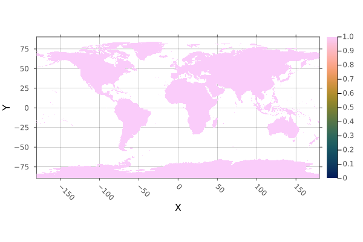


WARNING: This feature is experimental. It may change in future versions, and may not be 100% reliable in all cases. Please file github issues if problems occur.


<Badge type="info" class="source-link" text="source"><a href="https://github.com/rafaqz/Rasters.jl/blob/e21dbeaa6368c96cbd80ad39da2f44ca66031437/src/methods/mask.jl#L361-L401" target="_blank" rel="noreferrer">source</a></Badge>

</details>

<details class='jldocstring custom-block' open>
<summary><a id='Rasters.missingval' href='#Rasters.missingval'><span class="jlbinding">Rasters.missingval</span></a> <Badge type="info" class="jlObjectType jlFunction" text="Function" /></summary>


```julia
missingval(x)
```


Returns the value representing missing data in the dataset


<Badge type="info" class="source-link" text="source"><a href="https://github.com/rafaqz/Rasters.jl/blob/e21dbeaa6368c96cbd80ad39da2f44ca66031437/src/array.jl#L39-L43" target="_blank" rel="noreferrer">source</a></Badge>

</details>

<details class='jldocstring custom-block' open>
<summary><a id='Rasters.mosaic!-Tuple{Function, Union{AbstractRaster, AbstractRasterStack}, Vararg{Union{AbstractRaster, AbstractRasterStack}}}' href='#Rasters.mosaic!-Tuple{Function, Union{AbstractRaster, AbstractRasterStack}, Vararg{Union{AbstractRaster, AbstractRasterStack}}}'><span class="jlbinding">Rasters.mosaic!</span></a> <Badge type="info" class="jlObjectType jlMethod" text="Method" /></summary>


```julia
mosaic!(f, dest::Union{Raster,RasterStack}, regions...; kw...)
mosaic!(f, dest::Union{Raster,RasterStack}, regions; kw...)
```


Combine `regions` of `Raster` or `RasterStack` into `dest` using the function `f` to combine overlapping areas.

**Arguments**
- `f`: A reducing function for values where `regions` overlap.    Note that common base functions    (`mean`, `sum`, `prod`, `first`, `last`, `minimum`, `maximum`,  `length`)   are optimised and will work on many memory or disk based files,   but user-defined functions may fail at larger scales unless `op` is passes as a keyword.
  
- `regions`: Iterable of `Raster` or `RasterStack`. Using an `AbstractArray` is    usually better than a `Tuple` or splat when there are many regions.
  
- `dest`: A `Raster` or `RasterStack`. May be a an opened disk-based `Raster`,   the result will be written to disk.   With the current algorithm, the read speed is slow.
  

**Keywords**
- `missingval`: Fills empty areas, and defaults to the   `missingval` of the first region.
  
- `op`: an operator for the reduction, e.g. `add_sum` for `sum`.    For common methods like `sum` these are known and detected for you,    but you can provide it manually for other functions, so they continue   to work at large scales.
  
- `atol`: Absolute tolerance for comparison between index values.   This is often required due to minor differences in range values   due to floating point error. It is not applied to non-float dimensions.   A tuple of tolerances may be passed, matching the dimension order.
  
- `progress`: show a progress bar, `true` by default, `false` to hide.
  
- `read`: `read` lazy raster regions before writing them. This may help   if there are chunk alignment issues between the source and dest rasters.   `false` by default.
  

WARNING: This feature is experimental. It may change in future versions, and may not be 100% reliable in all cases. Please file github issues if problems occur.


<Badge type="info" class="source-link" text="source"><a href="https://github.com/rafaqz/Rasters.jl/blob/e21dbeaa6368c96cbd80ad39da2f44ca66031437/src/methods/mosaic.jl#L146-L166" target="_blank" rel="noreferrer">source</a></Badge>

</details>

<details class='jldocstring custom-block' open>
<summary><a id='Rasters.mosaic-Tuple{Function, Union{AbstractRaster, AbstractRasterStack}, Vararg{Union{AbstractRaster, AbstractRasterStack}}}' href='#Rasters.mosaic-Tuple{Function, Union{AbstractRaster, AbstractRasterStack}, Vararg{Union{AbstractRaster, AbstractRasterStack}}}'><span class="jlbinding">Rasters.mosaic</span></a> <Badge type="info" class="jlObjectType jlMethod" text="Method" /></summary>


```julia
mosaic(f, regions...; kw...)
mosaic(f, regions; kw...)
```


Combine `regions` of `Raster` or `RasterStack` into a single object,  using the function `f` to combine overlapping areas.

**Arguments**
- `f`: A reducing function for values where `regions` overlap.    Note that common base functions    (`mean`, `sum`, `prod`, `first`, `last`, `minimum`, `maximum`,  `length`)   are optimised and will work on many memory or disk based files,   but user-defined functions may fail at larger scales unless `op` is passes as a keyword.
  
- `regions`: Iterable of `Raster` or `RasterStack`. Using an `AbstractArray` is    usually better than a `Tuple` or splat when there are many regions.
  

**Keywords**
- `missingval`: Fills empty areas, and defaults to the   `missingval` of the first region.
  
- `op`: an operator for the reduction, e.g. `add_sum` for `sum`.    For common methods like `sum` these are known and detected for you,    but you can provide it manually for other functions, so they continue   to work at large scales.
  
- `atol`: Absolute tolerance for comparison between index values.   This is often required due to minor differences in range values   due to floating point error. It is not applied to non-float dimensions.   A tuple of tolerances may be passed, matching the dimension order.
  
- `progress`: show a progress bar, `true` by default, `false` to hide.
  
- `read`: `read` lazy raster regions before writing them. This may help   if there are chunk alignment issues between the source and dest rasters.   `false` by default.
  
- `filename`: a filename to write to directly, useful for large files.
  
- `suffix`: a string or value to append to the filename.   A tuple of `suffix` will be applied to stack layers. `keys(stack)` are the default.
  
- `force`: `false` by default. If `true` it force writing to a file destructively, even if it already exists.
  

If your mosaic has has apparent line errors, increase the `atol` value.

**Example**

Here we cut out Australia and Africa from a stack, and join them with `mosaic`.

```julia
using Rasters, RasterDataSources, NaturalEarth, DataFrames, Dates, Plots
import ArchGDAL

countries = naturalearth("admin_0_countries", 110) |> DataFrame
climate = RasterStack(WorldClim{Climate}, (:tmin, :tmax, :prec, :wind); month=July)
country_climates = map(("Norway", "Denmark", "Sweden")) do name
    country = subset(countries, :NAME => ByRow(==(name)))
    trim(mask(climate; with=country); pad=10)
end
scandinavia_climate = trim(mosaic(first, country_climates; progress=false))
plot(scandinavia_climate)
savefig("build/mosaic_example_combined.png"); nothing

# output

```


**Mosaic of countries**


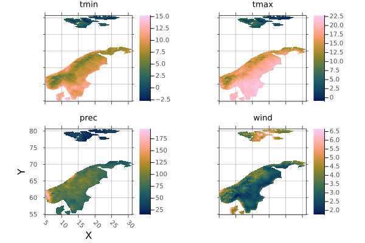


WARNING: This feature is experimental. It may change in future versions, and may not be 100% reliable in all cases. Please file github issues if problems occur.


<Badge type="info" class="source-link" text="source"><a href="https://github.com/rafaqz/Rasters.jl/blob/e21dbeaa6368c96cbd80ad39da2f44ca66031437/src/methods/mosaic.jl#L31-L78" target="_blank" rel="noreferrer">source</a></Badge>

</details>

<details class='jldocstring custom-block' open>
<summary><a id='Rasters.points-Tuple{AbstractRaster}' href='#Rasters.points-Tuple{AbstractRaster}'><span class="jlbinding">Rasters.points</span></a> <Badge type="info" class="jlObjectType jlMethod" text="Method" /></summary>


```julia
points(A::AbstractRaster; dims=(YDim, XDim), ignore_missing) => Array{Tuple}
```


Returns a generator of the points in `A` for dimensions in `dims`, where points are a tuple of the values in each specified dimension index.

**Keywords**
- `dims` the dimensions to return points from. The first slice of other   layers will be used.
  
- `ignore_missing`: wether to ignore missing values in the array when considering   points. If `true`, all points in the dimensions will be returned, if `false`   only the points that are not `=== missingval(A)` will be returned.
  

The order of `dims` determines the order of the points.

WARNING: This feature is experimental. It may change in future versions, and may not be 100% reliable in all cases. Please file github issues if problems occur.


<Badge type="info" class="source-link" text="source"><a href="https://github.com/rafaqz/Rasters.jl/blob/e21dbeaa6368c96cbd80ad39da2f44ca66031437/src/methods/points.jl#L1-L19" target="_blank" rel="noreferrer">source</a></Badge>

</details>

<details class='jldocstring custom-block' open>
<summary><a id='Rasters.rasterize' href='#Rasters.rasterize'><span class="jlbinding">Rasters.rasterize</span></a> <Badge type="info" class="jlObjectType jlFunction" text="Function" /></summary>


```julia
rasterize([reducer], data; geometrycolumn, kw...)
```


Rasterize a GeoInterface.jl compatable geometry or feature, or a Tables.jl table with a `:geometry` column of GeoInterface.jl objects, or points columns specified by `geometrycolumn`

**Arguments**
- `reducer`: a reducing function to reduce the fill value for all geometries that   cover or touch a pixel down to a single value. The default is `last`.   Any  that takes an iterable and returns a single value will work, including   custom functions. However, there are optimisations for built-in methods   including `sum`, `first`, `last`, `minimum`, `maximum`, `extrema` and `Statistics.mean`.   These may be an order of magnitude or more faster than   `count` is a special-cased as it does not need a fill value.
  
- `data`: a GeoInterface.jl `AbstractGeometry`, a nested `Vector` of `AbstractGeometry`,   or a Tables.jl compatible object containing a `:geometry` column or points and values columns,   in which case `geometrycolumn` must be specified.
  

**Keywords**

These are detected automatically from `data` where possible.
- `fill`: the value or values to fill a polygon with. A `Symbol` or tuple of `Symbol` will   be used to retrieve properties from features or column values from table rows. An array   or other iterable will be used for each geometry, in order. `fill` can also be a function of    the current value, e.g. `x -> x + 1`.
  
- `op`: A reducing function that accepts two values and returns one, like `min` to `minimum`.   For common methods this will be assigned for you, or is not required. But you can use it   instead of a `reducer` as it will usually be faster.
  
- `to`: a `Raster`, `RasterStack`, `Tuple` of `Dimension` or `Extents.Extent`.   If no `to` object is provided the extent will be calculated from the geometries,   Additionally, when no `to` object or an `Extent` is passed for `to`, the `size`   or `res` keyword must also be used.
  
- `res`: the resolution of the dimensions (often in meters or degrees), a `Real` or `Tuple{<:Real,<:Real}`.   Only required when `to` is not used or is an `Extents.Extent`, and `size` is not used.
  
- `size`: the size of the output array, as a `Tuple{Int,Int}` or single `Int` for a square.   Only required when `to` is not used or is an `Extents.Extent`, and `res` is not used.
  
- `crs`: a `crs` which will be attached to the resulting raster when `to` not passed  or is an `Extent`. Otherwise the crs from `to` is used.
  
- `boundary`: for polygons, include pixels where the `:center` is inside the polygon,   where the polygon `:touches` the pixel, or that are completely `:inside` the polygon.   The default is `:center`.
  
- `shape`: Force `data` to be treated as `:polygon`, `:line` or `:point` geometries.   using points or lines as polygons may have unexpected results.
  
- `geometrycolumn`: `Symbol` to manually select the column the geometries are in   when `data` is a Tables.jl compatible table, or a tuple of `Symbol` for columns of   point coordinates.
  
- `progress`: show a progress bar, `true` by default, `false` to hide.
  
- `vebose`: whether to print messages about potential problems. `true` by default.
  
- `threaded`: run operations in parallel, `false` by default. In some circumstances `threaded`    can give large speedups over single-threaded operation. This can be true for complicated    geometries written into low-resolution rasters, but may not be for simple geometries with    high-resolution rasters. With very large rasters threading may be counter productive due    to excessive memory use. Caution should also be used: `threaded` should not be used in in-place    functions writing to `BitArray` or other arrays where race conditions can occur. 
  
- `threadsafe`: specify that custom `reducer` and/or `op` functions are thread-safe,    in that the order of operation or blocking does not matter. For example,    `sum` and `maximum` are thread-safe, because the answer is approximately (besides   floating point error) the same after running on nested blocks, or on all the data.   In contrast, `median` or `last` are not, because the blocking (`median`) or order (`last`)    matters.
  
- `filename`: a filename to write to directly, useful for large files.
  
- `suffix`: a string or value to append to the filename.   A tuple of `suffix` will be applied to stack layers. `keys(stack)` are the default.
  

Note on threading. Performance may be much better with `threaded=false` if `reducer`/`op` are not `threadsafe`. `sum`, `prod`, `maximum`, `minimum` `count` and `mean` (by combining `sum` and `count`) are threadsafe. If you know your algorithm is threadsafe, use `threadsafe=true` to allow all optimisations. Functions passed to `fill` are always threadsafe, and ignore the `threadsafe` argument.

**Example**

Rasterize a shapefile for China and plot, with a border.

```julia
using Rasters, RasterDataSources, ArchGDAL, Plots, Dates, Shapefile, Downloads
using Rasters.Lookups

# Download a borders shapefile
shapefile_url = "https://github.com/nvkelso/natural-earth-vector/raw/master/10m_cultural/ne_10m_admin_0_countries.shp"
shapefile_name = "country_borders.shp"
isfile(shapefile_name) || Downloads.download(shapefile_url, shapefile_name)

# Load the shapes for china
china_border = Shapefile.Handle(shapefile_name).shapes[10]

# Rasterize the border polygon
china = rasterize(last, china_border; res=0.1, missingval=0, fill=1, boundary=:touches, progress=false)

# And plot
p = plot(china; color=:spring, legend=false)
plot!(p, china_border; fillalpha=0, linewidth=0.6)

savefig("build/china_rasterized.png"); nothing

# output

```


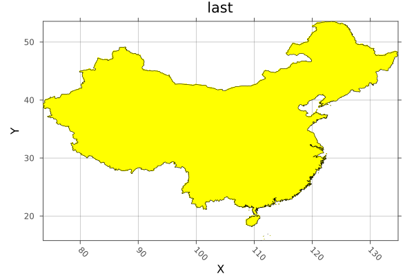


WARNING: This feature is experimental. It may change in future versions, and may not be 100% reliable in all cases. Please file github issues if problems occur.


<Badge type="info" class="source-link" text="source"><a href="https://github.com/rafaqz/Rasters.jl/blob/e21dbeaa6368c96cbd80ad39da2f44ca66031437/src/methods/rasterize.jl#L343-L400" target="_blank" rel="noreferrer">source</a></Badge>

</details>

<details class='jldocstring custom-block' open>
<summary><a id='Rasters.rasterize!' href='#Rasters.rasterize!'><span class="jlbinding">Rasters.rasterize!</span></a> <Badge type="info" class="jlObjectType jlFunction" text="Function" /></summary>


```julia
rasterize!([reducer], dest, data; kw...)
```


Rasterize the geometries in `data` into the [`Raster`](/api#Rasters.Raster) or [`RasterStack`](/api#Rasters.RasterStack) `dest`, using the values specified by `fill`.

**Arguments**
- `dest`: a `Raster` or `RasterStack` to rasterize into.
  
- `reducer`: a reducing function to reduce the fill value for all geometries that   cover or touch a pixel down to a single value. The default is `last`.   Any  that takes an iterable and returns a single value will work, including   custom functions. However, there are optimisations for built-in methods   including `sum`, `first`, `last`, `minimum`, `maximum`, `extrema` and `Statistics.mean`.   These may be an order of magnitude or more faster than   `count` is a special-cased as it does not need a fill value.
  
- `data`: a GeoInterface.jl `AbstractGeometry`, a nested `Vector` of `AbstractGeometry`,   or a Tables.jl compatible object containing a `:geometry` column or points and values columns,   in which case `geometrycolumn` must be specified.
  

**Keywords**

These are detected automatically from `A` and `data` where possible.
- `fill`: the value or values to fill a polygon with. A `Symbol` or tuple of `Symbol` will   be used to retrieve properties from features or column values from table rows. An array   or other iterable will be used for each geometry, in order. `fill` can also be a function of    the current value, e.g. `x -> x + 1`.
  
- `op`: A reducing function that accepts two values and returns one, like `min` to `minimum`.   For common methods this will be assigned for you, or is not required. But you can use it   instead of a `reducer` as it will usually be faster.
  
- `to`: a `Raster`, `RasterStack`, `Tuple` of `Dimension` or `Extents.Extent`.   If no `to` object is provided the extent will be calculated from the geometries,   Additionally, when no `to` object or an `Extent` is passed for `to`, the `size`   or `res` keyword must also be used.
  
- `res`: the resolution of the dimensions (often in meters or degrees), a `Real` or `Tuple{<:Real,<:Real}`.   Only required when `to` is not used or is an `Extents.Extent`, and `size` is not used.
  
- `size`: the size of the output array, as a `Tuple{Int,Int}` or single `Int` for a square.   Only required when `to` is not used or is an `Extents.Extent`, and `res` is not used.
  
- `crs`: a `crs` which will be attached to the resulting raster when `to` not passed  or is an `Extent`. Otherwise the crs from `to` is used.
  
- `boundary`: for polygons, include pixels where the `:center` is inside the polygon,   where the polygon `:touches` the pixel, or that are completely `:inside` the polygon.   The default is `:center`.
  
- `shape`: Force `data` to be treated as `:polygon`, `:line` or `:point` geometries.   using points or lines as polygons may have unexpected results.
  
- `geometrycolumn`: `Symbol` to manually select the column the geometries are in   when `data` is a Tables.jl compatible table, or a tuple of `Symbol` for columns of   point coordinates.
  
- `progress`: show a progress bar, `true` by default, `false` to hide.
  
- `vebose`: whether to print messages about potential problems. `true` by default.
  
- `threaded`: run operations in parallel, `false` by default. In some circumstances `threaded`    can give large speedups over single-threaded operation. This can be true for complicated    geometries written into low-resolution rasters, but may not be for simple geometries with    high-resolution rasters. With very large rasters threading may be counter productive due    to excessive memory use. Caution should also be used: `threaded` should not be used in in-place    functions writing to `BitArray` or other arrays where race conditions can occur. 
  
- `threadsafe`: specify that custom `reducer` and/or `op` functions are thread-safe,    in that the order of operation or blocking does not matter. For example,    `sum` and `maximum` are thread-safe, because the answer is approximately (besides   floating point error) the same after running on nested blocks, or on all the data.   In contrast, `median` or `last` are not, because the blocking (`median`) or order (`last`)    matters.
  
- `to`: a `Raster`, `RasterStack`, `Tuple` of `Dimension` or `Extents.Extent`.   If no `to` object is provided the extent will be calculated from the geometries,   Additionally, when no `to` object or an `Extent` is passed for `to`, the `size`   or `res` keyword must also be used.
  
- `res`: the resolution of the dimensions (often in meters or degrees), a `Real` or `Tuple{<:Real,<:Real}`.   Only required when `to` is not used or is an `Extents.Extent`, and `size` is not used.
  
- `size`: the size of the output array, as a `Tuple{Int,Int}` or single `Int` for a square.   Only required when `to` is not used or is an `Extents.Extent`, and `res` is not used.
  
- `crs`: a `crs` which will be attached to the resulting raster when `to` not passed  or is an `Extent`. Otherwise the crs from `to` is used.
  
- `boundary`: for polygons, include pixels where the `:center` is inside the polygon,   where the polygon `:touches` the pixel, or that are completely `:inside` the polygon.   The default is `:center`.
  
- `shape`: Force `data` to be treated as `:polygon`, `:line` or `:point` geometries.   using points or lines as polygons may have unexpected results.
  

**Example**

```julia
using Rasters, RasterDataSources, ArchGDAL, Plots, Dates, Shapefile, GeoInterface, Downloads
using Rasters.Lookups

# Download a borders shapefile
shapefile_url = "https://github.com/nvkelso/natural-earth-vector/raw/master/10m_cultural/ne_10m_admin_0_countries.shp"
shapefile_name = "country_borders.shp"
isfile(shapefile_name) || Downloads.download(shapefile_url, shapefile_name)

# Load the shapes for indonesia
indonesia_border = Shapefile.Handle(shapefile_name).shapes[1]

# Make an empty EPSG 4326 projected Raster of the area of Indonesia
dimz = X(Projected(90.0:0.1:145; sampling=Intervals(), crs=EPSG(4326))),
       Y(Projected(-15.0:0.1:10.9; sampling=Intervals(), crs=EPSG(4326)))

A = zeros(UInt32, dimz; missingval=UInt32(0))

# Rasterize each indonesian island with a different number. The islands are
# rings of a multi-polygon, so we use `GI.getring` to get them all separately.
islands = collect(GeoInterface.getring(indonesia_border))
rasterize!(last, A, islands; fill=1:length(islands), progress=false)

# And plot
p = plot(Rasters.trim(A); color=:spring)
plot!(p, indonesia_border; fillalpha=0, linewidth=0.7)

savefig("build/indonesia_rasterized.png"); nothing

# output

```


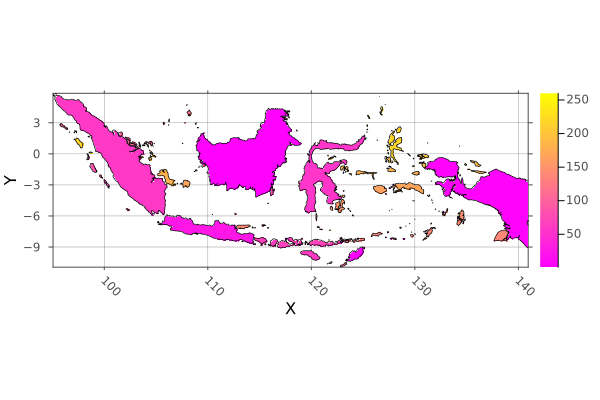


WARNING: This feature is experimental. It may change in future versions, and may not be 100% reliable in all cases. Please file github issues if problems occur.


<Badge type="info" class="source-link" text="source"><a href="https://github.com/rafaqz/Rasters.jl/blob/e21dbeaa6368c96cbd80ad39da2f44ca66031437/src/methods/rasterize.jl#L482-L538" target="_blank" rel="noreferrer">source</a></Badge>

</details>

<details class='jldocstring custom-block' open>
<summary><a id='Rasters.replace_missing-Tuple{Any}' href='#Rasters.replace_missing-Tuple{Any}'><span class="jlbinding">Rasters.replace_missing</span></a> <Badge type="info" class="jlObjectType jlMethod" text="Method" /></summary>


```julia
replace_missing(a::AbstractRaster, newmissingval)
replace_missing(a::AbstractRasterStack, newmissingval)
```


Replace missing values in the array or stack with a new missing value, also updating the `missingval` field/s.

**Keywords**
- `filename`: a filename to write to directly, useful for large files.
  
- `suffix`: a string or value to append to the filename.   A tuple of `suffix` will be applied to stack layers. `keys(stack)` are the default.
  

**Example**

```julia
using Rasters, RasterDataSources, ArchGDAL
A = Raster(WorldClim{Climate}, :prec; month=1) |> replace_missing
missingval(A)
# output
missing
```


<Badge type="info" class="source-link" text="source"><a href="https://github.com/rafaqz/Rasters.jl/blob/e21dbeaa6368c96cbd80ad39da2f44ca66031437/src/methods/replace_missing.jl#L1-L23" target="_blank" rel="noreferrer">source</a></Badge>

</details>

<details class='jldocstring custom-block' open>
<summary><a id='Rasters.reproject-NTuple{4, Any}' href='#Rasters.reproject-NTuple{4, Any}'><span class="jlbinding">Rasters.reproject</span></a> <Badge type="info" class="jlObjectType jlMethod" text="Method" /></summary>


```julia
reproject(source::GeoFormat, target::GeoFormat, dim::Dimension, val)
```


`reproject` uses ArchGDAL.reproject, but implemented for a reprojecting a value array of values, a single dimension at a time.


<Badge type="info" class="source-link" text="source"><a href="https://github.com/rafaqz/Rasters.jl/blob/e21dbeaa6368c96cbd80ad39da2f44ca66031437/src/methods/reproject.jl#L42-L47" target="_blank" rel="noreferrer">source</a></Badge>

</details>

<details class='jldocstring custom-block' open>
<summary><a id='Rasters.reproject-Tuple{Any}' href='#Rasters.reproject-Tuple{Any}'><span class="jlbinding">Rasters.reproject</span></a> <Badge type="info" class="jlObjectType jlMethod" text="Method" /></summary>


```julia
reproject(obj; crs)
```


Reproject the lookups of `obj` to a different crs. 

This is a lossless operation for the raster data, as only the  lookup values change. This is only possible when the axes of source and destination projections are aligned: the change is usually from a [`Regular`](https://rafaqz.github.io/DimensionalData.jl/stable/api/reference#DimensionalData.Lookups.Regular) and an [`Irregular`](https://rafaqz.github.io/DimensionalData.jl/stable/api/reference#DimensionalData.Lookups.Irregular) lookup spans.

For converting between projections that are rotated,  skewed or warped in any way, use [`resample`](/api#Rasters.resample-Tuple).

Dimensions without an `AbstractProjected` lookup (such as a `Ti` dimension) are silently returned without modification.

**Arguments**
- `obj`: a `Lookup`, `Dimension`, `Tuple` of `Dimension`, `Raster` or `RasterStack`.
  
- `crs`: a `crs` which will be attached to the resulting raster when `to` not passed  or is an `Extent`. Otherwise the crs from `to` is used.
  


<Badge type="info" class="source-link" text="source"><a href="https://github.com/rafaqz/Rasters.jl/blob/e21dbeaa6368c96cbd80ad39da2f44ca66031437/src/methods/reproject.jl#L1-L21" target="_blank" rel="noreferrer">source</a></Badge>

</details>

<details class='jldocstring custom-block' open>
<summary><a id='Rasters.resample-Tuple' href='#Rasters.resample-Tuple'><span class="jlbinding">Rasters.resample</span></a> <Badge type="info" class="jlObjectType jlMethod" text="Method" /></summary>


```julia
resample(x; kw...)
resample(xs...; to=first(xs), kw...)
```


`resample` uses `warp` (which uses GDALs `gdalwarp`) to resample a [`Raster`](/api#Rasters.Raster) or [`RasterStack`](/api#Rasters.RasterStack) to a new `resolution` and optionally new `crs`, or to snap to the bounds, resolution and crs of the object `to`.

Dimensions without an `AbstractProjected` lookup (such as a `Ti` dimension) are iteratively resampled with GDAL and joined back into a single array.

If projections can be converted for each axis independently, it may be faster and more accurate to use [`reproject`](/api#Rasters.reproject-NTuple{4,%20Any}).

Run `using ArchGDAL` to make this method available.

**Arguments**
- `x`: the object/s to resample.
  

**Keywords**
- `to`: a `Raster`, `RasterStack`, `Tuple` of `Dimension` or `Extents.Extent`.   If no `to` object is provided the extent will be calculated from `x`,
  
- `res`: the resolution of the dimensions (often in meters or degrees), a `Real` or `Tuple{<:Real,<:Real}`.   Only required when `to` is not used or is an `Extents.Extent`, and `size` is not used.
  
- `size`: the size of the output array, as a `Tuple{Int,Int}` or single `Int` for a square.   Only required when `to` is not used or is an `Extents.Extent`, and `res` is not used.
  
- `crs`: a `crs` which will be attached to the resulting raster when `to` not passed  or is an `Extent`. Otherwise the crs from `to` is used.
  
- `method`: A `Symbol` or `String` specifying the method to use for resampling.   From the docs for [`gdalwarp`](https://gdal.org/programs/gdalwarp.html#cmdoption-gdalwarp-r):
  - `:near`: nearest neighbour resampling (default, fastest algorithm, worst interpolation quality).
    
  - `:bilinear`: bilinear resampling.
    
  - `:cubic`: cubic resampling.
    
  - `:cubicspline`: cubic spline resampling.
    
  - `:lanczos`: Lanczos windowed sinc resampling.
    
  - `:average`: average resampling, computes the weighted average of all non-NODATA contributing pixels.   rms root mean square / quadratic mean of all non-NODATA contributing pixels (GDAL &gt;= 3.3)
    
  - `:mode`: mode resampling, selects the value which appears most often of all the sampled points.
    
  - `:max`: maximum resampling, selects the maximum value from all non-NODATA contributing pixels.
    
  - `:min`: minimum resampling, selects the minimum value from all non-NODATA contributing pixels.
    
  - `:med`: median resampling, selects the median value of all non-NODATA contributing pixels.
    
  - `:q1`: first quartile resampling, selects the first quartile value of all non-NODATA contributing pixels.
    
  - `:q3`: third quartile resampling, selects the third quartile value of all non-NODATA contributing pixels.
    
  - `:sum`: compute the weighted sum of all non-NODATA contributing pixels (since GDAL 3.1)
    
  Where NODATA values are set to `missingval`.
  
- `filename`: a filename to write to directly, useful for large files.
  
- `suffix`: a string or value to append to the filename.   A tuple of `suffix` will be applied to stack layers. `keys(stack)` are the default.
  

Note:
- GDAL may cause some unexpected changes in the raster, such as changing the `crs`   type from `EPSG` to `WellKnownText` (it will represent the same CRS).
  

**Example**

Resample a WorldClim layer to match an EarthEnv layer:

```julia
using Rasters, RasterDataSources, ArchGDAL, Plots
A = Raster(WorldClim{Climate}, :prec; month=1)
B = Raster(EarthEnv{HabitatHeterogeneity}, :evenness)

a = plot(A)
b = plot(resample(A; to=B))

savefig(a, "build/resample_example_before.png");
savefig(b, "build/resample_example_after.png"); nothing

# output
```


**Before `resample`:**


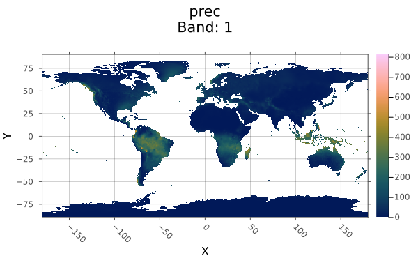


**After `resample`:**


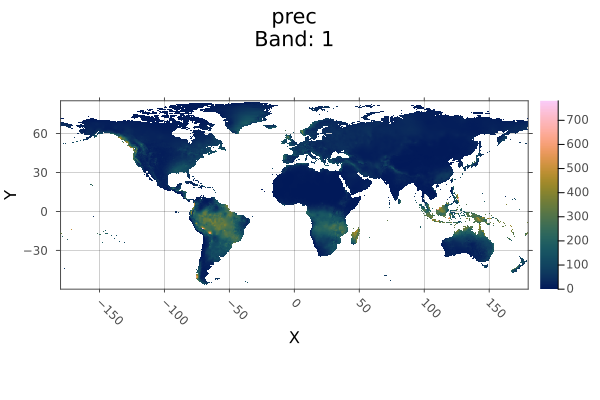


WARNING: This feature is experimental. It may change in future versions, and may not be 100% reliable in all cases. Please file github issues if problems occur.


<Badge type="info" class="source-link" text="source"><a href="https://github.com/rafaqz/Rasters.jl/blob/e21dbeaa6368c96cbd80ad39da2f44ca66031437/src/extensions.jl#L17-L96" target="_blank" rel="noreferrer">source</a></Badge>

</details>

<details class='jldocstring custom-block' open>
<summary><a id='Rasters.setcrs-Tuple{Union{AbstractRaster, AbstractRasterStack}, Any}' href='#Rasters.setcrs-Tuple{Union{AbstractRaster, AbstractRasterStack}, Any}'><span class="jlbinding">Rasters.setcrs</span></a> <Badge type="info" class="jlObjectType jlMethod" text="Method" /></summary>


```julia
setcrs(x, crs)
```


Set the crs of a `Raster`, `RasterStack`, `Tuple` of `Dimension`, or a `Dimension`. The `crs` is expected to be a GeoFormatTypes.jl `CRS` or `Mixed` `GeoFormat` type


<Badge type="info" class="source-link" text="source"><a href="https://github.com/rafaqz/Rasters.jl/blob/e21dbeaa6368c96cbd80ad39da2f44ca66031437/src/crs.jl#L47-L52" target="_blank" rel="noreferrer">source</a></Badge>

</details>

<details class='jldocstring custom-block' open>
<summary><a id='Rasters.setmappedcrs-Tuple{Union{AbstractRaster, AbstractRasterStack}, Any}' href='#Rasters.setmappedcrs-Tuple{Union{AbstractRaster, AbstractRasterStack}, Any}'><span class="jlbinding">Rasters.setmappedcrs</span></a> <Badge type="info" class="jlObjectType jlMethod" text="Method" /></summary>


```julia
setmappedcrs(x, crs)
```


Set the mapped crs of a `Raster`, a `RasterStack`, a `Tuple` of `Dimension`, or a `Dimension`. The `crs` is expected to be a GeoFormatTypes.jl `CRS` or `Mixed` `GeoFormat` type


<Badge type="info" class="source-link" text="source"><a href="https://github.com/rafaqz/Rasters.jl/blob/e21dbeaa6368c96cbd80ad39da2f44ca66031437/src/crs.jl#L64-L70" target="_blank" rel="noreferrer">source</a></Badge>

</details>

<details class='jldocstring custom-block' open>
<summary><a id='Rasters.slice-Tuple{Union{AbstractRaster, AbstractRasterStack}, Any}' href='#Rasters.slice-Tuple{Union{AbstractRaster, AbstractRasterStack}, Any}'><span class="jlbinding">Rasters.slice</span></a> <Badge type="info" class="jlObjectType jlMethod" text="Method" /></summary>


```julia
slice(A::Union{AbstractRaster,AbstractRasterStack,AbstracRasterSeries}, dims) => RasterSeries
```


Slice views along some dimension/s to obtain a `RasterSeries` of the slices.

For a `Raster` or `RasterStack` this will return a `RasterSeries` of `Raster` or `RasterStack` that are slices along the specified dimensions.

For a `RasterSeries`, the output is another series where the child objects are sliced and the series dimensions index is now of the child dimensions combined. `slice` on a `RasterSeries` with no dimensions will slice along the dimensions shared by both the series and child object.

WARNING: This feature is experimental. It may change in future versions, and may not be 100% reliable in all cases. Please file github issues if problems occur.


<Badge type="info" class="source-link" text="source"><a href="https://github.com/rafaqz/Rasters.jl/blob/e21dbeaa6368c96cbd80ad39da2f44ca66031437/src/methods/slice_combine.jl#L1-L14" target="_blank" rel="noreferrer">source</a></Badge>

</details>

<details class='jldocstring custom-block' open>
<summary><a id='Rasters.trim-Tuple{Union{AbstractRaster, AbstractRasterStack}}' href='#Rasters.trim-Tuple{Union{AbstractRaster, AbstractRasterStack}}'><span class="jlbinding">Rasters.trim</span></a> <Badge type="info" class="jlObjectType jlMethod" text="Method" /></summary>


```julia
trim(x; dims::Tuple, pad::Int)
```


Trim `missingval(x)` from `x` for axes in `dims`, returning a view of `x`.

**Arguments**
- `x`: A `Raster` or `RasterStack`. For stacks, all layers must having   missing values for a pixel for it to be trimmed.
  

**Keywords**
- `dims`: By default `dims=(XDim, YDim)`, so that trimming keeps the area    of `X` and `Y` that contains non-missing values along all other dimensions.
  
- `pad`: The trimmed size will be padded by `pad` on all sides, although   padding will not be added beyond the original extent of the array.
  

As `trim` is lazy, `filename` and `suffix` keywords are not used.

**Example**

Create trimmed layers of Australian habitat heterogeneity.

```julia
using Rasters, RasterDataSources, Plots
layers = (:evenness, :range, :contrast, :correlation)
st = RasterStack(EarthEnv{HabitatHeterogeneity}, layers)

# Roughly cut out australia
ausbounds = X(100 .. 160), Y(-50 .. -10)
aus = st[ausbounds...]
a = plot(aus)

# Trim missing values and plot
b = plot(trim(aus))

savefig(a, "build/trim_example_before.png");
savefig(b, "build/trim_example_after.png"); nothing

# output

```


**Before `trim`:**


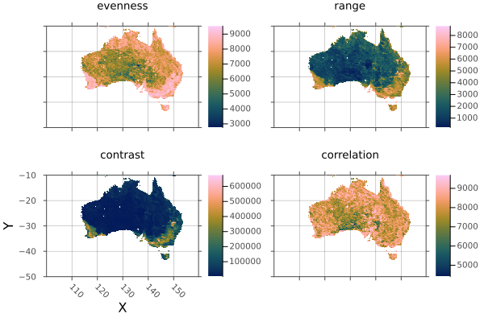


**After `trim`:**


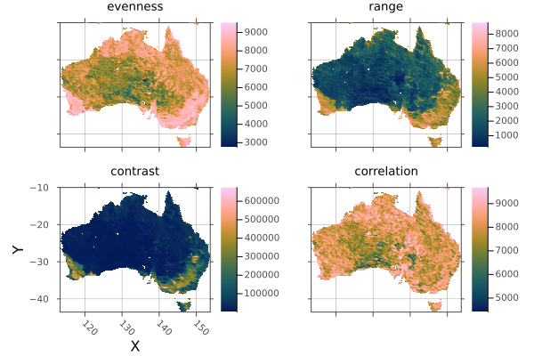


WARNING: This feature is experimental. It may change in future versions, and may not be 100% reliable in all cases. Please file github issues if problems occur.


<Badge type="info" class="source-link" text="source"><a href="https://github.com/rafaqz/Rasters.jl/blob/e21dbeaa6368c96cbd80ad39da2f44ca66031437/src/methods/trim.jl#L1-L53" target="_blank" rel="noreferrer">source</a></Badge>

</details>

<details class='jldocstring custom-block' open>
<summary><a id='Rasters.warp-Tuple' href='#Rasters.warp-Tuple'><span class="jlbinding">Rasters.warp</span></a> <Badge type="info" class="jlObjectType jlMethod" text="Method" /></summary>


```julia
warp(A::AbstractRaster, flags::Dict; kw...)
```


Gives access to the GDALs `gdalwarp` method given a `Dict` of `flag => value` arguments that can be converted to strings, or vectors where multiple space-separated arguments are required.

Arrays with additional dimensions not handled by GDAL (other than `X`, `Y`, `Band`) are sliced, warped, and then combined to match the original array dimensions. These slices will _not_ be written to disk and loaded lazily at this stage - you will need to do that manually if required.

See [the gdalwarp docs](https://gdal.org/programs/gdalwarp.html) for a list of arguments.

Run `using ArchGDAL` to make this method available.

**Keywords**
- `missingval`: value representing missing data, normally detected from the file and    automatically converted to `missing`. Setting to an alternate value, such as `0`    or `NaN` may be desirable for improved perfomance. `nothing` specifies no missing value.    Using the same `missingval` the file already has removes the overhead of replacing it,   this can be done by passing the `missingval` function as `missingval`.    If the file has an incorrect value, we can manually define the transformation   as a pair like `correct_value => missing` or `correct_value => NaN`.   `correct_value => correct_value` will keep remove the overhead of changing it.    Note: When `raw=true` is set, `missingval` is not changed from the value specified   in the file.
  
- `filename`: a filename to write to directly, useful for large files.
  
- `suffix`: a string or value to append to the filename.   A tuple of `suffix` will be applied to stack layers. `keys(stack)` are the default.
  
- `missingval`: the missing value to use during warping, will default to   `Rasters.missingval(A). Passing a pair will specify the missing value    to use after warping.
  

Any additional keywords are passed to `ArchGDAL.Dataset`.

**Example**

This simply resamples the array with the `:tr` (output file resolution) and `:r` flags, giving us a pixelated version:

```julia
using Rasters, ArchGDAL, RasterDataSources, Plots
A = Raster(WorldClim{Climate}, :prec; month=1)
a = plot(A)

flags = Dict(
    :tr => [2.0, 2.0],
    :r => :near,
)
b = plot(warp(A, flags))

savefig(a, "build/warp_example_before.png");
savefig(b, "build/warp_example_after.png"); nothing

# output

```


**Before `warp`:**


**After `warp`:**


In practise, prefer [`resample`](/api#Rasters.resample-Tuple) for this. But `warp` may be more flexible.

WARNING: This feature is experimental. It may change in future versions, and may not be 100% reliable in all cases. Please file github issues if problems occur.


<Badge type="info" class="source-link" text="source"><a href="https://github.com/rafaqz/Rasters.jl/blob/e21dbeaa6368c96cbd80ad39da2f44ca66031437/src/extensions.jl#L99-L160" target="_blank" rel="noreferrer">source</a></Badge>

</details>

<details class='jldocstring custom-block' open>
<summary><a id='Rasters.zonal-Tuple{Any, RasterStack}' href='#Rasters.zonal-Tuple{Any, RasterStack}'><span class="jlbinding">Rasters.zonal</span></a> <Badge type="info" class="jlObjectType jlMethod" text="Method" /></summary>


```julia
zonal(f, x::Union{Raster,RasterStack}; of, kw...)
```


Calculate zonal statistics for the the zone of a `Raster` or `RasterStack` covered by the `of` object/s.

**Arguments**
- `f`: any function that reduces an iterable to a single value, such as `sum` or `Statistics.mean`
  
- `x`: A `Raster` or `RasterStack`
  
- `of`: A `DimTuple`, `Extent`, a [`Raster`](/api#Rasters.Raster) or one or multiple geometries. Geometries can be   a GeoInterface.jl `AbstractGeometry`, a nested `Vector` of `AbstractGeometry`,   or a Tables.jl compatible object containing a `:geometry` column or points and values columns,   in which case `geometrycolumn` must be specified.
  

**Keywords**
- `geometrycolumn`: `Symbol` to manually select the column the geometries are in   when `data` is a Tables.jl compatible table, or a tuple of `Symbol` for columns of   point coordinates.
  

These can be used when `of` is or contains (a) GeoInterface.jl compatible object(s):
- `shape`: Force `data` to be treated as `:polygon`, `:line` or `:point`, where possible.
  
- `boundary`: for polygons, include pixels where the `:center` is inside the polygon,   where the line `:touches` the pixel, or that are completely `:inside` inside the polygon.   The default is `:center`.
  
- `progress`: show a progress bar, `true` by default, `false` to hide..
  
- `skipmissing`: wether to apply `f` to the result of `skipmissing(A)` or not. If `true`   `f` will be passed an iterator over the values, which loses all spatial information.   if `false` `f` will be passes a masked `Raster` or `RasterStack`, and will be responsible   for handling missing values itself. The default value is `true`.
  

**Example**

```julia
using Rasters, RasterDataSources, ArchGDAL, DataFrames, Statistics, Dates, NaturalEarth
# Download borders
countries = naturalearth("admin_0_countries", 10) |> DataFrame
# Download and read a raster stack from WorldClim
st = RasterStack(WorldClim{Climate}; month=Jan)
# Calculate the january mean of all climate variables for all countries
january_stats = zonal(mean, st; of=countries, boundary=:touches, progress=false) |> DataFrame
# Add the country name column (natural earth has some string errors it seems)
insertcols!(january_stats, 1, :country => first.(split.(countries.ADMIN, r"[^A-Za-z ]")))
# output
258×8 DataFrame
 Row │ country                       tmin       tmax       tavg       prec     ⋯
     │ SubStrin…                     Float32    Float32    Float32    Float64  ⋯
─────┼──────────────────────────────────────────────────────────────────────────
   1 │ Indonesia                      21.5447    29.1865    25.3656   271.063  ⋯
   2 │ Malaysia                       21.3087    28.4291    24.8688   273.381
   3 │ Chile                           7.24534   17.9262    12.5858    78.1287
   4 │ Bolivia                        17.2065    27.7454    22.4758   192.542
   5 │ Peru                           15.0273    25.5504    20.2889   180.007  ⋯
   6 │ Argentina                      13.6751    27.6716    20.6732    67.1837
   7 │ Dhekelia Sovereign Base Area    5.87126   15.8991    10.8868    76.25
   8 │ Cyprus                          5.65921   14.6665    10.1622    97.4474
  ⋮  │              ⋮                    ⋮          ⋮          ⋮         ⋮     ⋱
 252 │ Spratly Islands                25.0       29.2       27.05      70.5    ⋯
 253 │ Clipperton Island              21.5       33.2727    27.4        6.0
 254 │ Macao S                        11.6694    17.7288    14.6988    28.0
 255 │ Ashmore and Cartier Islands   NaN        NaN        NaN        NaN
 256 │ Bajo Nuevo Bank               NaN        NaN        NaN        NaN      ⋯
 257 │ Serranilla Bank               NaN        NaN        NaN        NaN
 258 │ Scarborough Reef              NaN        NaN        NaN        NaN
                                                  3 columns and 243 rows omitted
```


<Badge type="info" class="source-link" text="source"><a href="https://github.com/rafaqz/Rasters.jl/blob/e21dbeaa6368c96cbd80ad39da2f44ca66031437/src/methods/zonal.jl#L1-L62" target="_blank" rel="noreferrer">source</a></Badge>

</details>


## Reference - Internal functions {#Reference-Internal-functions}
<details class='jldocstring custom-block' open>
<summary><a id='Rasters.AbstractProjected' href='#Rasters.AbstractProjected'><span class="jlbinding">Rasters.AbstractProjected</span></a> <Badge type="info" class="jlObjectType jlType" text="Type" /></summary>


```julia
AbstractProjected <: AbstractSampled
```


Abstract supertype for projected index lookups.


<Badge type="info" class="source-link" text="source"><a href="https://github.com/rafaqz/Rasters.jl/blob/e21dbeaa6368c96cbd80ad39da2f44ca66031437/src/lookup.jl#L1-L5" target="_blank" rel="noreferrer">source</a></Badge>

</details>

<details class='jldocstring custom-block' open>
<summary><a id='Rasters.FileArray' href='#Rasters.FileArray'><span class="jlbinding">Rasters.FileArray</span></a> <Badge type="info" class="jlObjectType jlType" text="Type" /></summary>


```julia
FileArray{S} <: DiskArrays.AbstractDiskArray
```


Filearray is a DiskArrays.jl `AbstractDiskArray`. Instead of holding an open object, it just holds a filename string that is opened lazily when it needs to be read.


<Badge type="info" class="source-link" text="source"><a href="https://github.com/rafaqz/Rasters.jl/blob/e21dbeaa6368c96cbd80ad39da2f44ca66031437/src/filearray.jl#L1-L7" target="_blank" rel="noreferrer">source</a></Badge>

</details>

<details class='jldocstring custom-block' open>
<summary><a id='Rasters.FileStack' href='#Rasters.FileStack'><span class="jlbinding">Rasters.FileStack</span></a> <Badge type="info" class="jlObjectType jlType" text="Type" /></summary>


```julia
FileStack{S,Na}

FileStack{S,Na}(filename, types, sizes, eachchunk, haschunks, write)
```


A wrapper object that holds a filepath string and size/chunking metadata for a multi-layered stack stored in a single file.  such as zarr or netcdf.

`S` is a backend type like `NCDsource`, and `Na` is a tuple of `Symbol` keys.


<Badge type="info" class="source-link" text="source"><a href="https://github.com/rafaqz/Rasters.jl/blob/e21dbeaa6368c96cbd80ad39da2f44ca66031437/src/filestack.jl#L1-L11" target="_blank" rel="noreferrer">source</a></Badge>

</details>

<details class='jldocstring custom-block' open>
<summary><a id='Rasters.OpenStack' href='#Rasters.OpenStack'><span class="jlbinding">Rasters.OpenStack</span></a> <Badge type="info" class="jlObjectType jlType" text="Type" /></summary>


```julia
OpenStack{X,K}

OpenStack{X,K}(dataset)
```


A wrapper for any stack-like opened dataset that can be indexed with `Symbol` keys to retrieve `AbstractArray` layers.

`OpenStack` is usually hidden from users, wrapped in a regular `RasterStack` passed as the function argument in `open(stack)` when the stack is contained in a single file.

`X` is a backend type like `NCDsource`, and `K` is a tuple of `Symbol` keys.


<Badge type="info" class="source-link" text="source"><a href="https://github.com/rafaqz/Rasters.jl/blob/e21dbeaa6368c96cbd80ad39da2f44ca66031437/src/openstack.jl#L1-L14" target="_blank" rel="noreferrer">source</a></Badge>

</details>

<details class='jldocstring custom-block' open>
<summary><a id='Rasters.RasterDiskArray' href='#Rasters.RasterDiskArray'><span class="jlbinding">Rasters.RasterDiskArray</span></a> <Badge type="info" class="jlObjectType jlType" text="Type" /></summary>


```julia
RasterDiskArray <: DiskArrays.AbstractDiskArray
```


A basic DiskArrays.jl wrapper for objects that don&#39;t have one defined yet. When we `open` a `FileArray` it is replaced with a `RasterDiskArray`.


<Badge type="info" class="source-link" text="source"><a href="https://github.com/rafaqz/Rasters.jl/blob/e21dbeaa6368c96cbd80ad39da2f44ca66031437/src/filearray.jl#L88-L93" target="_blank" rel="noreferrer">source</a></Badge>

</details>

<details class='jldocstring custom-block' open>
<summary><a id='Rasters.Source' href='#Rasters.Source'><span class="jlbinding">Rasters.Source</span></a> <Badge type="info" class="jlObjectType jlType" text="Type" /></summary>


```julia
Source
```


Abstract type for all sources.  This is used to dispatch on the source backend to use for reading a file.  The source is determined by the file extension, or by the source keyword argument.


<Badge type="info" class="source-link" text="source"><a href="https://github.com/rafaqz/Rasters.jl/blob/e21dbeaa6368c96cbd80ad39da2f44ca66031437/src/sources/sources.jl#L2-L8" target="_blank" rel="noreferrer">source</a></Badge>

</details>

<details class='jldocstring custom-block' open>
<summary><a id='Base.open-Tuple{Function, AbstractRaster}' href='#Base.open-Tuple{Function, AbstractRaster}'><span class="jlbinding">Base.open</span></a> <Badge type="info" class="jlObjectType jlMethod" text="Method" /></summary>


```julia
open(f, A::AbstractRaster; write=false)
```


`open` is used to open any `lazy=true` `AbstractRaster` and do multiple operations on it in a safe way. The `write` keyword opens the file in write lookup so that it can be altered on disk using e.g. a broadcast.

`f` is a method that accepts a single argument - an `Raster` object which is just an `AbstractRaster` that holds an open disk-based object. Often it will be a `do` block:

`lazy=false` (in-memory) rasters will ignore `open` and pass themselves to `f`.

```julia
# A is an `Raster` wrapping the opened disk-based object.
open(Raster(filepath); write=true) do A
    mask!(A; with=maskfile)
    A[I...] .*= 2
    # ...  other things you need to do with the open file
end
```


By using a do block to open files we ensure they are always closed again after we finish working with them.


<Badge type="info" class="source-link" text="source"><a href="https://github.com/rafaqz/Rasters.jl/blob/e21dbeaa6368c96cbd80ad39da2f44ca66031437/src/array.jl#L124-L148" target="_blank" rel="noreferrer">source</a></Badge>

</details>

<details class='jldocstring custom-block' open>
<summary><a id='Base.read!-Tuple{AbstractRaster, AbstractArray}' href='#Base.read!-Tuple{AbstractRaster, AbstractArray}'><span class="jlbinding">Base.read!</span></a> <Badge type="info" class="jlObjectType jlMethod" text="Method" /></summary>


```julia
read!(src::Union{AbstractString,AbstractRaster}, dst::AbstractRaster)
read!(src::Union{AbstractString,AbstractRasterStack}, dst::AbstractRasterStack)
read!(scr::AbstractRasterSeries, dst::AbstractRasterSeries)
```


`read!` will copy the data from `src` to the object `dst`.

`src` can be an object or a file-path `String`.


<Badge type="info" class="source-link" text="source"><a href="https://github.com/rafaqz/Rasters.jl/blob/e21dbeaa6368c96cbd80ad39da2f44ca66031437/src/read.jl#L35-L43" target="_blank" rel="noreferrer">source</a></Badge>

</details>

<details class='jldocstring custom-block' open>
<summary><a id='Base.read-Tuple{Union{AbstractRaster, AbstractRasterSeries, AbstractRasterStack}}' href='#Base.read-Tuple{Union{AbstractRaster, AbstractRasterSeries, AbstractRasterStack}}'><span class="jlbinding">Base.read</span></a> <Badge type="info" class="jlObjectType jlMethod" text="Method" /></summary>


```julia
read(A::AbstractRaster)
read(A::AbstractRasterStack)
read(A::AbstractRasterSeries)
```


`read` will move a Rasters.jl object completely to memory.

**Keywords**
- `checkmemory`: if `true` (the default), check if there is enough memory for the operation.    `false` will ignore memory needs.
  


<Badge type="info" class="source-link" text="source"><a href="https://github.com/rafaqz/Rasters.jl/blob/e21dbeaa6368c96cbd80ad39da2f44ca66031437/src/read.jl#L1-L11" target="_blank" rel="noreferrer">source</a></Badge>

</details>

<details class='jldocstring custom-block' open>
<summary><a id='Base.skipmissing-Tuple{Raster}' href='#Base.skipmissing-Tuple{Raster}'><span class="jlbinding">Base.skipmissing</span></a> <Badge type="info" class="jlObjectType jlMethod" text="Method" /></summary>


```julia
skipmissing(itr::Raster)
```


Returns an iterable over the elements in a `Raster` object, skipping any values equal to either the `missingval` or `missing`.


<Badge type="info" class="source-link" text="source"><a href="https://github.com/rafaqz/Rasters.jl/blob/e21dbeaa6368c96cbd80ad39da2f44ca66031437/src/skipmissing.jl#L1-L5" target="_blank" rel="noreferrer">source</a></Badge>

</details>

<details class='jldocstring custom-block' open>
<summary><a id='Base.write-Tuple{AbstractString, AbstractRasterSeries}' href='#Base.write-Tuple{AbstractString, AbstractRasterSeries}'><span class="jlbinding">Base.write</span></a> <Badge type="info" class="jlObjectType jlMethod" text="Method" /></summary>


```julia
Base.write(filepath::AbstractString, s::AbstractRasterSeries; kw...)
```


Write any [`AbstractRasterSeries`](/api#Rasters.AbstractRasterSeries) to multiple files, guessing the backend from the file extension.

The lookup values of the series will be appended to the filepath (before the extension), separated by underscores.

All keywords are passed through to these `Raster` and `RasterStack` methods.

**Keywords**
- `chunks`: a `NTuple{N,Int}` specifying the chunk size for each dimension.    To specify only specific dimensions, a Tuple of `Dimension` wrapping `Int`    or a `NamedTuple` of `Int` can be used. Other dimensions will have a chunk   size of `1`. `true` can be used to mean: use the original    chunk size of the lazy `Raster` being written or X and Y of 256 by 256.   `false` means don&#39;t use chunks at all.
  
- `ext`: filename extension such as &quot;.tiff&quot; or &quot;.nc&quot;.    Used to specify specific files if only a directory path is used.
  
- `force`: `false` by default. If `true` it force writing to a file destructively, even if it already exists.
  
- `missingval`: value representing missing data, normally detected from the file and    automatically converted to `missing`. Setting to an alternate value, such as `0`    or `NaN` may be desirable for improved perfomance. `nothing` specifies no missing value.    Using the same `missingval` the file already has removes the overhead of replacing it,   this can be done by passing the `missingval` function as `missingval`.    If the file has an incorrect value, we can manually define the transformation   as a pair like `correct_value => missing` or `correct_value => NaN`.   `correct_value => correct_value` will keep remove the overhead of changing it.    Note: When `raw=true` is set, `missingval` is not changed from the value specified   in the file.
  For series with `RasterStack` child objects, this may be a `NamedTuple`, one for each layer.
  
- `source`: Usually automatically detected from filepath extension.    To manually force, a `Symbol` can be passed `:gdal`, `:netcdf`, `:grd`, `:grib`.   The internal [`Rasters.Source`](/api#Rasters.Source) objects, such as `Rasters.GDALsource()`,    `Rasters.GRIBsource()` or `Rasters.NCDsource()` can also be used.
  
- `vebose`: whether to print messages about potential problems. `true` by default.
  


<Badge type="info" class="source-link" text="source"><a href="https://github.com/rafaqz/Rasters.jl/blob/e21dbeaa6368c96cbd80ad39da2f44ca66031437/src/write.jl#L159-L179" target="_blank" rel="noreferrer">source</a></Badge>

</details>

<details class='jldocstring custom-block' open>
<summary><a id='Base.write-Tuple{AbstractString, AbstractRaster}' href='#Base.write-Tuple{AbstractString, AbstractRaster}'><span class="jlbinding">Base.write</span></a> <Badge type="info" class="jlObjectType jlMethod" text="Method" /></summary>


```julia
Base.write(filename::AbstractString, A::AbstractRaster; [source], kw...)
```


Write an [`AbstractRaster`](/api#Rasters.AbstractRaster) to file, guessing the backend from the file extension or using the `source` keyword.

**Keywords**
- `chunks`: a `NTuple{N,Int}` specifying the chunk size for each dimension.    To specify only specific dimensions, a Tuple of `Dimension` wrapping `Int`    or a `NamedTuple` of `Int` can be used. Other dimensions will have a chunk   size of `1`. `true` can be used to mean: use the original    chunk size of the lazy `Raster` being written or X and Y of 256 by 256.   `false` means don&#39;t use chunks at all.
  
- `force`: `false` by default. If `true` it force writing to a file destructively, even if it already exists.
  
- `missingval`: set the missing value (i.e. FillValue / nodataval) of the written raster,   as Julia&#39;s `missing` cannot be stored. If not passed in, an appropriate `missingval`    will be detected from the objects `missingval`, its `metadata`, or a default will be    chosen base on the array element type(s).
  
- `source`: Usually automatically detected from filepath extension.    To manually force, a `Symbol` can be passed `:gdal`, `:netcdf`, `:grd`, `:grib`.   The internal [`Rasters.Source`](/api#Rasters.Source) objects, such as `Rasters.GDALsource()`,    `Rasters.GRIBsource()` or `Rasters.NCDsource()` can also be used.
  

Other keyword arguments are passed to the `write` method for the backend.

**NetCDF keywords**
- `append`: If true, the variable of the current Raster will be appended   to `filename`, if it actually exists.
  
- `deflatelevel`: Compression level: `0` (default) means no compression and `9`   means maximum compression. Each chunk will be compressed individually.
  
- `shuffle`: If `true`, the shuffle filter is activated which can improve the   compression ratio.
  
- `checksum`: The checksum method can be `:fletcher32` or `:nochecksum`,   the default.
  
- `typename`: The name of the NetCDF type required for vlen arrays   (https://web.archive.org/save/https://www.unidata.ucar.edu/software/netcdf/netcdf-4/newdocs/netcdf-c/nc_005fdef_005fvlen.html)
  

**GDAL Keywords**
- `force`: `false` by default. If `true` it force writing to a file destructively, even if it already exists.
  
- `driver`: A GDAL driver name `String` or a GDAL driver retrieved via `ArchGDAL.getdriver(drivername)`.   By default `driver` is guessed from the filename extension.
  
- `options::Dict{String,String}`: A dictionary containing the dataset creation options passed to the driver.   For example: `Dict("COMPRESS" => "DEFLATE")`.
  

Valid `driver` names and the `options` for each can be found at: [https://gdal.org/drivers/raster/index.html](https://gdal.org/drivers/raster/index.html)

**Source comments**

**R grd/grid files**

Write a `Raster` to a .grd file with a .gri header file. Returns the base of `filename` with a `.grd` extension.

**GDAL (tiff, and everything else)**

Used if you `write` a `Raster` with a `filename` extension that no other backend can write. GDAL is the fallback, and writes a lot of file types, but is not guaranteed to work.

Returns `filename`.


<Badge type="info" class="source-link" text="source"><a href="https://github.com/rafaqz/Rasters.jl/blob/e21dbeaa6368c96cbd80ad39da2f44ca66031437/src/write.jl#L44-L60" target="_blank" rel="noreferrer">source</a></Badge>

</details>

<details class='jldocstring custom-block' open>
<summary><a id='Base.write-Tuple{String, Rasters.GRDsource, AbstractRaster}' href='#Base.write-Tuple{String, Rasters.GRDsource, AbstractRaster}'><span class="jlbinding">Base.write</span></a> <Badge type="info" class="jlObjectType jlMethod" text="Method" /></summary>


```julia
Base.write(filename::AbstractString, ::Type{GRDsource}, s::AbstractRaster; kw...)
```


Write a `Raster` to a .grd file with a .gri header file.

This method is called automatically if you `write` a `Raster`  with a `.grd` or `.gri` extension. 

**Keywords**
- `force`: `false` by default. If `true` it force writing to a file destructively, even if it already exists.
  

If this method is called directly the extension of `filename` will be ignored.

Returns the base of `filename` with a `.grd` extension.


<Badge type="info" class="source-link" text="source"><a href="https://github.com/rafaqz/Rasters.jl/blob/e21dbeaa6368c96cbd80ad39da2f44ca66031437/src/sources/grd.jl#L147-L162" target="_blank" rel="noreferrer">source</a></Badge>

</details>

<details class='jldocstring custom-block' open>
<summary><a id='Base.write-Union{Tuple{K}, Tuple{AbstractString, AbstractRasterStack{K}}} where K' href='#Base.write-Union{Tuple{K}, Tuple{AbstractString, AbstractRasterStack{K}}} where K'><span class="jlbinding">Base.write</span></a> <Badge type="info" class="jlObjectType jlMethod" text="Method" /></summary>


```julia
Base.write(filename::AbstractString, s::AbstractRasterStack; kw...)
```


Write any [`AbstractRasterStack`](/api#Rasters.AbstractRasterStack) to one or multiple files, depending on the backend. Backend is guessed from the filename extension or forced with the `source` keyword.

If the source can&#39;t be saved as a stack-like object, individual array layers will be saved.

**Keywords**
- `chunks`: a `NTuple{N,Int}` specifying the chunk size for each dimension.    To specify only specific dimensions, a Tuple of `Dimension` wrapping `Int`    or a `NamedTuple` of `Int` can be used. Other dimensions will have a chunk   size of `1`. `true` can be used to mean: use the original    chunk size of the lazy `Raster` being written or X and Y of 256 by 256.   `false` means don&#39;t use chunks at all.
  
- `ext`: filename extension such as &quot;.tiff&quot; or &quot;.nc&quot;.    Used to specify specific files if only a directory path is used.
  
- `force`: `false` by default. If `true` it force writing to a file destructively, even if it already exists.
  
- `missingval`: value representing missing data, normally detected from the file and    automatically converted to `missing`. Setting to an alternate value, such as `0`    or `NaN` may be desirable for improved perfomance. `nothing` specifies no missing value.    Using the same `missingval` the file already has removes the overhead of replacing it,   this can be done by passing the `missingval` function as `missingval`.    If the file has an incorrect value, we can manually define the transformation   as a pair like `correct_value => missing` or `correct_value => NaN`.   `correct_value => correct_value` will keep remove the overhead of changing it.    Note: When `raw=true` is set, `missingval` is not changed from the value specified   in the file.
  For `RasterStack` this may be a `NamedTuple`, one for each layer.
  
- `source`: Usually automatically detected from filepath extension.    To manually force, a `Symbol` can be passed `:gdal`, `:netcdf`, `:grd`, `:grib`.   The internal [`Rasters.Source`](/api#Rasters.Source) objects, such as `Rasters.GDALsource()`,    `Rasters.GRIBsource()` or `Rasters.NCDsource()` can also be used.
  
- `suffix`: a string or value to append to the filename.   A tuple of `suffix` will be applied to stack layers. `keys(stack)` are the default.
  
- `vebose`: whether to print messages about potential problems. `true` by default.
  

Other keyword arguments are passed to the `write` method for the backend.

**NetCDF keywords**
- `append`: If true, the variable of the current Raster will be appended   to `filename`, if it actually exists.
  
- `deflatelevel`: Compression level: `0` (default) means no compression and `9`   means maximum compression. Each chunk will be compressed individually.
  
- `shuffle`: If `true`, the shuffle filter is activated which can improve the   compression ratio.
  
- `checksum`: The checksum method can be `:fletcher32` or `:nochecksum`,   the default.
  
- `typename`: The name of the NetCDF type required for vlen arrays   (https://web.archive.org/save/https://www.unidata.ucar.edu/software/netcdf/netcdf-4/newdocs/netcdf-c/nc_005fdef_005fvlen.html)
  

**GDAL Keywords**
- `force`: `false` by default. If `true` it force writing to a file destructively, even if it already exists.
  
- `driver`: A GDAL driver name `String` or a GDAL driver retrieved via `ArchGDAL.getdriver(drivername)`.   By default `driver` is guessed from the filename extension.
  
- `options::Dict{String,String}`: A dictionary containing the dataset creation options passed to the driver.   For example: `Dict("COMPRESS" => "DEFLATE")`.
  

Valid `driver` names and the `options` for each can be found at: [https://gdal.org/drivers/raster/index.html](https://gdal.org/drivers/raster/index.html)

**Source comments**

**R grd/grid files**

Write a `Raster` to a .grd file with a .gri header file. Returns the base of `filename` with a `.grd` extension.

**GDAL (tiff, and everything else)**

Used if you `write` a `Raster` with a `filename` extension that no other backend can write. GDAL is the fallback, and writes a lot of file types, but is not guaranteed to work.


<Badge type="info" class="source-link" text="source"><a href="https://github.com/rafaqz/Rasters.jl/blob/e21dbeaa6368c96cbd80ad39da2f44ca66031437/src/write.jl#L78-L99" target="_blank" rel="noreferrer">source</a></Badge>

</details>

<details class='jldocstring custom-block' open>
<summary><a id='Rasters.checkmem!-Tuple{Bool}' href='#Rasters.checkmem!-Tuple{Bool}'><span class="jlbinding">Rasters.checkmem!</span></a> <Badge type="info" class="jlObjectType jlMethod" text="Method" /></summary>


```julia
checkmem!(x::Bool)
```


Set `checkmem` to `true` or `false`.

In some architectures memory reporting may be wrong and you may wish to disable memory checks.

This setting can be overridden with the `checkmem` keyword, where applicable.


<Badge type="info" class="source-link" text="source"><a href="https://github.com/rafaqz/Rasters.jl/blob/e21dbeaa6368c96cbd80ad39da2f44ca66031437/src/array.jl#L3-L12" target="_blank" rel="noreferrer">source</a></Badge>

</details>

<details class='jldocstring custom-block' open>
<summary><a id='Rasters.create' href='#Rasters.create'><span class="jlbinding">Rasters.create</span></a> <Badge type="info" class="jlObjectType jlFunction" text="Function" /></summary>


```julia
create([f!], [filename], template; kw...)
```


Create a new, uninitialised [`Raster`](/api#Rasters.Raster) or [`RasterStack`](/api#Rasters.RasterStack).

If `filename` is a `String` it will be created on disk, and opened lazily. If it is `nothing` or not passed, an in-memory `Raster` will be created.

If type is a `Type` return value is a `Raster`. The `eltype` will usually be `T`, except where `scale` and/or `offset` keywords are used or a `missingval` of a different type is specified,  in which case `T` will depend on the type promotion of `scale`, `offset` and `missingval` with `T`. If `missingval` is a `Pair` of `on_disk_missingval => user_facing_missingval`, the user facing value will effect `T`, not the internal on-disk value.

If types is a `NamedTuple` of types, the result will be a `RasterStack`. In this case `fill` and  `missingval` can be single values (for all layers) or `NamedTuple` with the same names to specify per-layer.

`f!` will be applied to the `Raster` or `RasterStack` while it is stil open after creation,  to avoid opening it twice. The return value of `f!` is disregarded but modifications to the `Raster` or the `RasterStack` layers will be written to disk or changed in memory.

**Arguments**
- `filename`: a String file path, which will create a file on disk and return it as   a lazy `Raster`, or `nothing` to create an in-memory `Raster`.
  
- `template`: a `Raster`, `Tuple` of `Dimension` or `Extents.Extent` to use as a template.   If an `Extent` is used, a `size` or `res` keyword must be passed.   If a `T` argument is not used, it is taken from the `template` eltype.
  
- `type`: the element type to use in the created array. A `NamedTuple` of types   will create a `RasterStack`
  

**Keywords**
- `name`: a `Symbol` name for a Raster, which will also retrieve the    a named layer if `Raster` is used on a multi-layered file like a NetCDF. 
  
- `refdims`: `Tuple of` position `Dimension`s the array was sliced from, defaulting to `()`.   Usually not needed.
  
- `metadata`: `Dict` or `Metadata` object for the array, or `NoMetadata()`.
  
- `missingval`: set the missing value (i.e. FillValue / nodataval) of the written raster,   as Julia&#39;s `missing` cannot be stored. If not passed in, an appropriate `missingval`    will be detected from the objects `missingval`, its `metadata`, or a default will be    chosen base on the array element type(s).
  
- `fill`: A value to fill the array with, before `scale` and `offset` are applied.    If there is no `fill`, raster values may remain undefined. They may be set to    `missingval` on disk, but this is not guaranteed. It us often more efficient to    use `fill` than to fill manually after `create`.
  
- `source`: Usually automatically detected from filepath extension.    To manually force, a `Symbol` can be passed `:gdal`, `:netcdf`, `:grd`, `:grib`.   The internal [`Rasters.Source`](/api#Rasters.Source) objects, such as `Rasters.GDALsource()`,    `Rasters.GRIBsource()` or `Rasters.NCDsource()` can also be used.
  
- `lazy`: A `Bool` specifying if to load data lazily from disk. For `create`   `lazy=true` is the default, as creating a disk-based file is normally associated   with it being larger than memory.
  
- `chunks`: a `NTuple{N,Int}` specifying the chunk size for each dimension.    To specify only specific dimensions, a Tuple of `Dimension` wrapping `Int`    or a `NamedTuple` of `Int` can be used. Other dimensions will have a chunk   size of `1`. `true` can be used to mean: use the original    chunk size of the lazy `Raster` being written or X and Y of 256 by 256.   `false` means don&#39;t use chunks at all.
  
- `scale`: set `scale` for `x * scale + offset` transformations. 
  
- `offset`: set `offset` for `x * scale + offset` transformations. 
  
- `coerce`: where `scale` and/or `offset` are present during `setindex!` to disk,    coerce values to the element type used on dist. `convert` is the default,    but `round`, `trunc` or or `ceil` or other functions with `f(::Type{T}, x)`   signature may be needed where the values are not exact.
  
- `vebose`: whether to print messages about potential problems. `true` by default.
  
- `res`: the resolution of the dimensions (often in meters or degrees), a `Real` or `Tuple{<:Real,<:Real}`.   Only required when `to` is not used or is an `Extents.Extent`, and `size` is not used.
  
- `size`: the size of the output array, as a `Tuple{Int,Int}` or single `Int` for a square.   Only required when `to` is not used or is an `Extents.Extent`, and `res` is not used.
  
- `crs`: a `crs` which will be attached to the resulting raster when `to` not passed  or is an `Extent`. Otherwise the crs from `to` is used.
  
- `chunks`: a `NTuple{N,Int}` specifying the chunk size for each dimension.    To specify only specific dimensions, a Tuple of `Dimension` wrapping `Int`    or a `NamedTuple` of `Int` can be used. Other dimensions will have a chunk   size of `1`. `true` can be used to mean: use the original    chunk size of the lazy `Raster` being written or X and Y of 256 by 256.   `false` means don&#39;t use chunks at all.
  
- `reverse_y`: often we want to write `Y` dimensions in reverse.   When building dimensions from an `Extents.Extent` and `size` or `res` we can do this by   using `reverse_y=true`. Using a negative value in `res` will acheive the same result.   With a template `Raster` or a `Tuple` of `Dimension`, the existing order is used.
  

**Example**

Here we create a UInt8 GeoTIFF and open it as a Raster, from -80 to 80 lattitude, and 0 to 120 longitude, with a resolution of 0.25 degrees.

We scale values from 0-1 over `UInt8` 0-200, and using `255`. Values that don&#39;t convert exactly will error (we could use `coerce=trunc` to fix that).

We use `UInt8(255)` as the `missingval` on disk, but mask it with `missing` in the loaded `Raster`.

We use standard lat/lon (EPSG:4326) as the crs, and force writing if the file exists.

```julia
using Rasters, NCDatasets, ArchGDAL, Extents, Dates
using Rasters.Lookups
rast = Rasters.create("created.tif", UInt8, Extents.Extent(X=(0, 120), Y=(-80, 80), Band=(0, 12));
    res=(X=10.0, Y=10.0, Band=1),
    # size=(X=100, Y=100, Band=12),
    name=:myraster,
    crs=EPSG(4326),
    force=true,
    fill=0x01,
    sampling=(X=Intervals(Start()), Y=Intervals(Start()), Band=Intervals(Start())),
) do A
    # While we have the newly created raster open, we can write to it
    A[X=1:10, Y=1:10] .= 0xff
end

read(rast)
```


We can also create a `RasterStack` by passing a `NamedTuple` of types:

```julia
ext = Extents.Extent(X=(0, 120), Y=(-80, 80))#, Band=(1, 3))
types = (a=UInt8, b=Int32, c=Float64)
rast = Rasters.create("created.nc", types, ext;
    # res=(X=1.0, Y=1.0, Band=1),
    size=(X=100, Y=100),
    crs=EPSG(4326),
    force=true,
    # sampling=(X=Intervals(Start()), Y=Intervals(Start()), Band=Points()),
end

RasterStack("created.nc")

╭───────────────────────────────────────────╮
│ 480×640 Raster{Union{Missing, Float64},2} │
├───────────────────────────────────────────┴───────────────────────────────────────── dims ┐
  ↓ X Projected{Float64} LinRange{Float64}(0.0, 119.75, 480) ForwardOrdered Regular Points,
  → Y Projected{Float64} LinRange{Float64}(79.75, -80.0, 640) ReverseOrdered Regular Points
├───────────────────────────────────────────────────────────────────────────────── metadata ┤
  Metadata{GDALsource} of Dict{String, Any} with 2 entries:
  "filepath" => "created.tif"
  "scale"    => 0.005
├─────────────────────────────────────────────────────────────────────────────────── raster ┤
  extent: Extent(X = (0.0, 119.75), Y = (-80.0, 79.75))
  missingval: missing
  crs: GEOGCS["WGS 84",DATUM["WGS_1984",SPHEROID["WGS 84",6378137,298.257223563,AUTHORITY["EPSG","7030"]],AUTHORITY["EPSG","6326"]],PRIMEM["Greenwich",0,AUTHORITY["EPSG","8901"]],UNIT["degree",0.0174532925199
433,AUTHORITY["EPSG","9122"]],AXIS["Latitude",NORTH],AXIS["Longitude",EAST],AUTHORITY["EPSG","4326"]]
  filename: nothing
└───────────────────────────────────────────────────────────────────────────────────────────┘
```


<Badge type="info" class="source-link" text="source"><a href="https://github.com/rafaqz/Rasters.jl/blob/e21dbeaa6368c96cbd80ad39da2f44ca66031437/src/create.jl#L3-L126" target="_blank" rel="noreferrer">source</a></Badge>

</details>

<details class='jldocstring custom-block' open>
<summary><a id='Rasters.rplot-Tuple' href='#Rasters.rplot-Tuple'><span class="jlbinding">Rasters.rplot</span></a> <Badge type="info" class="jlObjectType jlMethod" text="Method" /></summary>


```julia
Rasters.rplot([position::GridPosition], raster; kw...)
```


`raster` may be a `Raster` (of 2 or 3 dimensions) or a `RasterStack` whose underlying rasters are 2 dimensional, or 3-dimensional with a singleton (length-1) third dimension.

**Keywords**
- `plottype = Makie.Heatmap`: The type of plot. Can be any Makie plot type which accepts a `Raster`; in practice, `Heatmap`, `Contour`, `Contourf` and `Surface` are the best bets.
  
- `axistype = Makie.Axis`: The type of axis. This can be an `Axis`, `Axis3`, `LScene`, or even a `GeoAxis` from GeoMakie.jl.
  
- `X = XDim`: The X dimension of the raster.
  
- `Y = YDim`: The Y dimension of the raster.
  
- `Z = YDim`: The Y dimension of the raster.
  
- `draw_colorbar = true`: Whether to draw a colorbar for the axis or not.
  
- `colorbar_position = Makie.Right()`: Indicates which side of the axis the colorbar should be placed on.  Can be `Makie.Top()`, `Makie.Bottom()`, `Makie.Left()`, or `Makie.Right()`.
  
- `colorbar_padding = Makie.automatic`: The amount of padding between the colorbar and its axis.  If `automatic`, then this is set to the width of the colorbar.
  
- `title = Makie.automatic`: The titles of each plot. If `automatic`, these are set to the name of the band.
  
- `xlabel = Makie.automatic`: The x-label for the axis. If `automatic`, set to the dimension name of the X-dimension of the raster.
  
- `ylabel = Makie.automatic`: The y-label for the axis. If `automatic`, set to the dimension name of the Y-dimension of the raster.
  
- `colorbarlabel = ""`: Usually nothing, but here if you need it. Sets the label on the colorbar.
  
- `colormap = nothing`: The colormap for the heatmap. This can be set to a vector of colormaps (symbols, strings, `cgrad`s) if plotting a 3D raster or RasterStack.
  
- `colorrange = Makie.automatic`: The colormap for the heatmap.  This can be set to a vector of `(low, high)` if plotting a 3D raster or RasterStack.
  
- `nan_color = :transparent`: The color which `NaN` values should take. Default to transparent.
  


<Badge type="info" class="source-link" text="source"><a href="https://github.com/rafaqz/Rasters.jl/blob/e21dbeaa6368c96cbd80ad39da2f44ca66031437/src/plotrecipes.jl#L239-L261" target="_blank" rel="noreferrer">source</a></Badge>

</details>

<details class='jldocstring custom-block' open>
<summary><a id='Rasters.sample-Tuple' href='#Rasters.sample-Tuple'><span class="jlbinding">Rasters.sample</span></a> <Badge type="info" class="jlObjectType jlMethod" text="Method" /></summary>


Rasters.sample([rng], x, [n::Integer]; kw...)

Sample `n` random and optionally weighted points from from a `Raster` or `RasterStack`. Returns a `Vector` of `NamedTuple`, closely resembling the return type of [`extract`](/api#Rasters.extract).

Run `using StatsBase` to make this method available. Note that this function is not exported to avoid confusion with StatsBase.sample

**Keywords**
- `geometry`: include `:geometry` in returned `NamedTuple`. Specify the type and dimensions of the returned geometry by   providing a `Tuple` or `NamedTuple` of dimensions. Defaults to `(X,Y)`
  
- `index`: include `:index` of the `CartesianIndex` in returned `NamedTuple`, `false` by default.
  
- `name`: a `Symbol` or `Tuple` of `Symbol` corresponding to layer/s of a `RasterStack` to extract. All layers by default.
  
- `skipmissing`: skip missing points automatically.
  
- `weights`: A DimArray that matches one or more of the dimensions of `x` with weights for sampling.
  
- `weightstype`: a `StatsBase.AbstractWeights` specifying the type of weights. Defaults to `StatsBase.Weights`.
  
- `replace`: sample with replacement, `true` by default. See `StatsBase.sample`
  
- `ordered`: sample in order, `false` by default. See `StatsBase.sample`
  

**Example**

This code draws 5 random points from a raster, weighted by cell area.

```julia
using Rasters, Rasters.Lookups, Proj, StatsBase
xdim = X(Projected(90.0:10.0:120; sampling=Intervals(Start()), crs=EPSG(4326)))
ydim = Y(Projected(0.0:10.0:50; sampling=Intervals(Start()), crs=EPSG(4326)))
myraster = rand(xdim, ydim)
Rasters.sample(myraster, 5; weights=cellarea(myraster))

# output

5-element Vector{@NamedTuple{geometry::Tuple{Float64, Float64}, ::Union{Missing, Float64}}}:
 @NamedTuple{geometry::Tuple{Float64, Float64}, ::Union{Missing, Float64}}(((90.0, 10.0), 0.7360504790189618))
 @NamedTuple{geometry::Tuple{Float64, Float64}, ::Union{Missing, Float64}}(((90.0, 30.0), 0.5447657183842469))
 @NamedTuple{geometry::Tuple{Float64, Float64}, ::Union{Missing, Float64}}(((90.0, 30.0), 0.5447657183842469))
 @NamedTuple{geometry::Tuple{Float64, Float64}, ::Union{Missing, Float64}}(((90.0, 10.0), 0.7360504790189618))
 @NamedTuple{geometry::Tuple{Float64, Float64}, ::Union{Missing, Float64}}(((110.0, 10.0), 0.5291143028176258))
```


<Badge type="info" class="source-link" text="source"><a href="https://github.com/rafaqz/Rasters.jl/blob/e21dbeaa6368c96cbd80ad39da2f44ca66031437/src/extensions.jl#L240-L279" target="_blank" rel="noreferrer">source</a></Badge>

</details>

