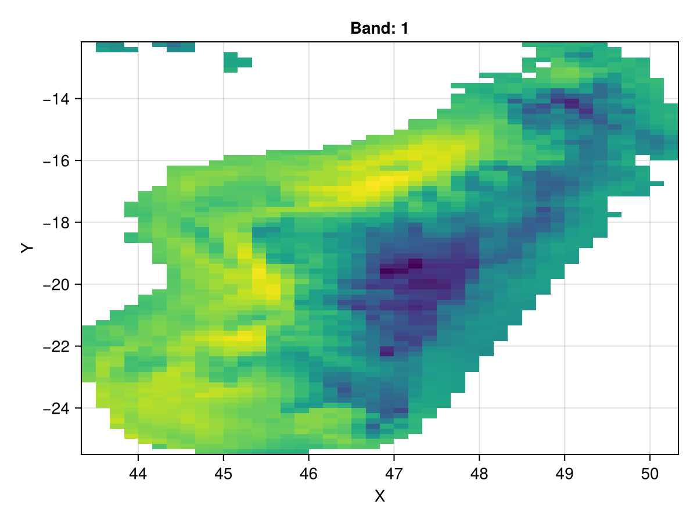

# Quick start {#Quick-start}

## Install the package by typing: {#Install-the-package-by-typing:}

```julia
] 
add Rasters
```


then do

```julia
using Rasters
```


Using Rasters to read GeoTiff or NetCDF files will output something similar to the following toy examples. This is possible because Rasters.jl extends DimensionalData.jl so that spatial data can be indexed using named dimensions like `X`, `Y` and `Ti` (time) and e.g. spatial coordinates.

```julia
using Rasters, Dates

lon, lat = X(25:1:30), Y(25:1:30)
ti = Ti(DateTime(2001):Month(1):DateTime(2002))
ras = Raster(rand(lon, lat, ti)) # this generates random numbers with the dimensions given
```


```
┌ 6×6×13 Raster{Float64, 3} ┐
├───────────────────────────┴──────────────────────────────────────────── dims ┐
  ↓ X  Sampled{Int64} 25:1:30 ForwardOrdered Regular Points,
  → Y  Sampled{Int64} 25:1:30 ForwardOrdered Regular Points,
  ↗ Ti Sampled{DateTime} DateTime("2001-01-01T00:00:00"):Month(1):DateTime("2002-01-01T00:00:00") ForwardOrdered Regular Points
├────────────────────────────────────────────────────────────────────── raster ┤
  extent: Extent(X = (25, 30), Y = (25, 30), Ti = (DateTime("2001-01-01T00:00:00"), DateTime("2002-01-01T00:00:00")))
└──────────────────────────────────────────────────────────────────────────────┘
[:, :, 1]
  ↓ →  25          26         27         28         29         30
 25     0.260998    0.743352   0.256826   0.674055   0.291134   0.617914
 26     0.782805    0.531218   0.810714   0.375886   0.634134   0.864708
 27     0.96864     0.474178   0.749179   0.394481   0.364335   0.307008
 28     0.0331745   0.986744   0.37073    0.502616   0.19786    0.623435
 29     0.798668    0.687758   0.92102    0.437158   0.722269   0.531246
 30     0.986457    0.204294   0.239687   0.988523   0.825782   0.422658
```


## Getting the lookup array from dimensions {#Getting-the-lookup-array-from-dimensions}

```julia
lon = lookup(ras, X) # if X is longitude
lat = lookup(ras, Y) # if Y is latitude
```


```
Sampled{Int64} ForwardOrdered Regular Points
wrapping: 25:1:30
```


## Select by index {#Select-by-index}

Selecting a time slice by index is done via

```julia
ras[Ti(1)]
```


```
┌ 6×6 Raster{Float64, 2} ┐
├────────────────────────┴──────────────────────────── dims ┐
  ↓ X Sampled{Int64} 25:1:30 ForwardOrdered Regular Points,
  → Y Sampled{Int64} 25:1:30 ForwardOrdered Regular Points
├─────────────────────────────────────────────────── raster ┤
  extent: Extent(X = (25, 30), Y = (25, 30))
└───────────────────────────────────────────────────────────┘
  ↓ →  25          26         27         28         29         30
 25     0.260998    0.743352   0.256826   0.674055   0.291134   0.617914
 26     0.782805    0.531218   0.810714   0.375886   0.634134   0.864708
 27     0.96864     0.474178   0.749179   0.394481   0.364335   0.307008
 28     0.0331745   0.986744   0.37073    0.502616   0.19786    0.623435
 29     0.798668    0.687758   0.92102    0.437158   0.722269   0.531246
 30     0.986457    0.204294   0.239687   0.988523   0.825782   0.422658
```


also

```julia
ras[Ti=1]
```


```
┌ 6×6 Raster{Float64, 2} ┐
├────────────────────────┴──────────────────────────── dims ┐
  ↓ X Sampled{Int64} 25:1:30 ForwardOrdered Regular Points,
  → Y Sampled{Int64} 25:1:30 ForwardOrdered Regular Points
├─────────────────────────────────────────────────── raster ┤
  extent: Extent(X = (25, 30), Y = (25, 30))
└───────────────────────────────────────────────────────────┘
  ↓ →  25          26         27         28         29         30
 25     0.260998    0.743352   0.256826   0.674055   0.291134   0.617914
 26     0.782805    0.531218   0.810714   0.375886   0.634134   0.864708
 27     0.96864     0.474178   0.749179   0.394481   0.364335   0.307008
 28     0.0331745   0.986744   0.37073    0.502616   0.19786    0.623435
 29     0.798668    0.687758   0.92102    0.437158   0.722269   0.531246
 30     0.986457    0.204294   0.239687   0.988523   0.825782   0.422658
```


or and interval of indices using the syntax =a:b or (a:b)

```julia
ras[Ti(1:10)]
```


```
┌ 6×6×10 Raster{Float64, 3} ┐
├───────────────────────────┴──────────────────────────────────────────── dims ┐
  ↓ X  Sampled{Int64} 25:1:30 ForwardOrdered Regular Points,
  → Y  Sampled{Int64} 25:1:30 ForwardOrdered Regular Points,
  ↗ Ti Sampled{DateTime} DateTime("2001-01-01T00:00:00"):Month(1):DateTime("2001-10-01T00:00:00") ForwardOrdered Regular Points
├────────────────────────────────────────────────────────────────────── raster ┤
  extent: Extent(X = (25, 30), Y = (25, 30), Ti = (DateTime("2001-01-01T00:00:00"), DateTime("2001-10-01T00:00:00")))
└──────────────────────────────────────────────────────────────────────────────┘
[:, :, 1]
  ↓ →  25          26         27         28         29         30
 25     0.260998    0.743352   0.256826   0.674055   0.291134   0.617914
 26     0.782805    0.531218   0.810714   0.375886   0.634134   0.864708
 27     0.96864     0.474178   0.749179   0.394481   0.364335   0.307008
 28     0.0331745   0.986744   0.37073    0.502616   0.19786    0.623435
 29     0.798668    0.687758   0.92102    0.437158   0.722269   0.531246
 30     0.986457    0.204294   0.239687   0.988523   0.825782   0.422658
```


## Select by value {#Select-by-value}

```julia
ras[Ti=At(DateTime(2001))]
```


```
┌ 6×6 Raster{Float64, 2} ┐
├────────────────────────┴──────────────────────────── dims ┐
  ↓ X Sampled{Int64} 25:1:30 ForwardOrdered Regular Points,
  → Y Sampled{Int64} 25:1:30 ForwardOrdered Regular Points
├─────────────────────────────────────────────────── raster ┤
  extent: Extent(X = (25, 30), Y = (25, 30))
└───────────────────────────────────────────────────────────┘
  ↓ →  25          26         27         28         29         30
 25     0.260998    0.743352   0.256826   0.674055   0.291134   0.617914
 26     0.782805    0.531218   0.810714   0.375886   0.634134   0.864708
 27     0.96864     0.474178   0.749179   0.394481   0.364335   0.307008
 28     0.0331745   0.986744   0.37073    0.502616   0.19786    0.623435
 29     0.798668    0.687758   0.92102    0.437158   0.722269   0.531246
 30     0.986457    0.204294   0.239687   0.988523   0.825782   0.422658
```


More options are available, like `Near`, `Contains` and `Where`.

::: tip Dimensions

Rasters uses X, Y, and Z dimensions from [`DimensionalData`](https://rafaqz.github.io/DimensionalData.jl/) to represent spatial directions like longitude,   latitude and the vertical dimension, and subset data with them. Ti is used for time, and Band represent bands.   Other dimensions can have arbitrary names, but will be treated generically.   See [`DimensionalData`](https://rafaqz.github.io/DimensionalData.jl/) for more details on how they work.

:::

::: tip Lookup Arrays

These specify properties of the index associated with e.g. the X and Y  dimension. Rasters.jl defines additional lookup arrays: [`Projected`](/api#Rasters.Projected) to handle  dimensions with projections, and [`Mapped`](/api#Rasters.Mapped) where the projection is mapped to  another projection like `EPSG(4326)`. `Mapped` is largely designed to handle  NetCDF dimensions, especially with `Explicit` spans.

:::

## Subsetting an object {#Subsetting-an-object}

Regular `getindex` (e.g. `A[1:100, :]`) and `view` work on all objects just as with an `Array`. `view` is always lazy, and reads from disk are deferred until `getindex` is used. `DimensionalData.jl` `Dimension`s and `Selector`s are the other way to subset an object, making use of the objects index to find values at  e.g. certain `X/Y` coordinates. The available selectors are listed here:

| Selectors              | Description                                                        |
|:---------------------- |:------------------------------------------------------------------ |
| `At(x)`                | get the index exactly matching the passed in value(s).             |
| `Near(x)`              | get the closest index to the passed in value(s).                   |
| `Where(f::Function)`   | filter the array axis by a function of the dimension index values. |
| `a..b`/`Between(a, b)` | get all indices between two values, excluding the high value.      |
| `Contains(x)`          | get indices where the value x falls within an interval.            |


::: tip Info
- Use the `..` selector to take a view of madagascar:
  

:::

```julia
using Rasters, RasterDataSources
const RS = Rasters
using CairoMakie
CairoMakie.activate!()

A = Raster(WorldClim{BioClim}, 5)
madagascar = view(A, X(43.25 .. 50.48), Y(-25.61 .. -12.04))
# Note the space between .. -12
Makie.plot(madagascar)
```

{width=600px height=450px}
