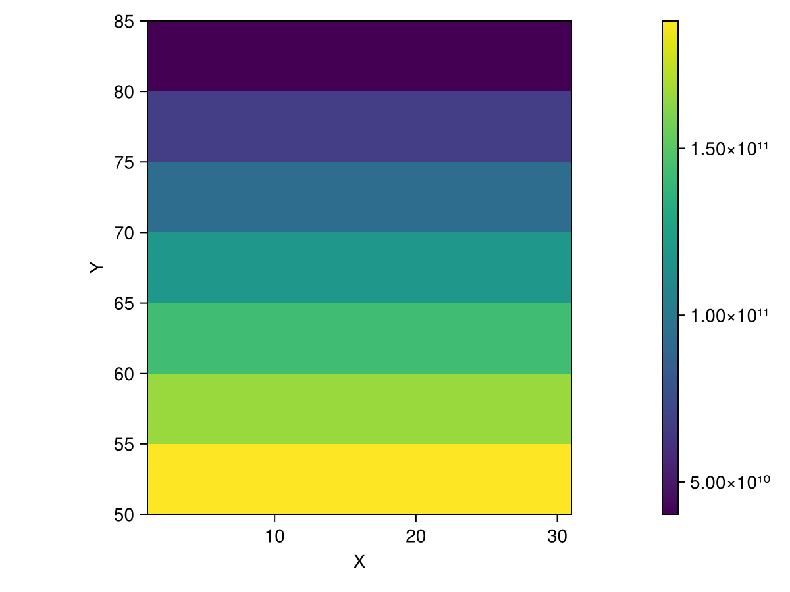

## `cellarea` {#cellarea}


<details class='jldocstring custom-block' >
<summary><a id='Rasters.cellarea-manual-cellarea' href='#Rasters.cellarea-manual-cellarea'><span class="jlbinding">Rasters.cellarea</span></a> <Badge type="info" class="jlObjectType jlFunction" text="Function" /></summary>


```julia
cellarea([method], x)
```


Gives the approximate area of each gridcell of `x`. By assuming the earth is a sphere, it approximates the true size to about 0.1%, depending on latitude. 

Run `using ArchGDAL` or `using Proj` to make this method fully available.
- `method`: You can specify whether you want to compute the area in the plane of your projection `Planar()` or on a sphere of some radius `Spherical(; radius=...)`(the default).
  
- `Spherical` will compute cell area on the sphere, by transforming all points back to long-lat.  You can specify the radius by the `radius` keyword argument here.  By default, this is `6371008.8`, the mean radius of the Earth.
  
- `Planar` will compute cell area in the plane of the CRS you have chosen.  Be warned that this will likely be incorrect for non-equal-area projections.
  

Returns a Raster with the same x and y dimensions as the input,  where each value in the raster encodes the area of the cell (in meters by default).

**Example**

```julia
using Rasters, Proj, Rasters.Lookups
xdim = X(Projected(90.0:10.0:120; sampling=Intervals(Start()), crs=EPSG(4326)))
ydim = Y(Projected(0.0:10.0:50; sampling=Intervals(Start()), crs=EPSG(4326)))
myraster = rand(xdim, ydim)
cs = cellarea(myraster)

# output
╭───────────────────────╮
│ 4×6 Raster{Float64,2} │
├───────────────────────┴─────────────────────────────────────────────────── dims ┐
  ↓ X Projected{Float64} 90.0:10.0:120.0 ForwardOrdered Regular Intervals{Start},
  → Y Projected{Float64} 0.0:10.0:50.0 ForwardOrdered Regular Intervals{Start}
├───────────────────────────────────────────────────────────────────────── raster ┤
  extent: Extent(X = (90.0, 130.0), Y = (0.0, 60.0))

  crs: EPSG:4326
└─────────────────────────────────────────────────────────────────────────────────┘
   ↓ →  0.0        10.0        20.0        30.0            40.0      50.0
  90.0  1.23017e6   1.19279e6   1.11917e6   1.01154e6  873182.0  708290.0
 100.0  1.23017e6   1.19279e6   1.11917e6   1.01154e6  873182.0  708290.0
 110.0  1.23017e6   1.19279e6   1.11917e6   1.01154e6  873182.0  708290.0
 120.0  1.23017e6   1.19279e6   1.11917e6   1.01154e6  873182.0  708290.0
```


WARNING: This feature is experimental. It may change in future versions, and may not be 100% reliable in all cases. Please file github issues if problems occur.


<Badge type="info" class="source-link" text="source"><a href="https://github.com/rafaqz/Rasters.jl/blob/e21dbeaa6368c96cbd80ad39da2f44ca66031437/src/extensions.jl#L165-L209" target="_blank" rel="noreferrer">source</a></Badge>

</details>


Computing the area of each cell in a raster is useful for a number of reasons - if you have a variable like  population per cell, or elevation ([spatially extensive variables](https://r-spatial.org/book/05-Attributes.html#sec-extensiveintensive)), you&#39;ll want to account for the fact that different cells have different areas.

Let&#39;s construct a raster and see what this looks like!  We&#39;ll keep it in memory.

The spherical method relies on the [Proj.jl](https://github.com/JuliaGeo/Proj.jl) package to perform coordinate transformation, so that has to be loaded explicitly.

```julia
using Rasters, Proj
```


To construct a raster, we&#39;ll need to specify the `x` and `y` dimensions.  These are called `lookups` in `Rasters.jl.`

```julia
using Rasters.Lookups
```


We can now construct the x and y lookups.  Here we&#39;ll use a start-at-one, step-by-five grid. Note that we&#39;re specifying that the &quot;sampling&quot;, i.e., what the coordinates actually mean,  is `Intervals(Start())`, meaning that the coordinates are the starting point of each interval.

This is in contrast to `Points()` sampling, where each index in the raster represents the value at a sampling point; here, each index represents a grid cell, which is defined by the coordinate being at the start.

```julia
x = X(1:5:30; sampling = Intervals(Start()), crs = EPSG(4326))
y = Y(50:5:80; sampling = Intervals(Start()), crs = EPSG(4326));
```


I have chosen the y-range here specifically so we can show the difference between spherical and planar `cellarea`.

```julia
julia> ras = Raster(ones(x, y); crs = EPSG(4326))
```

```ansi
┌ 6×7 Raster{Float64, 2} ┐
├────────────────────────┴─────────────────────────────────────────────── dims ┐
  ↓ X Projected{Int64} 1:5:26 ForwardOrdered Regular Intervals{Start},
  → Y Projected{Int64} 50:5:80 ForwardOrdered Regular Intervals{Start}
├────────────────────────────────────────────────────────────────────── raster ┤
  extent: Extent(X = (1, 31), Y = (50, 85))
  crs: EPSG:4326
└──────────────────────────────────────────────────────────────────────────────┘
  ↓ →  50    55    60    65    70    75    80
  1     1.0   1.0   1.0   1.0   1.0   1.0   1.0
  6     1.0   1.0   1.0   1.0   1.0   1.0   1.0
 11     1.0   1.0   1.0   1.0   1.0   1.0   1.0
 16     1.0   1.0   1.0   1.0   1.0   1.0   1.0
 21     1.0   1.0   1.0   1.0   1.0   1.0   1.0
 26     1.0   1.0   1.0   1.0   1.0   1.0   1.0
```


We can just call `cellarea` on this raster, which returns cell areas in meters, on Earth, assuming it&#39;s a sphere:

```julia
julia> cellarea(ras)
```

```ansi
┌ 6×7 Raster{Float64, 2} ┐
├────────────────────────┴─────────────────────────────────────────────── dims ┐
  ↓ X Projected{Int64} 1:5:26 ForwardOrdered Regular Intervals{Start},
  → Y Projected{Int64} 50:5:80 ForwardOrdered Regular Intervals{Start}
├────────────────────────────────────────────────────────────────────── raster ┤
  extent: Extent(X = (1, 31), Y = (50, 85))
  crs: EPSG:4326
└──────────────────────────────────────────────────────────────────────────────┘
  ↓ →  50           55           60           …  75           80
  1     1.88114e11   1.66031e11   1.42685e11      6.68821e10   4.0334e10
  6     1.88114e11   1.66031e11   1.42685e11      6.68821e10   4.0334e10
 11     1.88114e11   1.66031e11   1.42685e11      6.68821e10   4.0334e10
 16     1.88114e11   1.66031e11   1.42685e11      6.68821e10   4.0334e10
 21     1.88114e11   1.66031e11   1.42685e11  …   6.68821e10   4.0334e10
 26     1.88114e11   1.66031e11   1.42685e11      6.68821e10   4.0334e10
```


and if we plot it, you can see the difference in cell area as we go from the equator to the poles:

```julia
using CairoMakie
heatmap(cellarea(ras); axis = (; aspect = DataAspect()))
```

{width=600px height=450px}

We can also try this using the planar method, which simply computes the area of the rectangle using `area = x_side_length * y_side_length`:

```julia
julia> cellarea(Planar(), ras)
```

```ansi
┌ 6×7 Raster{Int64, 2} ┐
├──────────────────────┴───────────────────────────────────────────────── dims ┐
  ↓ X Projected{Int64} 1:5:26 ForwardOrdered Regular Intervals{Start},
  → Y Projected{Int64} 50:5:80 ForwardOrdered Regular Intervals{Start}
├────────────────────────────────────────────────────────────────────── raster ┤
  extent: Extent(X = (1, 31), Y = (50, 85))
  crs: EPSG:4326
└──────────────────────────────────────────────────────────────────────────────┘
  ↓ →  50  55  60  65  70  75  80
  1    25  25  25  25  25  25  25
  6    25  25  25  25  25  25  25
 11    25  25  25  25  25  25  25
 16    25  25  25  25  25  25  25
 21    25  25  25  25  25  25  25
 26    25  25  25  25  25  25  25
```


Note that this is of course wildly inaccurate for a geographic dataset - but if you&#39;re working in a projected coordinate system, like polar stereographic or Mercator, this can be very useful (and a _lot_ faster)!
