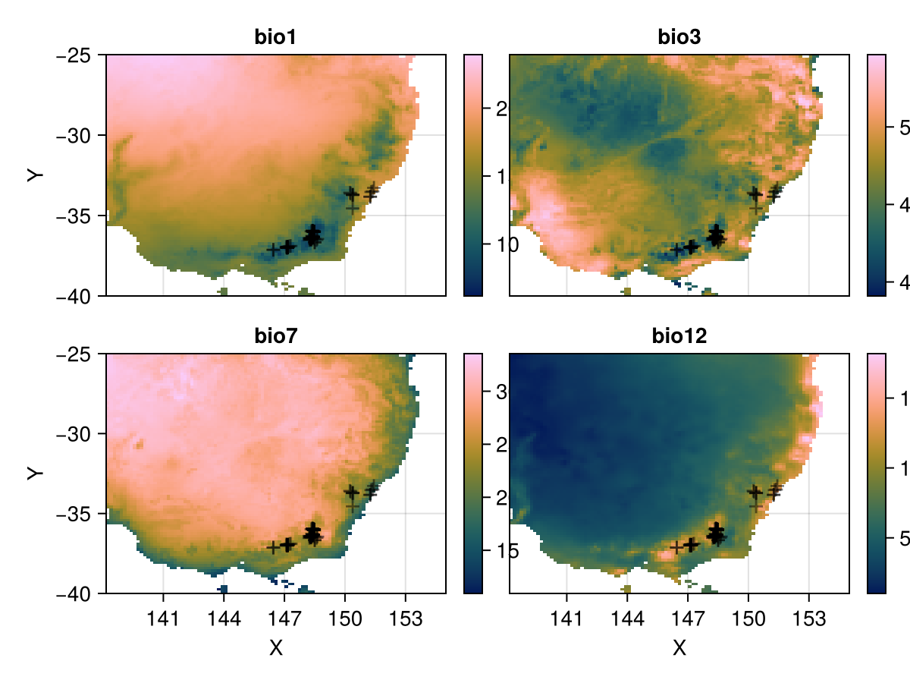
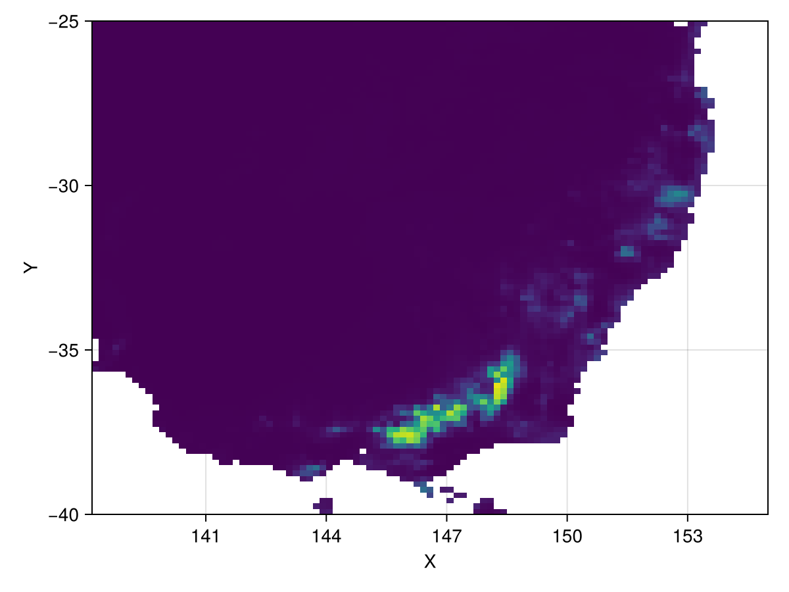

# Species distribution modelling workflow {#Species-distribution-modelling-workflow}

This example shows a full Species distribution modelling workflow, from loading data, to cleaning it, to fitting an ensemble and generating predictions.

It uses GBIF and WorldClim data, which are common datasets in ecology. We&#39;ll load occurrences for the Mountain Pygmy Possum species using [GBIF2.jl](https://github.com/rafaqz/GBIF2.jl), an interface to the [Global Biodiversity Information Facility](https://www.gbif.org/), and extract environmental variables using BioClim data from [RasterDataSources.jl](https://github.com/EcoJulia/RasterDataSources.jl).

## Load Rasters, ArchGDAL, RasterDataSources and GBIF {#Load-Rasters,-ArchGDAL,-RasterDataSources-and-GBIF}

The GBIF2 library is used to download occurrence data, RasterDataSources to conveniently access Bioclim data. ArchGDAL is necessary to load in the Bioclim data.

```julia
using Rasters, GBIF2
using RasterDataSources, ArchGDAL
```


Load occurrences for the Mountain Pygmy Possum using GBIF.jl

```julia
records = GBIF2.occurrence_search("Burramys parvus"; limit=300)
```


```
300-element GBIF2.Table{GBIF2.Occurrence, JSON3.Array{JSON3.Object, Vector{UInt8}, SubArray{UInt64, 1, Vector{UInt64}, Tuple{UnitRange{Int64}}, true}}}┌──────────────────────────┬─────────┬─────────┬─────────┬──────────┬───────────
│                 geometry │    year │   month │     day │  kingdom │   phylum ⋯
│ Tuple{Float64, Float64}? │  Int64? │  Int64? │  Int64? │  String? │  String? ⋯
├──────────────────────────┼─────────┼─────────┼─────────┼──────────┼───────────
│      (148.391, -36.3036) │    2015 │      11 │      15 │ Animalia │ Chordata ⋯
│      (148.396, -36.3818) │    2016 │      11 │      15 │ Animalia │ Chordata ⋯
│                  missing │    2021 │       1 │       6 │ Animalia │ Chordata ⋯
│      (147.096, -36.9357) │    2020 │       2 │      10 │ Animalia │ Chordata ⋯
│                  missing │ missing │ missing │ missing │ Animalia │ Chordata ⋯
│      (148.333, -36.4333) │    2011 │      11 │      21 │ Animalia │ Chordata ⋯
│                  missing │ missing │ missing │ missing │ Animalia │ Chordata ⋯
│      (148.236, -36.5249) │    2012 │      11 │      23 │ Animalia │ Chordata ⋯
│      (148.347, -36.5047) │    2012 │      11 │      22 │ Animalia │ Chordata ⋯
│      (148.329, -36.4317) │    2016 │       1 │       3 │ Animalia │ Chordata ⋯
│                  missing │ missing │ missing │ missing │ Animalia │ Chordata ⋯
│                  missing │ missing │ missing │ missing │ Animalia │ Chordata ⋯
│      (151.251, -33.8319) │    1975 │       4 │       9 │ Animalia │ Chordata ⋯
│                  missing │ missing │ missing │ missing │ Animalia │ Chordata ⋯
│      (148.241, -36.4001) │    2011 │      11 │      18 │ Animalia │ Chordata ⋯
│            ⋮             │    ⋮    │    ⋮    │    ⋮    │    ⋮     │    ⋮     ⋱
└──────────────────────────┴─────────┴─────────┴─────────┴──────────┴───────────
                                                 78 columns and 285 rows omitted

```


## Get Bioclimatic variables {#Get-Bioclimatic-variables}

Get BioClim layers and subset to south-east Australia. The first time this is run, this will automatically download and save the files.

```julia
A = RasterStack(WorldClim{BioClim}, (1, 3, 7, 12))
se_aus = A[X(138 .. 155), Y(-40 .. -25), Band(1)]
```


```
┌ 101×90 RasterStack ┐
├────────────────────┴─────────────────────────────────────────────────── dims ┐
  ↓ X Projected{Float64} 138.16666666666666:0.16666666666666666:154.83333333333331 ForwardOrdered Regular Intervals{Start},
  → Y Projected{Float64} -25.166666666666668:-0.16666666666666666:-40.0 ReverseOrdered Regular Intervals{Start}
├────────────────────────────────────────────────────────────────────── layers ┤
  :bio1  eltype: Union{Missing, Float32} dims: X, Y size: 101×90
  :bio3  eltype: Union{Missing, Float32} dims: X, Y size: 101×90
  :bio7  eltype: Union{Missing, Float32} dims: X, Y size: 101×90
  :bio12 eltype: Union{Missing, Float32} dims: X, Y size: 101×90
├────────────────────────────────────────────────────────────────────── raster ┤
  missingval: missing
  extent: Extent(X = (138.16666666666666, 154.99999999999997), Y = (-40.0, -25.0))
  crs: GEOGCS["WGS 84",DATUM["WGS_1984",SPHEROID["WGS 84",6378137,298.25722...
└──────────────────────────────────────────────────────────────────────────────┘
```


Plot BioClim predictors and scatter occurrence points on all subplots

```julia
# The coordinates from the gbif table
coords = collect(skipmissing(records.geometry))

using CairoMakie
p = Rasters.rplot(se_aus);
for ax in p.content
    if ax isa Axis
        scatter!(ax, coords; alpha=0.5, marker='+', color=:black, markersize = 20)
    end
end
p
```

{width=600px height=450px}

## Extract bioclim variables at occurrence points {#Extract-bioclim-variables-at-occurrence-points}

Then extract predictor variables and write to CSV. Use the skipmissing keyword to exclude both missing coordinates and coordinates with missing values in the RasterStack.

```julia
using CSV
presences = extract(se_aus, coords, skipmissing = true)
CSV.write("burramys_parvus_predictors.csv", presences)
```


```
"burramys_parvus_predictors.csv"
```


Or convert them to a `DataFrame`:

```julia
using DataFrames
df = DataFrame(presences)
df[1:5,:]
```

<div v-html="`&lt;div&gt;&lt;div style = &quot;float: left;&quot;&gt;&lt;span&gt;5×5 DataFrame&lt;/span&gt;&lt;/div&gt;&lt;div style = &quot;clear: both;&quot;&gt;&lt;/div&gt;&lt;/div&gt;&lt;div class = &quot;data-frame&quot; style = &quot;overflow-x: scroll;&quot;&gt;&lt;table class = &quot;data-frame&quot; style = &quot;margin-bottom: 6px;&quot;&gt;&lt;thead&gt;&lt;tr class = &quot;header&quot;&gt;&lt;th class = &quot;rowNumber&quot; style = &quot;font-weight: bold; text-align: right;&quot;&gt;Row&lt;/th&gt;&lt;th style = &quot;text-align: left;&quot;&gt;geometry&lt;/th&gt;&lt;th style = &quot;text-align: left;&quot;&gt;bio1&lt;/th&gt;&lt;th style = &quot;text-align: left;&quot;&gt;bio3&lt;/th&gt;&lt;th style = &quot;text-align: left;&quot;&gt;bio7&lt;/th&gt;&lt;th style = &quot;text-align: left;&quot;&gt;bio12&lt;/th&gt;&lt;/tr&gt;&lt;tr class = &quot;subheader headerLastRow&quot;&gt;&lt;th class = &quot;rowNumber&quot; style = &quot;font-weight: bold; text-align: right;&quot;&gt;&lt;/th&gt;&lt;th title = &quot;Tuple{Float64, Float64}&quot; style = &quot;text-align: left;&quot;&gt;Tuple…&lt;/th&gt;&lt;th title = &quot;Float32&quot; style = &quot;text-align: left;&quot;&gt;Float32&lt;/th&gt;&lt;th title = &quot;Float32&quot; style = &quot;text-align: left;&quot;&gt;Float32&lt;/th&gt;&lt;th title = &quot;Float32&quot; style = &quot;text-align: left;&quot;&gt;Float32&lt;/th&gt;&lt;th title = &quot;Float32&quot; style = &quot;text-align: left;&quot;&gt;Float32&lt;/th&gt;&lt;/tr&gt;&lt;/thead&gt;&lt;tbody&gt;&lt;tr&gt;&lt;td class = &quot;rowNumber&quot; style = &quot;font-weight: bold; text-align: right;&quot;&gt;1&lt;/td&gt;&lt;td style = &quot;text-align: left;&quot;&gt;(148.391, -36.3036)&lt;/td&gt;&lt;td style = &quot;text-align: right;&quot;&gt;6.1707&lt;/td&gt;&lt;td style = &quot;text-align: right;&quot;&gt;41.1198&lt;/td&gt;&lt;td style = &quot;text-align: right;&quot;&gt;23.4645&lt;/td&gt;&lt;td style = &quot;text-align: right;&quot;&gt;1692.0&lt;/td&gt;&lt;/tr&gt;&lt;tr&gt;&lt;td class = &quot;rowNumber&quot; style = &quot;font-weight: bold; text-align: right;&quot;&gt;2&lt;/td&gt;&lt;td style = &quot;text-align: left;&quot;&gt;(148.396, -36.3818)&lt;/td&gt;&lt;td style = &quot;text-align: right;&quot;&gt;6.88158&lt;/td&gt;&lt;td style = &quot;text-align: right;&quot;&gt;42.2681&lt;/td&gt;&lt;td style = &quot;text-align: right;&quot;&gt;23.133&lt;/td&gt;&lt;td style = &quot;text-align: right;&quot;&gt;1544.0&lt;/td&gt;&lt;/tr&gt;&lt;tr&gt;&lt;td class = &quot;rowNumber&quot; style = &quot;font-weight: bold; text-align: right;&quot;&gt;3&lt;/td&gt;&lt;td style = &quot;text-align: left;&quot;&gt;(147.096, -36.9357)&lt;/td&gt;&lt;td style = &quot;text-align: right;&quot;&gt;9.40835&lt;/td&gt;&lt;td style = &quot;text-align: right;&quot;&gt;40.7905&lt;/td&gt;&lt;td style = &quot;text-align: right;&quot;&gt;23.0895&lt;/td&gt;&lt;td style = &quot;text-align: right;&quot;&gt;1292.0&lt;/td&gt;&lt;/tr&gt;&lt;tr&gt;&lt;td class = &quot;rowNumber&quot; style = &quot;font-weight: bold; text-align: right;&quot;&gt;4&lt;/td&gt;&lt;td style = &quot;text-align: left;&quot;&gt;(148.333, -36.4333)&lt;/td&gt;&lt;td style = &quot;text-align: right;&quot;&gt;7.83572&lt;/td&gt;&lt;td style = &quot;text-align: right;&quot;&gt;41.5975&lt;/td&gt;&lt;td style = &quot;text-align: right;&quot;&gt;23.5028&lt;/td&gt;&lt;td style = &quot;text-align: right;&quot;&gt;1500.0&lt;/td&gt;&lt;/tr&gt;&lt;tr&gt;&lt;td class = &quot;rowNumber&quot; style = &quot;font-weight: bold; text-align: right;&quot;&gt;5&lt;/td&gt;&lt;td style = &quot;text-align: left;&quot;&gt;(148.236, -36.5249)&lt;/td&gt;&lt;td style = &quot;text-align: right;&quot;&gt;8.0016&lt;/td&gt;&lt;td style = &quot;text-align: right;&quot;&gt;41.8465&lt;/td&gt;&lt;td style = &quot;text-align: right;&quot;&gt;22.8522&lt;/td&gt;&lt;td style = &quot;text-align: right;&quot;&gt;1368.0&lt;/td&gt;&lt;/tr&gt;&lt;/tbody&gt;&lt;/table&gt;&lt;/div&gt;`"></div>

## Sample background points {#Sample-background-points}

Next, sample random background points in the Raster. Rasters has a StatsBase extension to make this very straightforward. The syntax and output of `Rasters.sample` is very similar to that of `extract`.

```julia
using StatsBase
background = Rasters.sample(se_aus, 500, skipmissing = true)
```


```
500-element Vector{@NamedTuple{geometry::Tuple{Float64, Float64}, bio1::Float32, bio3::Float32, bio7::Float32, bio12::Float32}}:
 (geometry = (140.66666666666666, -36.166666666666664), bio1 = 15.231406, bio3 = 53.140182, bio7 = 25.725002, bio12 = 456.0)
 (geometry = (141.33333333333331, -30.333333333333332), bio1 = 20.520176, bio3 = 45.09598, bio7 = 31.394749, bio12 = 206.0)
 (geometry = (145.16666666666666, -34.666666666666664), bio1 = 17.035261, bio3 = 47.387257, bio7 = 29.843248, bio12 = 382.0)
 (geometry = (143.99999999999997, -38.166666666666664), bio1 = 14.227177, bio3 = 50.17885, bio7 = 21.421999, bio12 = 583.0)
 (geometry = (148.66666666666666, -37.5), bio1 = 12.52925, bio3 = 46.594723, bio7 = 19.65575, bio12 = 1028.0)
 (geometry = (140.66666666666666, -30.833333333333332), bio1 = 20.154396, bio3 = 47.022156, bio7 = 31.43775, bio12 = 182.0)
 (geometry = (139.99999999999997, -26.833333333333332), bio1 = 23.019865, bio3 = 44.5082, bio7 = 32.0785, bio12 = 162.0)
 (geometry = (141.83333333333331, -29.0), bio1 = 21.353395, bio3 = 42.53966, bio7 = 31.006752, bio12 = 215.0)
 (geometry = (140.99999999999997, -25.166666666666668), bio1 = 23.798178, bio3 = 45.64515, bio7 = 31.07025, bio12 = 254.0)
 (geometry = (150.83333333333331, -30.666666666666668), bio1 = 15.448364, bio3 = 47.664883, bio7 = 26.486, bio12 = 757.0)
 ⋮
 (geometry = (145.16666666666666, -34.333333333333336), bio1 = 17.370176, bio3 = 47.01613, bio7 = 29.89475, bio12 = 383.0)
 (geometry = (145.33333333333331, -29.166666666666668), bio1 = 20.87448, bio3 = 42.974113, bio7 = 29.749498, bio12 = 330.0)
 (geometry = (140.33333333333331, -36.666666666666664), bio1 = 15.11325, bio3 = 52.627136, bio7 = 23.49675, bio12 = 530.0)
 (geometry = (151.33333333333331, -27.166666666666668), bio1 = 19.013937, bio3 = 51.93428, bio7 = 27.18925, bio12 = 631.0)
 (geometry = (143.66666666666666, -30.0), bio1 = 20.461605, bio3 = 42.64563, bio7 = 30.62975, bio12 = 278.0)
 (geometry = (141.33333333333331, -38.0), bio1 = 13.336552, bio3 = 50.96618, bio7 = 18.82625, bio12 = 783.0)
 (geometry = (151.16666666666666, -31.666666666666668), bio1 = 12.968657, bio3 = 47.666008, bio7 = 24.304749, bio12 = 964.0)
 (geometry = (139.66666666666666, -36.666666666666664), bio1 = 15.107955, bio3 = 50.842224, bio7 = 19.609089, bio12 = 556.0)
 (geometry = (150.99999999999997, -28.833333333333332), bio1 = 18.683844, bio3 = 50.884636, bio7 = 29.11025, bio12 = 699.0)
```


## Fit a statistical ensemble {#Fit-a-statistical-ensemble}

In this example, we will [SpeciesDistributionModels.jl](https://github.com/tiemvanderdeure/SpeciesDistributionModels.jl) to fit a statistical ensemble to the occurrence and background data.

First we need to load the models. SDM.jl integrates with MLJ - see the [model browser](https://juliaai.github.io/MLJ.jl/dev/model_browser/#Classification) for what models are available.

```julia
import Maxnet: MaxnetBinaryClassifier
import MLJGLMInterface: LinearBinaryClassifier
# define the models in the ensemble
models = (
    maxnet = MaxnetBinaryClassifier(),
    maxnet2 = MaxnetBinaryClassifier(features = "lq"),
    glm = LinearBinaryClassifier()
)
```


```
(maxnet = Maxnet.MaxnetBinaryClassifier("", 1.0, Maxnet.default_regularization, true, 50, 100.0, GLM.CloglogLink(), false, Base.Pairs{Symbol, Union{}, Tuple{}, @NamedTuple{}}()), maxnet2 = Maxnet.MaxnetBinaryClassifier("lq", 1.0, Maxnet.default_regularization, true, 50, 100.0, GLM.CloglogLink(), false, Base.Pairs{Symbol, Union{}, Tuple{}, @NamedTuple{}}()), glm = MLJGLMInterface.LinearBinaryClassifier(true, GLM.LogitLink(), nothing, 30, 1.0e-6, 1.0e-6, 0.001, [:deviance, :dof_residual, :stderror, :vcov, :coef_table]))
```


Next, format the data using `sdmdata`. To test how rigurous our models are, we will use 3-fold cross-validation.

```julia
using SpeciesDistributionModels
const SDM = SpeciesDistributionModels
data = sdmdata(presences, background; resampler = CV(; nfolds = 3))
```


```
SDMdata object with 110 presence points and 500 absence points. 
 
Resampling: 
Data is divided into 3 folds using resampling strategy CV(nfolds = 3, …).
┌──────┬─────────┬────────┐
│ fold │ # train │ # test │
├──────┼─────────┼────────┤
│    1 │     406 │    204 │
│    2 │     407 │    203 │
│    3 │     407 │    203 │
└──────┴─────────┴────────┘
Predictor variables: 
┌───────┬────────────┬─────────┐
│ names │ scitypes   │ types   │
├───────┼────────────┼─────────┤
│ bio1  │ Continuous │ Float32 │
│ bio3  │ Continuous │ Float32 │
│ bio7  │ Continuous │ Float32 │
│ bio12 │ Continuous │ Float32 │
└───────┴────────────┴─────────┘
Also contains geometry data
```


Now, fit the ensemble, passing the data object and the `NamedTuple` of models!

```julia
ensemble = sdm(data, models)
```


```
trained SDMensemble, containing 9 SDMmachines across 3 SDMgroups 

Uses the following models:
maxnet => MaxnetBinaryClassifier. 
maxnet2 => MaxnetBinaryClassifier. 
glm => LinearBinaryClassifier. 

```


Use SDM.jl&#39;s evaluate function to see how this ensemble performs.

```julia
SDM.evaluate(ensemble)
```


```
SpeciesDistributionModels.SDMensembleEvaluation with 4 performance measures
train
┌──────────┬──────────┬──────────┬───────────┬──────────┐
│    model │ accuracy │      auc │  log_loss │    kappa │
│      Any │  Float64 │  Float64 │   Float64 │  Float64 │
├──────────┼──────────┼──────────┼───────────┼──────────┤
│   maxnet │ 0.974583 │  0.99427 │  0.109897 │ 0.914481 │
│  maxnet2 │ 0.972126 │ 0.991994 │  0.113417 │ 0.901461 │
│      glm │ 0.972126 │  0.99247 │ 0.0825491 │ 0.902511 │
│ ensemble │ 0.974585 │ 0.993217 │ 0.0934184 │ 0.910216 │
└──────────┴──────────┴──────────┴───────────┴──────────┘
test
┌──────────┬──────────┬──────────┬──────────┬──────────┐
│    model │ accuracy │      auc │ log_loss │    kappa │
│      Any │  Float64 │  Float64 │  Float64 │  Float64 │
├──────────┼──────────┼──────────┼──────────┼──────────┤
│   maxnet │ 0.972101 │  0.98955 │ 0.140948 │  0.90039 │
│  maxnet2 │ 0.973744 │ 0.989329 │ 0.130161 │ 0.905937 │
│      glm │ 0.973735 │ 0.988324 │ 0.115065 │ 0.906591 │
│ ensemble │ 0.975378 │ 0.989067 │ 0.116142 │ 0.911604 │
└──────────┴──────────┴──────────┴──────────┴──────────┘

```


Not too bad!

## Make predictions of climatic suitability {#Make-predictions-of-climatic-suitability}

Use the ensemble to 

```julia
suitability = SDM.predict(ensemble, se_aus, reducer = mean)
```


```
┌ 101×90 Raster{Union{Missing, Float64}, 2} ┐
├───────────────────────────────────────────┴──────────────────────────── dims ┐
  ↓ X Projected{Float64} 138.16666666666666:0.16666666666666666:154.83333333333331 ForwardOrdered Regular Intervals{Start},
  → Y Projected{Float64} -25.166666666666668:-0.16666666666666666:-40.0 ReverseOrdered Regular Intervals{Start}
├────────────────────────────────────────────────────────────────────── raster ┤
  missingval: missing
  extent: Extent(X = (138.16666666666666, 154.99999999999997), Y = (-40.0, -25.0))
  crs: GEOGCS["WGS 84",DATUM["WGS_1984",SPHEROID["WGS 84",6378137,298.25722...
└──────────────────────────────────────────────────────────────────────────────┘
   ↓ →    -25.1667      -25.3333      …  -39.6667    -39.8333    -40.0
 138.167    4.75755e-5    5.2108e-5         missing     missing     missing
 138.333    4.84527e-5    5.37189e-5        missing     missing     missing
 138.5      5.8635e-5     6.71008e-5        missing     missing     missing
 138.667    6.33558e-5    8.67758e-5        missing     missing     missing
   ⋮                                  ⋱                            ⋮
 154.167     missing       missing          missing     missing     missing
 154.333     missing       missing          missing     missing     missing
 154.5       missing       missing          missing     missing     missing
 154.667     missing       missing    …     missing     missing     missing
 154.833     missing       missing          missing     missing     missing
```


And let&#39;s see what that looks like

```julia
plot(suitability, colorrange = (0,1))
```

{width=600px height=450px}
