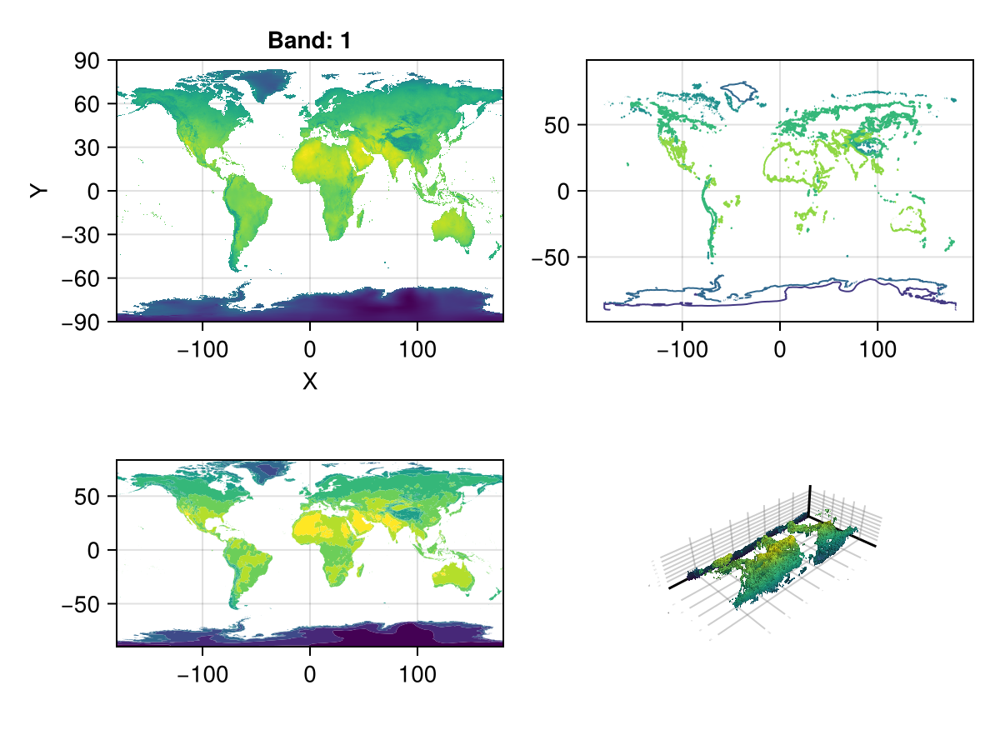
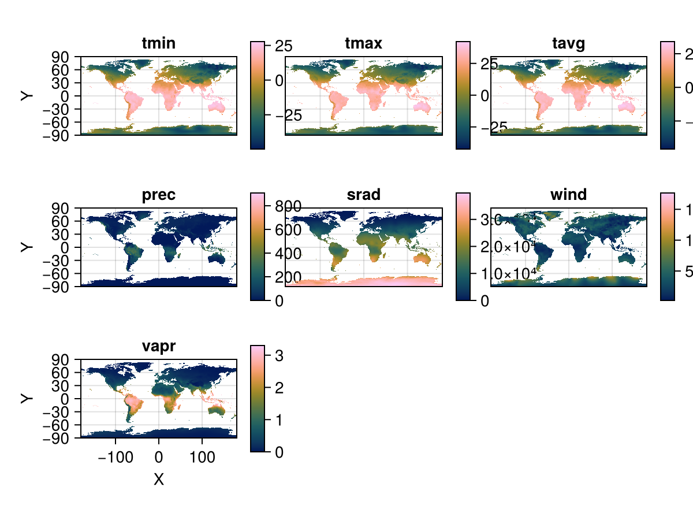
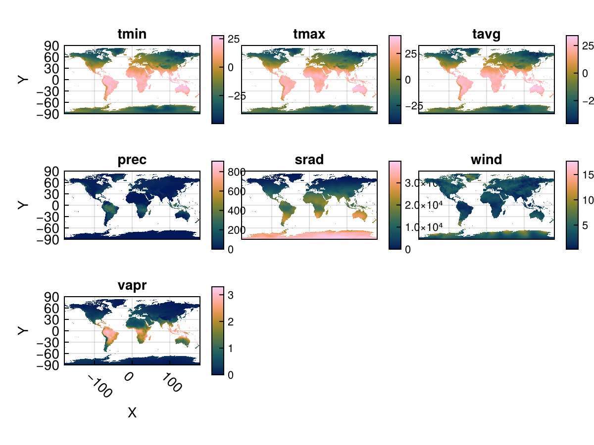
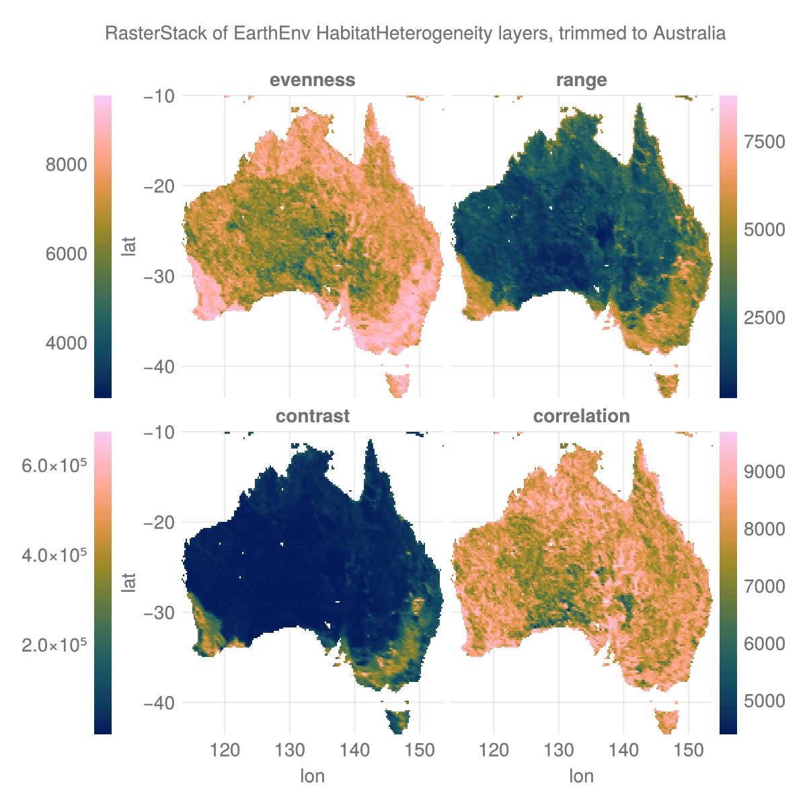

## Plotting in Makie {#Plotting-in-Makie}

Plotting in Makie works somewhat differently than Plots, since the recipe system is different. You can pass a 2-D raster to any surface-like function (heatmap, contour, contourf, or even surface for a 3D plot) with ease.

## 2-D rasters in Makie {#2-D-rasters-in-Makie}

```julia
using CairoMakie, Makie
using Rasters, RasterDataSources, ArchGDAL
A = Raster(WorldClim{BioClim}, 5) # this is a 3D raster, so is not accepted.
```


```
┌ 2160×1080 Raster{Union{Missing, Float32}, 2} bio5 ┐
├───────────────────────────────────────────────────┴──────────────────── dims ┐
  ↓ X Projected{Float64} -180.0:0.16666666666666666:179.83333333333331 ForwardOrdered Regular Intervals{Start},
  → Y Projected{Float64} 89.83333333333333:-0.16666666666666666:-90.0 ReverseOrdered Regular Intervals{Start}
├──────────────────────────────────────────────────────────────────── metadata ┤
  Metadata{Rasters.GDALsource} of Dict{String, Any} with 1 entry:
  "filepath" => "./WorldClim/BioClim/wc2.1_10m_bio_5.tif"
├────────────────────────────────────────────────────────────────────── raster ┤
  missingval: missing
  extent: Extent(X = (-180.0, 179.99999999999997), Y = (-90.0, 90.0))
  crs: GEOGCS["WGS 84",DATUM["WGS_1984",SPHEROID["WGS 84",6378137,298.25722...
└──────────────────────────────────────────────────────────────────────────────┘
    ↓ →    89.8333    89.6667    89.5       …  -89.6667  -89.8333  -90.0
 -180.0      missing    missing    missing     -15.399   -13.805   -14.046
 -179.833    missing    missing    missing     -15.9605  -14.607   -14.5545
    ⋮                                       ⋱                        ⋮
  179.5      missing    missing    missing     -18.2955  -16.7583  -16.72
  179.667    missing    missing    missing     -18.2847  -16.7513  -16.72
  179.833    missing    missing    missing  …  -17.1478  -15.4243  -15.701
```


```julia
fig, ax, _ = plot(A)
contour(fig[1, 2], A)
ax = Axis(fig[2, 1]; aspect = DataAspect())
contourf!(ax, A)
surface(fig[2, 2], A) # even a 3D plot work!
fig
```

{width=600px height=450px}

## 3-D rasters in Makie {#3-D-rasters-in-Makie}

::: warning Warning

This interface is experimental, and unexported for that reason.  It may break at any time!

:::

Just as in Plots, 3D rasters are treated as a series of 2D rasters, which are tiled and plotted.  

You can use `Rasters.rplot` to visualize 3D rasters or RasterStacks in this way.  An example is below:

```julia
stack = RasterStack(WorldClim{Climate}; month = 1)
Rasters.rplot(stack; Axis = (aspect = DataAspect(),),)
```

{width=600px height=450px}

You can pass any theming keywords in, which are interpreted by Makie appropriately.

The plots seem a little squished here.  We provide a Makie theme which makes text a little smaller and has some other space-efficient attributes:

```julia
Makie.set_theme!(Rasters.theme_rasters())
Rasters.rplot(stack)
```

{width=600px height=450px}

# reset theme {#reset-theme}

```julia
Makie.set_theme!()
```


### Plotting with `Observable`s, animations {#Plotting-with-Observables,-animations}

`Rasters.rplot` should support Observable input out of the box, but the dimensions of that input must remain the same - i.e., the element names of a RasterStack must remain the same.

```julia
Makie.set_theme!(Rasters.theme_rasters())
# `stack` is the WorldClim climate data for January
stack_obs = Observable(stack)
fig = Rasters.rplot(stack_obs;
    Colorbar=(; height=Relative(0.75), width=5)
)
record(fig, "rplot.mp4", 1:12; framerate = 3) do i
    stack_obs[] = RasterStack(WorldClim{Climate}; month = i)
end
```


```
"rplot.mp4"
```

<video src="./rplot.mp4" controls="controls" autoplay="autoplay"></video>


```julia
Makie.set_theme!() # reset theme
```

<details class='jldocstring custom-block' open>
<summary><a id='Rasters.rplot' href='#Rasters.rplot'><span class="jlbinding">Rasters.rplot</span></a> <Badge type="info" class="jlObjectType jlFunction" text="Function" /></summary>


```julia
Rasters.rplot([position::GridPosition], raster; kw...)
```


`raster` may be a `Raster` (of 2 or 3 dimensions) or a `RasterStack` whose underlying rasters are 2 dimensional, or 3-dimensional with a singleton (length-1) third dimension.

**Keywords**
- `plottype = Makie.Heatmap`: The type of plot. Can be any Makie plot type which accepts a `Raster`; in practice, `Heatmap`, `Contour`, `Contourf` and `Surface` are the best bets.
  
- `axistype = Makie.Axis`: The type of axis. This can be an `Axis`, `Axis3`, `LScene`, or even a `GeoAxis` from GeoMakie.jl.
  
- `X = XDim`: The X dimension of the raster.
  
- `Y = YDim`: The Y dimension of the raster.
  
- `Z = YDim`: The Y dimension of the raster.
  
- `draw_colorbar = true`: Whether to draw a colorbar for the axis or not.
  
- `colorbar_position = Makie.Right()`: Indicates which side of the axis the colorbar should be placed on.  Can be `Makie.Top()`, `Makie.Bottom()`, `Makie.Left()`, or `Makie.Right()`.
  
- `colorbar_padding = Makie.automatic`: The amount of padding between the colorbar and its axis.  If `automatic`, then this is set to the width of the colorbar.
  
- `title = Makie.automatic`: The titles of each plot. If `automatic`, these are set to the name of the band.
  
- `xlabel = Makie.automatic`: The x-label for the axis. If `automatic`, set to the dimension name of the X-dimension of the raster.
  
- `ylabel = Makie.automatic`: The y-label for the axis. If `automatic`, set to the dimension name of the Y-dimension of the raster.
  
- `colorbarlabel = ""`: Usually nothing, but here if you need it. Sets the label on the colorbar.
  
- `colormap = nothing`: The colormap for the heatmap. This can be set to a vector of colormaps (symbols, strings, `cgrad`s) if plotting a 3D raster or RasterStack.
  
- `colorrange = Makie.automatic`: The colormap for the heatmap.  This can be set to a vector of `(low, high)` if plotting a 3D raster or RasterStack.
  
- `nan_color = :transparent`: The color which `NaN` values should take. Default to transparent.
  


<Badge type="info" class="source-link" text="source"><a href="https://github.com/rafaqz/Rasters.jl/blob/e21dbeaa6368c96cbd80ad39da2f44ca66031437/src/plotrecipes.jl#L239-L261" target="_blank" rel="noreferrer">source</a></Badge>

</details>


## Using vanilla Makie {#Using-vanilla-Makie}

```julia
using Rasters, RasterDataSources
```


The data

```julia
layers = (:evenness, :range, :contrast, :correlation)
st = RasterStack(EarthEnv{HabitatHeterogeneity}, layers)
ausbounds = X(100 .. 160), Y(-50 .. -10) # Roughly cut out australia
aus = st[ausbounds...] |> Rasters.trim
```


```
┌ 194×161 RasterStack ┐
├─────────────────────┴────────────────────────────────────────────────── dims ┐
  ↓ X Projected{Float64} 113.33333333333334:0.20833333333333334:153.54166666666669 ForwardOrdered Regular Intervals{Start},
  → Y Projected{Float64} -10.208333333333334:-0.20833333333333334:-43.541666666666664 ReverseOrdered Regular Intervals{Start}
├────────────────────────────────────────────────────────────────────── layers ┤
  :evenness    eltype: Union{Missing, UInt16} dims: X, Y size: 194×161
  :range       eltype: Union{Missing, UInt16} dims: X, Y size: 194×161
  :contrast    eltype: Union{Missing, UInt32} dims: X, Y size: 194×161
  :correlation eltype: Union{Missing, UInt16} dims: X, Y size: 194×161
├────────────────────────────────────────────────────────────────────── raster ┤
  missingval: missing
  extent: Extent(X = (113.33333333333334, 153.75000000000003), Y = (-43.541666666666664, -10.0))
  crs: GEOGCS["WGS 84",DATUM["WGS_1984",SPHEROID["WGS 84",6378137,298.25722...
└──────────────────────────────────────────────────────────────────────────────┘
```


The plot

```julia
# colorbar attributes
colormap = :batlow
flipaxis = false
tickalign=1
width = 13
ticksize = 13
# figure
with_theme(theme_dark()) do
    fig = Figure(; size=(600, 600), backgroundcolor=:transparent)
    axs = [Axis(fig[i,j], xlabel = "lon", ylabel = "lat",
        backgroundcolor=:transparent) for i in 1:2 for j in 1:2]
    plt = [Makie.heatmap!(axs[i], aus[l]; colormap) for (i, l) in enumerate(layers)]
    for (i, l) in enumerate(layers) axs[i].title = string(l) end
    hidexdecorations!.(axs[1:2]; grid=false, ticks=false)
    hideydecorations!.(axs[[2,4]]; grid=false, ticks=false)
    Colorbar(fig[1, 0], plt[1]; flipaxis, tickalign, width, ticksize)
    Colorbar(fig[1, 3], plt[2]; tickalign, width, ticksize)
    Colorbar(fig[2, 0], plt[3]; flipaxis, tickalign, width, ticksize)
    Colorbar(fig[2, 3], plt[4]; tickalign, width, ticksize)
    colgap!(fig.layout, 5)
    rowgap!(fig.layout, 5)
    Label(fig[0, :], "RasterStack of EarthEnv HabitatHeterogeneity layers, trimmed to Australia")
    fig
end
save("aus_trim.png", current_figure());
```




