## Plots, simple {#Plots,-simple}

[`Plots.jl`](https://github.com/JuliaPlots/Plots.jl) and [`Makie.jl`](https://makie.org) are fully supported by Rasters.jl, with recipes for plotting `Raster` and `RasterStack` provided. `plot` will plot a heatmap with axes matching dimension values. If `mappedcrs` is used, converted values will be shown on axes instead of the underlying `crs` values. `contourf` will similarly plot a filled contour plot.

Pixel resolution is limited to allow loading very large files quickly. `max_res`  specifies the maximum pixel resolution to show on the longest axis of the array. It can be set manually to change the resolution (e.g. for large or high-quality plots):

```julia
using Rasters, RasterDataSources, ArchGDAL, Plots
A = Raster(WorldClim{BioClim}, 5)
plot(A; max_res=3000)
```

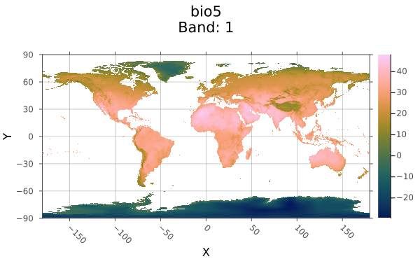{width=600px height=400px}

For Makie, `plot` functions in a similar way.  `plot` will only accept two-dimensional rasters. You can invoke `contour`, `contourf`, `heatmap`, `surface` or any Makie plotting function which supports surface-like data on a **2D raster**.

To obtain tiled plots for 3D rasters and RasterStacks, use the function `Rasters.rplot([gridposition], raster; kw_args...)`.  This is an unexported function, since we&#39;re not sure how the API will change going forward.

## Makie, simple {#Makie,-simple}

```julia
using CairoMakie
CairoMakie.activate!(px_per_unit = 2)
using Rasters, CairoMakie, RasterDataSources, ArchGDAL
A = Raster(WorldClim{BioClim}, 5)
Makie.plot(A)
```

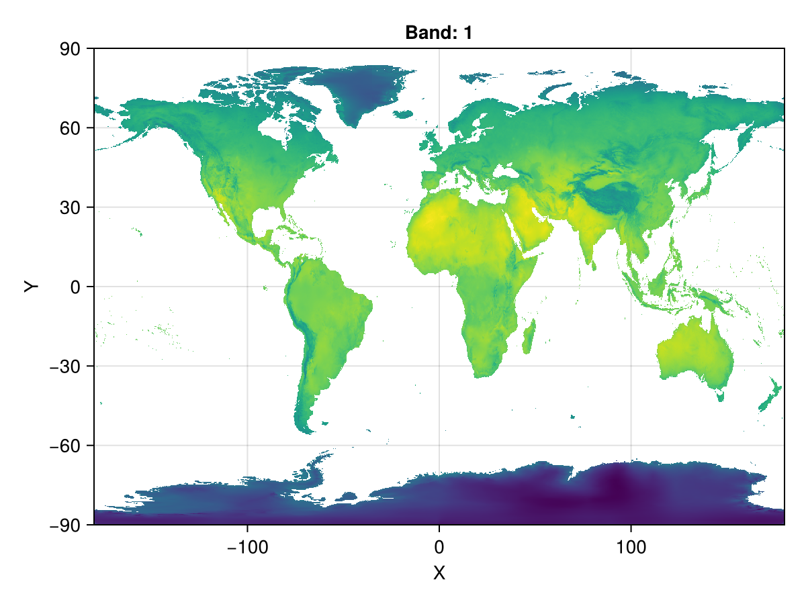{width=600px height=450px}

## Loading data {#Loading-data}

Our first example simply loads a file from disk and plots it.

This `netcdf` file only has one layer, if it has more we could use RasterStack instead.

```julia
using Rasters, NCDatasets, Plots
using Downloads: download

url = "https://www.unidata.ucar.edu/software/netcdf/examples/tos_O1_2001-2002.nc";
filename = download(url, "tos_O1_2001-2002.nc");
A = Raster(filename)
```


```
┌ 180×170×24 Raster{Union{Missing, Float32}, 3} tos ┐
├───────────────────────────────────────────────────┴──────────────────── dims ┐
  ↓ X  Mapped{Float64} [1.0, 3.0, …, 357.0, 359.0] ForwardOrdered Regular Intervals{Center},
  → Y  Mapped{Float64} [-79.5, -78.5, …, 88.5, 89.5] ForwardOrdered Regular Intervals{Center},
  ↗ Ti Sampled{DateTime360Day} [DateTime360Day(2001-01-16T00:00:00), …, DateTime360Day(2002-12-16T00:00:00)] ForwardOrdered Explicit Intervals{Center}
├──────────────────────────────────────────────────────────────────── metadata ┤
  Metadata{Rasters.NCDsource} of Dict{String, Any} with 9 entries:
  "units"          => "K"
  "missing_value"  => 1.0f20
  "original_units" => "degC"
  "cell_methods"   => "time: mean (interval: 30 minutes)"
  "history"        => " At   16:37:23 on 01/11/2005: CMOR altered the data in t…
  "long_name"      => "Sea Surface Temperature"
  "standard_name"  => "sea_surface_temperature"
  "_FillValue"     => 1.0f20
  "original_name"  => "sosstsst"
├────────────────────────────────────────────────────────────────────── raster ┤
  missingval: missing
  extent: Extent(X = (0.0, 360.0), Y = (-80.0, 90.0), Ti = (DateTime360Day(2001-01-01T00:00:00), DateTime360Day(2003-01-01T00:00:00)))
  crs: EPSG:4326
  mappedcrs: EPSG:4326
└──────────────────────────────────────────────────────────────────────────────┘
[:, :, 1]
 ⋮      ⋱  
```


Objects with Dimensions other than X and Y will produce multi-pane plots. Here we plot every third month in the first year in one plot:

```julia
A[Ti=1:3:12] |> plot
```

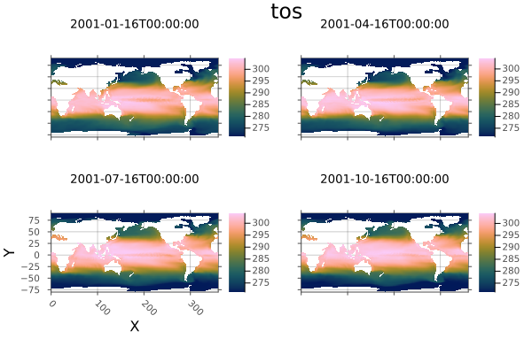{width=600px height=400px}

Now plot the ocean temperatures around the Americas in the first month of 2001. Notice we are using lat/lon coordinates and date/time instead of regular indices. The time dimension uses `DateTime360Day`, so we need to load CFTime.jl to index it with `Near`.

```julia
using CFTime
A[Ti(Near(DateTime360Day(2001, 01, 17))), Y(-60.0 .. 90.0), X(45.0 .. 190.0)] |> plot
```

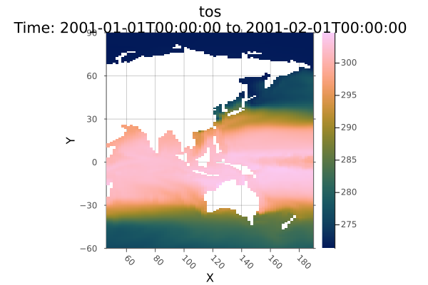{width=600px height=400px}

Now get the mean over the timespan, then save it to disk, and plot it as a filled contour.

Other plot functions and sliced objects that have only one `X`/`Y`/`Z` dimension fall back to generic DimensionalData.jl plotting, which will still correctly label plot axes.

```julia
using Statistics
# Take the mean
mean_tos = mean(A; dims=Ti)
```


```
┌ 180×170×1 Raster{Union{Missing, Float32}, 3} tos ┐
├──────────────────────────────────────────────────┴───────────────────── dims ┐
  ↓ X  Mapped{Float64} [1.0, 3.0, …, 357.0, 359.0] ForwardOrdered Regular Intervals{Center},
  → Y  Mapped{Float64} [-79.5, -78.5, …, 88.5, 89.5] ForwardOrdered Regular Intervals{Center},
  ↗ Ti Sampled{DateTime360Day} DateTime360Day(2002-01-16T00:00:00):Millisecond(2592000000):DateTime360Day(2002-01-16T00:00:00) ForwardOrdered Explicit Intervals{Center}
├──────────────────────────────────────────────────────────────────── metadata ┤
  Metadata{Rasters.NCDsource} of Dict{String, Any} with 9 entries:
  "units"          => "K"
  "missing_value"  => 1.0f20
  "original_units" => "degC"
  "cell_methods"   => "time: mean (interval: 30 minutes)"
  "history"        => " At   16:37:23 on 01/11/2005: CMOR altered the data in t…
  "long_name"      => "Sea Surface Temperature"
  "standard_name"  => "sea_surface_temperature"
  "_FillValue"     => 1.0f20
  "original_name"  => "sosstsst"
├────────────────────────────────────────────────────────────────────── raster ┤
  missingval: missing
  extent: Extent(X = (0.0, 360.0), Y = (-80.0, 90.0), Ti = (DateTime360Day(2001-01-01T00:00:00), DateTime360Day(2003-01-01T00:00:00)))
  crs: EPSG:4326
  mappedcrs: EPSG:4326
└──────────────────────────────────────────────────────────────────────────────┘
[:, :, 1]
 ⋮      ⋱  
```


### Plot a contour plot {#Plot-a-contour-plot}

```julia
using Plots
Plots.contourf(mean_tos; dpi=300, size=(800, 400))
```

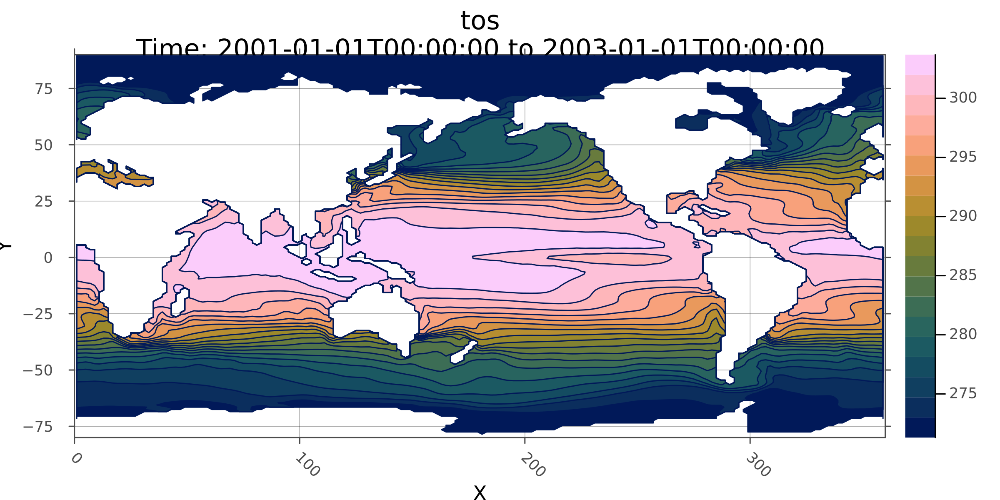{width=2400px height=1200px}

### write to disk {#write-to-disk}

Write the mean values to disk

```julia
write("mean_tos.nc", mean_tos)
```


```
"mean_tos.nc"
```


Plotting recipes in DimensionalData.jl are the fallback for Rasters.jl when the object doesn&#39;t have 2 `X`/`Y`/`Z` dimensions, or a non-spatial plot command is used. So (as a random example) we could plot a transect of ocean surface temperature at 20 degree latitude :

```julia
A[Y(Near(20.0)), Ti(1)] |> plot
```

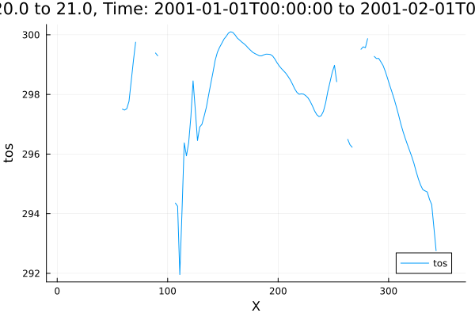{width=600px height=400px}

## Polygon masking, mosaic and plot {#Polygon-masking,-mosaic-and-plot}

In this example we will `mask` the Scandinavian countries with border polygons, then `mosaic` together to make a single plot. 

First, get the country boundary shape files using GADM.jl.

using Rasters, RasterDataSources, ArchGDAL, Shapefile, Plots, Dates, Downloads, NCDatasets

## Download the shapefile {#Download-the-shapefile}

```julia
using Downloads
using Shapefile
shapefile_url = "https://github.com/nvkelso/natural-earth-vector/raw/master/10m_cultural/ne_10m_admin_0_countries.shp"
shapefile_name = "boundary_lines.shp"
Downloads.download(shapefile_url, shapefile_name);
```


### Load using Shapefile.jl {#Load-using-Shapefile.jl}

```julia
shapes = Shapefile.Handle(shapefile_name)
denmark_border = shapes.shapes[71]
norway_border = shapes.shapes[53]
sweden_border = shapes.shapes[54];
```


Then load raster data. We load some worldclim layers using `RasterDataSources` via Rasters.jl:

```julia
using Rasters, RasterDataSources
using Dates
climate = RasterStack(WorldClim{Climate}, (:tmin, :tmax, :prec, :wind); month=July)
```


```
┌ 2160×1080 RasterStack ┐
├───────────────────────┴──────────────────────────────────────────────── dims ┐
  ↓ X Projected{Float64} -180.0:0.16666666666666666:179.83333333333331 ForwardOrdered Regular Intervals{Start},
  → Y Projected{Float64} 89.83333333333333:-0.16666666666666666:-90.0 ReverseOrdered Regular Intervals{Start}
├────────────────────────────────────────────────────────────────────── layers ┤
  :tmin eltype: Union{Missing, Float32} dims: X, Y size: 2160×1080
  :tmax eltype: Union{Missing, Float32} dims: X, Y size: 2160×1080
  :prec eltype: Union{Missing, Int16} dims: X, Y size: 2160×1080
  :wind eltype: Union{Missing, Float32} dims: X, Y size: 2160×1080
├────────────────────────────────────────────────────────────────────── raster ┤
  missingval: missing
  extent: Extent(X = (-180.0, 179.99999999999997), Y = (-90.0, 90.0))
  crs: GEOGCS["WGS 84",DATUM["WGS_1984",SPHEROID["WGS 84",6378137,298.25722...
└──────────────────────────────────────────────────────────────────────────────┘
```


`mask` Denmark, Norway and Sweden from the global dataset using their border polygon, then trim the missing values. We pad `trim` with a 10 pixel margin.

```julia
mask_trim(climate, poly) = trim(mask(climate; with=poly); pad=10)

denmark = mask_trim(climate, denmark_border)
norway = mask_trim(climate, norway_border)
sweden = mask_trim(climate, sweden_border)
```


```
┌ 98×102 RasterStack ┐
├────────────────────┴─────────────────────────────────────────────────── dims ┐
  ↓ X Projected{Float64} 9.49999999999999:0.16666666666666666:25.666666666666657 ForwardOrdered Regular Intervals{Start},
  → Y Projected{Float64} 70.5:-0.16666666666666666:53.666666666666664 ReverseOrdered Regular Intervals{Start}
├────────────────────────────────────────────────────────────────────── layers ┤
  :tmin eltype: Union{Missing, Float32} dims: X, Y size: 98×102
  :tmax eltype: Union{Missing, Float32} dims: X, Y size: 98×102
  :prec eltype: Union{Missing, Int16} dims: X, Y size: 98×102
  :wind eltype: Union{Missing, Float32} dims: X, Y size: 98×102
├────────────────────────────────────────────────────────────────────── raster ┤
  missingval: missing
  extent: Extent(X = (9.49999999999999, 25.833333333333325), Y = (53.666666666666664, 70.66666666666667))
  crs: GEOGCS["WGS 84",DATUM["WGS_1984",SPHEROID["WGS 84",6378137,298.25722...
└──────────────────────────────────────────────────────────────────────────────┘
```


### Plotting with Plots.jl {#Plotting-with-Plots.jl}

First define a function to add borders to all subplots.

```julia
function borders!(p, poly)
    for i in 1:length(p)
        Plots.plot!(p, poly; subplot=i, fillalpha=0, linewidth=0.6)
    end
    return p
end
```


```
borders! (generic function with 1 method)
```


Now we can plot the individual countries.

```julia
dp = plot(denmark)
borders!(dp, denmark_border)
```

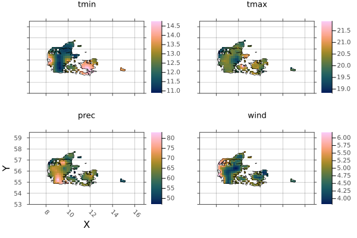{width=600px height=400px}

and sweden

```julia
sp = plot(sweden)
borders!(sp, sweden_border)
```

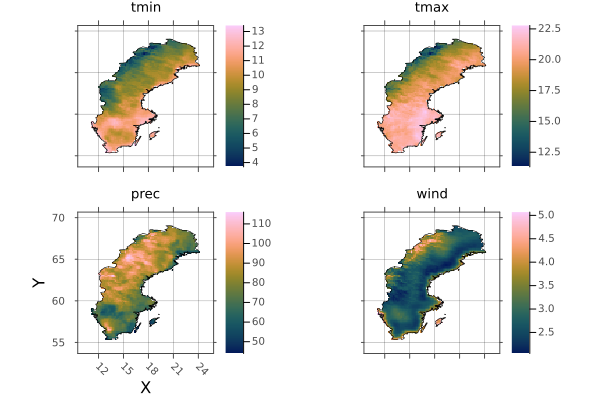{width=600px height=400px}

and norway

```julia
np = plot(norway)
borders!(np, norway_border)
```

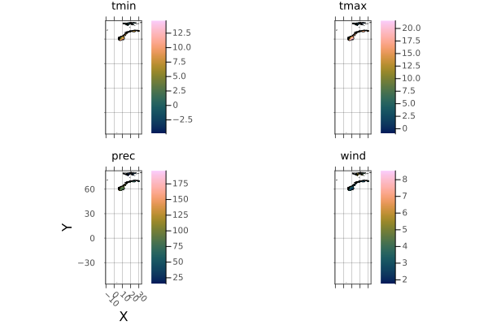{width=600px height=400px}

The Norway shape includes a lot of islands. Lets crop them out using `..` intervals:

```julia
norway_region = climate[X(0..40), Y(55..73)]
plot(norway_region)
```

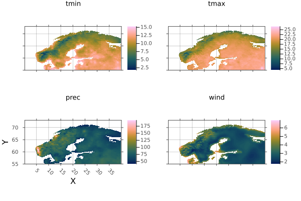{width=600px height=400px}

And mask it with the border again:

```julia
norway = mask_trim(norway_region, norway_border)
np = plot(norway)
borders!(np, norway_border)
```

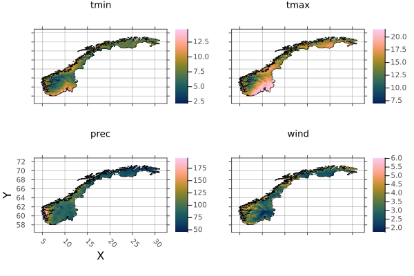{width=600px height=400px}

Now we can combine the countries into a single raster using mosaic. first will take the first value if/when there is an overlap.

```julia
scandinavia = mosaic(first, denmark, norway, sweden)
```


```
┌ 177×119 RasterStack ┐
├─────────────────────┴────────────────────────────────────────────────── dims ┐
  ↓ X Projected{Float64} 3.166666666666657:0.16666666666666666:32.499999999999986 ForwardOrdered Regular Intervals{Start},
  → Y Projected{Float64} 72.66666666666667:-0.16666666666666666:53.00000000000001 ReverseOrdered Regular Intervals{Start}
├────────────────────────────────────────────────────────────────────── layers ┤
  :tmin eltype: Union{Missing, Float32} dims: X, Y size: 177×119
  :tmax eltype: Union{Missing, Float32} dims: X, Y size: 177×119
  :prec eltype: Union{Missing, Int16} dims: X, Y size: 177×119
  :wind eltype: Union{Missing, Float32} dims: X, Y size: 177×119
├────────────────────────────────────────────────────────────────────── raster ┤
  missingval: missing
  extent: Extent(X = (3.166666666666657, 32.66666666666665), Y = (53.00000000000001, 72.83333333333334))
  crs: GEOGCS["WGS 84",DATUM["WGS_1984",SPHEROID["WGS 84",6378137,298.25722...
└──────────────────────────────────────────────────────────────────────────────┘
```


And plot scandinavia, with all borders included:

```julia
p = plot(scandinavia)
borders!(p, denmark_border)
borders!(p, norway_border)
borders!(p, sweden_border)
p
```

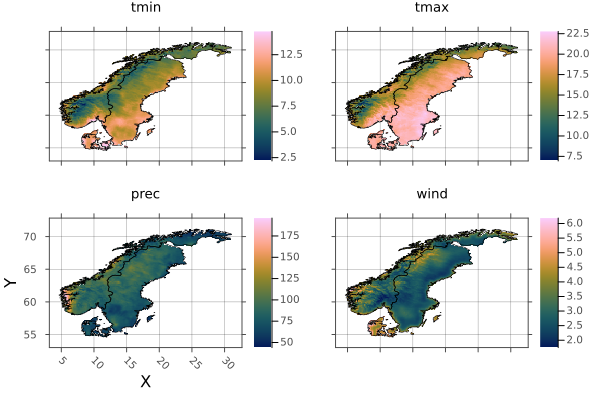{width=600px height=400px}

And save to `netcdf` - a single multi-layered file, and `tif`, which will write a file for each stack layer.

```julia
write("scandinavia.nc", scandinavia)
write("scandinavia.tif", scandinavia)
```


```
(tmin = "scandinavia_tmin.tif",
 tmax = "scandinavia_tmax.tif",
 prec = "scandinavia_prec.tif",
 wind = "scandinavia_wind.tif",)
```


`Rasters.jl` provides a range of other methods that are being added to over time. Where applicable these methods read and write lazily to and from disk-based arrays of common raster file types. These methods also work for entire RasterStacks and RasterSeries using the same syntax.
