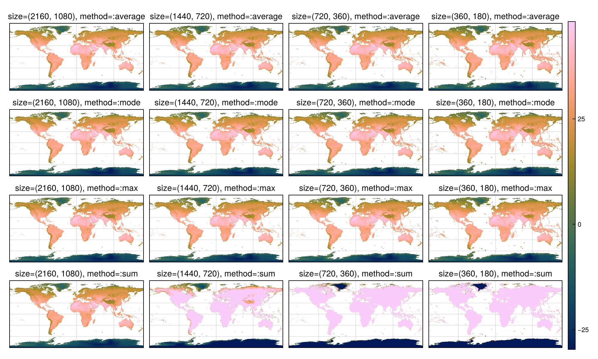
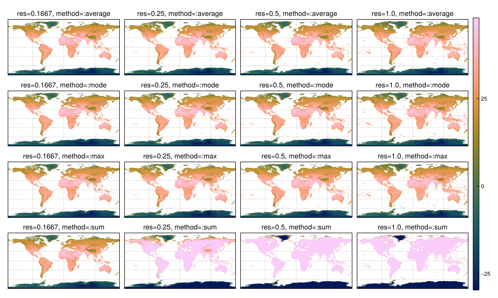
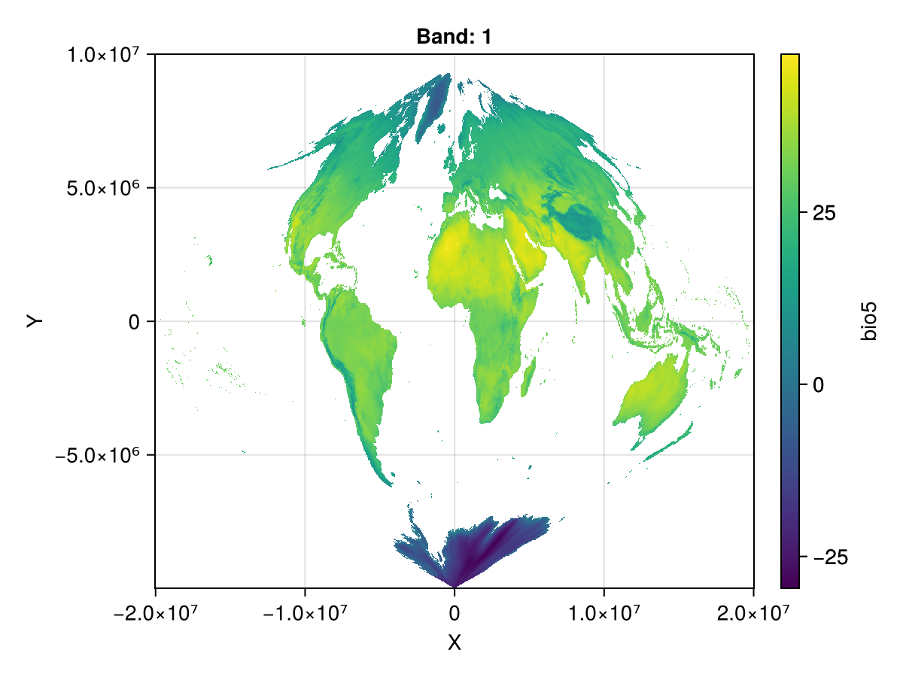
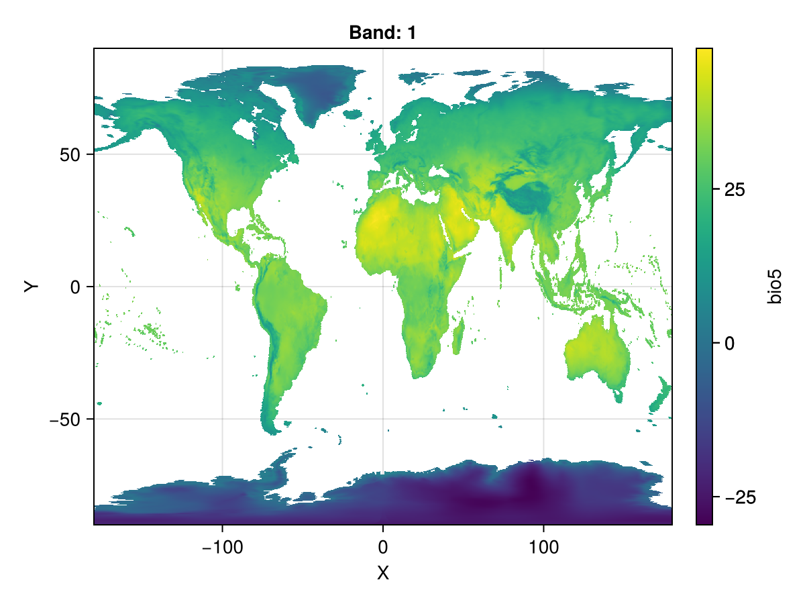
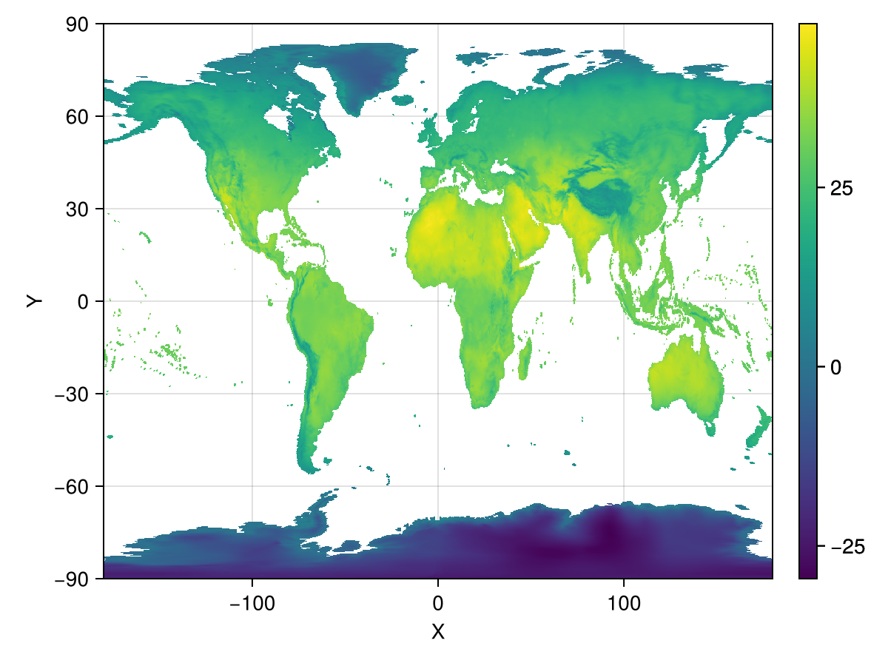
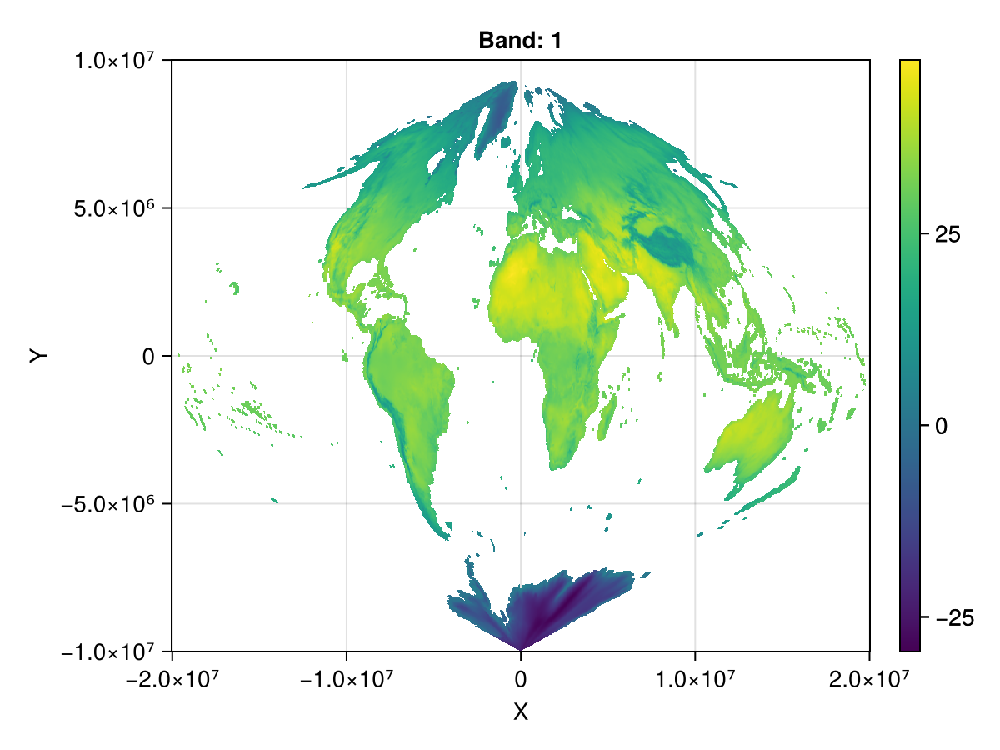
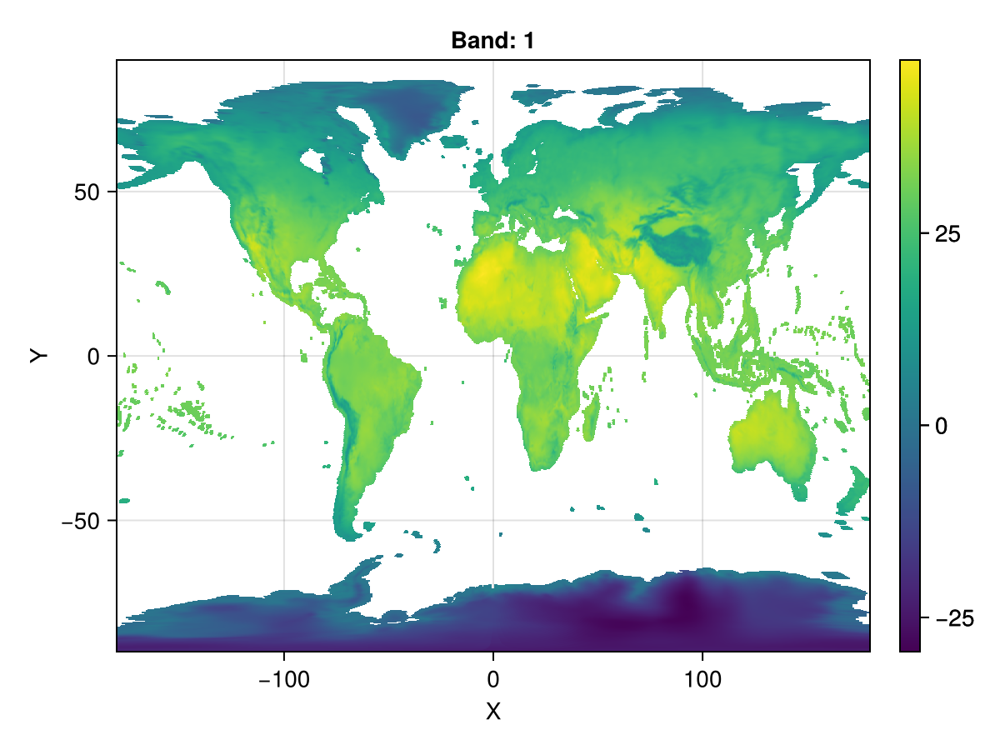

# Reprojection and resampling {#Reprojection-and-resampling}

### What is resampling? {#What-is-resampling?}

**[`resample`](/api#Rasters.resample-Tuple)** &quot;re-samples&quot; the  data by interpolation and can also aggregate or disaggregate, changing the resolution. It always returns a `Regular` lookup (like a range), and is the most flexible of the  resampling methods.

This uses GDAL&#39;s `gdalwarp` algorithm under the hood.  You can call that via [`warp`](/api#Rasters.warp-Tuple) if you need more control, but generally `resample` is sufficient. 

::: tip warp, contributions are welcome!
- Show how to use `warp` to reproject a raster
  

:::

Rasters.jl has a few other methods to change the lookups of a raster.  These are:
- [`reproject`](/api#Rasters.reproject-NTuple{4,%20Any}), which directly reprojects the lookup axes  (but is **only usable for specific cases**, where the source and destination  coordinate systems are both cylindrical, like the long-lat, Mercator, or Web-Mercator projections.) 
  This is a lossless operation and keeps the data exactly the same - only the axes are changed. 
  
- [`aggregate`](/api#Rasters.aggregate) and [`disaggregate`](/api#Rasters.disaggregate), which change the resolution of  the raster by merging ([`aggregate`](/api#Rasters.aggregate)) or splitting ([`disaggregate`](/api#Rasters.disaggregate)) cells.
  They can&#39;t change cells fractionally, and can&#39;t change the projection or coordinate system.
  

Of all these methods, **`resample`** is the most flexible and powerful, and is what we will focus on here.   It is, however, also the slowest.  So if another method is applicable to your problem, you should consider it.

### How `resample` works {#How-resample-works}

`resample` uses GDAL&#39;s `gdalwarp` algorithm under the hood.  This is a battle-tested algorithm and is generally pretty robust.  However, it has the following limitations:
- It always assumes cell-based sampling, instead of point-based sampling.  This does mean that  point-based rasters are converted to cell-based sampling.
  
- It can only accept some primitive types for the input data, since that data is passed directly to a C library. Things like `RGB` or user-defined types are not usually supported.
  

`resample` allows you to specify several methods, see some of them in the next section.

### `resolution`, `size` and `methods` {#resolution,-size-and-methods}

Let&#39;s start by loading the necessary packages:

```julia
using Rasters, RasterDataSources, ArchGDAL
using DimensionalData
using DimensionalData.Lookups
using NaNStatistics
using CairoMakie
```


```julia
ras = Raster(WorldClim{BioClim}, 5)
ras_m = replace_missing(ras, missingval=NaN)
```


```
┌ 2160×1080 Raster{Float64, 2} bio5 ┐
├───────────────────────────────────┴──────────────────────────────────── dims ┐
  ↓ X Projected{Float64} -180.0:0.16666666666666666:179.83333333333331 ForwardOrdered Regular Intervals{Start},
  → Y Projected{Float64} 89.83333333333333:-0.16666666666666666:-90.0 ReverseOrdered Regular Intervals{Start}
├──────────────────────────────────────────────────────────────────── metadata ┤
  Metadata{Rasters.GDALsource} of Dict{String, Any} with 1 entry:
  "filepath" => "./WorldClim/BioClim/wc2.1_10m_bio_5.tif"
├────────────────────────────────────────────────────────────────────── raster ┤
  missingval: NaN
  extent: Extent(X = (-180.0, 179.99999999999997), Y = (-90.0, 90.0))
  crs: GEOGCS["WGS 84",DATUM["WGS_1984",SPHEROID["WGS 84",6378137,298.25722...
└──────────────────────────────────────────────────────────────────────────────┘
    ↓ →     89.8333   89.6667   89.5  …  -89.6667  -89.8333  -90.0
 -180.0    NaN       NaN       NaN       -15.399   -13.805   -14.046
 -179.833  NaN       NaN       NaN       -15.9605  -14.607   -14.5545
    ⋮                                 ⋱                        ⋮
  179.5    NaN       NaN       NaN       -18.2955  -16.7583  -16.72
  179.667  NaN       NaN       NaN       -18.2847  -16.7513  -16.72
  179.833  NaN       NaN       NaN    …  -17.1478  -15.4243  -15.701
```


resampling to a given `size` or `res ≡ resolution` providing a `method` is done with

:::tabs

== size

```julia
julia> ras_sample = resample(ras_m; size=(1440, 720), method="average")
```

```ansi
┌ 1440×720 Raster{Float64, 2} bio5 ┐
├──────────────────────────────────┴───────────────────────────────────── dims ┐
  ↓ X Projected{Float64} -180.0:0.25:179.75 ForwardOrdered Regular Intervals{Start},
  → Y Projected{Float64} 89.75:-0.25:-90.0 ReverseOrdered Regular Intervals{Start}
├──────────────────────────────────────────────────────────────────── metadata ┤
  Metadata{Rasters.GDALsource} of Dict{String, Any} with 1 entry:
  "filepath" => "/vsimem/tmp"
├────────────────────────────────────────────────────────────────────── raster ┤
  missingval: NaN
  extent: Extent(X = (-180.0, 180.0), Y = (-90.0, 90.0))
  crs: GEOGCS["WGS 84",DATUM["WGS_1984",SPHEROID["WGS 84",6378137,298.25722...
└──────────────────────────────────────────────────────────────────────────────┘
    ↓ →    89.75   89.5   89.25   89.0  …  -89.5     -89.75    -90.0
 -180.0   NaN     NaN    NaN     NaN       -15.7547  -15.0816  -14.1678
 -179.75  NaN     NaN    NaN     NaN       -16.1382  -15.5151  -14.5793
    ⋮                                   ⋱                        ⋮
  179.25  NaN     NaN    NaN     NaN       -18.594   -17.7993  -16.7431
  179.5   NaN     NaN    NaN     NaN       -18.4647  -17.7799  -16.732
  179.75  NaN     NaN    NaN     NaN    …  -17.6831  -16.9734  -15.9826
```


== resolution

```julia
julia> ras_sample = resample(ras_m; res=1.0, method="average")
```

```ansi
┌ 360×180 Raster{Float64, 2} bio5 ┐
├─────────────────────────────────┴────────────────────────────────────── dims ┐
  ↓ X Projected{Float64} -180.0:1.0:179.0 ForwardOrdered Regular Intervals{Start},
  → Y Projected{Float64} 89.0:-1.0:-90.0 ReverseOrdered Regular Intervals{Start}
├──────────────────────────────────────────────────────────────────── metadata ┤
  Metadata{Rasters.GDALsource} of Dict{String, Any} with 1 entry:
  "filepath" => "/vsimem/tmp"
├────────────────────────────────────────────────────────────────────── raster ┤
  missingval: NaN
  extent: Extent(X = (-180.0, 180.0), Y = (-90.0, 90.0))
  crs: GEOGCS["WGS 84",DATUM["WGS_1984",SPHEROID["WGS 84",6378137,298.25722...
└──────────────────────────────────────────────────────────────────────────────┘
    ↓ →   89.0   88.0   87.0   86.0   85.0  …  -88.0     -89.0     -90.0
 -180.0  NaN    NaN    NaN    NaN    NaN       -19.728   -19.2911  -15.9072
 -179.0  NaN    NaN    NaN    NaN    NaN       -21.4924  -22.4063  -18.6251
    ⋮                                  ⋮    ⋱                        ⋮
  177.0  NaN    NaN    NaN    NaN    NaN       -24.8445  -25.6942  -22.5898
  178.0  NaN    NaN    NaN    NaN    NaN       -24.738   -25.6031  -21.3692
  179.0  NaN    NaN    NaN    NaN    NaN    …  -22.5468  -21.9183  -18.1424
```


:::

other available methods to try:  `"mode"`, `"max"`, `"sum"`, `"bilinear"`, `"cubic"`, `"cubicspline"`, `"lanczos"`, `"min"`, `"med"`, `"q1"`, `"q3"` and  `"near"`.

Let&#39;s consider a few more examples, with the following options:

```julia
methods = ["average", "mode", "max", "sum"]
sizes = [(2160, 1080), (1440, 720), (720, 360), (360, 180)]
resolutions = [0.16666666666666666, 0.25, 0.5, 1.0];
```


:::tabs

== sizes and methods

```julia
method_sizes = [resample(ras_m; size=size, method=method) for method in methods for size in sizes]
with_theme(Rasters.theme_rasters()) do
    colorrange = (nanminimum(ras_m), nanmaximum(ras_m))
    hm=nothing
    fig = Figure(; size = (1000, 600))
    axs = [Axis(fig[i,j], title="size=$(size), method=:$(method)", titlefont=:regular)
        for (i, method) in enumerate(methods) for (j, size) in enumerate(sizes)]
    for (i, ax) in enumerate(axs)
        hm = heatmap!(ax, method_sizes[i]; colorrange)
    end
    Colorbar(fig[:,end+1], hm)
    hidedecorations!.(axs; grid=false)
    rowgap!(fig.layout, 5)
    colgap!(fig.layout, 10)
    fig
end
```

{width=1000px height=600px}

== resolutions and methods

```julia
method_res = [resample(ras_m; res=res, method=method) for method in methods for res in resolutions]
with_theme(Rasters.theme_rasters()) do
    colorrange = (nanminimum(ras_m), nanmaximum(ras_m))
    hm=nothing
    fig = Figure(; size = (1000, 600))
    axs = [Axis(fig[i,j], title="res=$(round(res, digits=4)), method=:$(method)", titlefont=:regular)
        for (i, method) in enumerate(methods) for (j, res) in enumerate(resolutions)]
    for (i, ax) in enumerate(axs)
        hm = heatmap!(ax, method_res[i]; colorrange)
    end
    Colorbar(fig[:,end+1], hm)
    hidedecorations!.(axs; grid=false)
    rowgap!(fig.layout, 5)
    colgap!(fig.layout, 10)
    fig
end
```

{width=1000px height=600px}

:::

## `reproject` with `resample` using a `ProjString` {#reproject-with-resample-using-a-ProjString}

Geospatial datasets will come in different [projections](https://proj.org/en/9.4/operations/projections/index.html) or coordinate reference systems (CRS) for many reasons. Here, we will focus on `MODIS SINUSOIDAL` and `EPSG`, and transformations between them.

Let&#39;s load our test raster

```julia
ras = Raster(WorldClim{BioClim}, 5)
ras_m = replace_missing(ras, missingval=NaN);
```


### Sinusoidal Projection (MODIS) {#Sinusoidal-Projection-MODIS}

```julia
SINUSOIDAL_CRS = ProjString("+proj=sinu +lon_0=0 +type=crs")
```


```
ProjString: +proj=sinu +lon_0=0 +type=crs
```


::: details Raw MODIS ProjString

```julia
SINUSOIDAL_CRS = ProjString("+proj=sinu +lon_0=0 +x_0=0 +y_0=0 +a=6371007.181 +b=6371007.181 +units=m +no_defs")
```


:::

and the `resample` is performed with

```julia
ras_sin = resample(ras_m; size=(2160, 1080), crs=SINUSOIDAL_CRS, method="average")
```


```
┌ 2160×1080 Raster{Float64, 2} bio5 ┐
├───────────────────────────────────┴──────────────────────────────────── dims ┐
  ↓ X Projected{Float64} -2.0037508342789244e7:18547.034693196307:2.000553955982158e7 ForwardOrdered Regular Intervals{Start},
  → Y Projected{Float64} 9.983453040980069e6:-18512.68833265335:-9.991737669952895e6 ReverseOrdered Regular Intervals{Start}
├──────────────────────────────────────────────────────────────────── metadata ┤
  Metadata{Rasters.GDALsource} of Dict{String, Any} with 1 entry:
  "filepath" => "/vsimem/tmp"
├────────────────────────────────────────────────────────────────────── raster ┤
  missingval: NaN
  extent: Extent(X = (-2.0037508342789244e7, 2.0024086594514776e7), Y = (-9.991737669952895e6, 1.0001965729312722e7))
  crs: +proj=sinu +lon_0=0 +type=crs
└──────────────────────────────────────────────────────────────────────────────┘
  ↓ →          9.98345e6    9.96494e6  …   -9.97322e6   -9.99174e6
 -2.00375e7  NaN          NaN             NaN          NaN
 -2.0019e7   NaN          NaN             NaN          NaN
  ⋮                                    ⋱                 ⋮
  1.99684e7  NaN          NaN             NaN          NaN
  1.9987e7   NaN          NaN             NaN          NaN
  2.00055e7  NaN          NaN          …  NaN          NaN
```


::: tip

`GDAL` always changes the locus to cell sampling, you can reset this by using `shiftlocus`.

:::

let&#39;s compare the total counts!

```julia
nansum(ras_m), nansum(ras_sin)
```


```
(1.1263161695036696e7, 1.1730134537265886e7)
```


and, how does this looks like?

```julia
fig, ax, plt = heatmap(ras_sin)
Colorbar(fig[1,2], plt)
fig
```

{width=600px height=450px}

now, let&#39;s go back to `latitude` and `longitude` and reduce the resolution

```julia
ras_epsg = resample(ras_sin; size=(1440,720), crs=EPSG(4326), method="average")
```


```
┌ 1440×720 Raster{Float64, 2} bio5 ┐
├──────────────────────────────────┴───────────────────────────────────── dims ┐
  ↓ X Projected{Float64} -180.0:0.25:179.75 ForwardOrdered Regular Intervals{Start},
  → Y Projected{Float64} 89.75002543153558:-0.2499745684644309:-89.98168929439024 ReverseOrdered Regular Intervals{Start}
├──────────────────────────────────────────────────────────────────── metadata ┤
  Metadata{Rasters.GDALsource} of Dict{String, Any} with 1 entry:
  "filepath" => "/vsimem/tmp"
├────────────────────────────────────────────────────────────────────── raster ┤
  missingval: NaN
  extent: Extent(X = (-180.0, 180.0), Y = (-89.98168929439024, 90.0))
  crs: EPSG:4326
└──────────────────────────────────────────────────────────────────────────────┘
    ↓ →    89.75   89.5001   89.2501  …  -89.4817  -89.7317  -89.9817
 -180.0   NaN     NaN       NaN          -22.341   -21.57    -21.7346
 -179.75  NaN     NaN       NaN          -22.3399  -21.5718  -21.7351
    ⋮                                 ⋱                        ⋮
  179.25  NaN     NaN       NaN          -24.3415  -23.9049  -23.734
  179.5   NaN     NaN       NaN          -24.341   -23.9056  -23.7339
  179.75  NaN     NaN       NaN       …  -24.3405  -23.9063  -23.7338
```


and let&#39;s apply `shiftlocus` such that the lookups share the exact same grid, which might be needed when building bigger datasets:

```julia
locus_resampled = DimensionalData.shiftlocus(Center(), ras_epsg)
```


```
┌ 1440×720 Raster{Float64, 2} bio5 ┐
├──────────────────────────────────┴───────────────────────────────────── dims ┐
  ↓ X Projected{Float64} -179.875:0.25:179.875 ForwardOrdered Regular Intervals{Center},
  → Y Projected{Float64} 89.8750127157678:-0.2499745684644309:-89.85670201015802 ReverseOrdered Regular Intervals{Center}
├──────────────────────────────────────────────────────────────────── metadata ┤
  Metadata{Rasters.GDALsource} of Dict{String, Any} with 1 entry:
  "filepath" => "/vsimem/tmp"
├────────────────────────────────────────────────────────────────────── raster ┤
  missingval: NaN
  extent: Extent(X = (-180.0, 180.0), Y = (-89.98168929439024, 90.00000000000001))
  crs: EPSG:4326
└──────────────────────────────────────────────────────────────────────────────┘
    ↓ →     89.875   89.625   89.3751  …  -89.3568  -89.6067  -89.8567
 -179.875  NaN      NaN      NaN          -22.341   -21.57    -21.7346
 -179.625  NaN      NaN      NaN          -22.3399  -21.5718  -21.7351
    ⋮                                  ⋱                        ⋮
  179.375  NaN      NaN      NaN          -24.3415  -23.9049  -23.734
  179.625  NaN      NaN      NaN          -24.341   -23.9056  -23.7339
  179.875  NaN      NaN      NaN       …  -24.3405  -23.9063  -23.7338
```


::: info Things to keep in mind
- You can in fact resample to another raster `resample(ras; to=ref_ras)`, if you want perfect alignment. Contributions are welcome for this use case!
  
- This doesn&#39;t work for irregularly sampled rasters.
  

:::

```julia
fig, ax, plt = heatmap(ras_epsg)
Colorbar(fig[1,2], plt)
fig
```

{width=600px height=450px}

### A `Raster` from scratch {#A-Raster-from-scratch}

```julia
x_range = LinRange(-180, 179.75, 1440)
y_range = LinRange(89.75, -90, 720)
ras_data = ras_epsg.data
```


create the raster

```julia
julia> using Rasters.Lookups

julia> ras_scratch = Raster(ras_data, (X(x_range; sampling=Intervals(Start())),
           Y(y_range; sampling=Intervals(Start()))), crs=EPSG(4326), missingval=NaN)
```

```ansi
┌ 1440×720 Raster{Float64, 2} ┐
├─────────────────────────────┴────────────────────────────────────────── dims ┐
  ↓ X Projected{Float64} LinRange{Float64}(-180.0, 179.75, 1440) ForwardOrdered Regular Intervals{Start},
  → Y Projected{Float64} LinRange{Float64}(89.75, -90.0, 720) ReverseOrdered Regular Intervals{Start}
├────────────────────────────────────────────────────────────────────── raster ┤
  missingval: NaN
  extent: Extent(X = (-180.0, 180.0), Y = (-90.0, 90.0))
  crs: EPSG:4326
└──────────────────────────────────────────────────────────────────────────────┘
    ↓ →    89.75   89.5   89.25   89.0  …  -89.5     -89.75    -90.0
 -180.0   NaN     NaN    NaN     NaN       -22.341   -21.57    -21.7346
 -179.75  NaN     NaN    NaN     NaN       -22.3399  -21.5718  -21.7351
 -179.5   NaN     NaN    NaN     NaN       -22.3389  -21.5736  -21.7356
 -179.25  NaN     NaN    NaN     NaN       -22.3378  -21.5754  -21.736
    ⋮                                   ⋱                        ⋮
  178.75  NaN     NaN    NaN     NaN       -24.3424  -23.9036  -23.7343
  179.0   NaN     NaN    NaN     NaN       -24.3419  -23.9043  -23.7341
  179.25  NaN     NaN    NaN     NaN       -24.3415  -23.9049  -23.734
  179.5   NaN     NaN    NaN     NaN       -24.341   -23.9056  -23.7339
  179.75  NaN     NaN    NaN     NaN    …  -24.3405  -23.9063  -23.7338
```


::: warning

Note that you need to specify `sampling=Intervals(Start())` for `X` and `Y`.

This requires that you run `using Rasters.Lookups`, where the `Intervals` and `Start` types are defined.

:::

and take a look

```julia
fig, ax, plt = heatmap(ras_scratch)
Colorbar(fig[1,2], plt)
fig
```

{width=600px height=450px}

and the corresponding resampled projection

```julia
julia> ras_sin_s = resample(ras_scratch; size=(1440,720), crs=SINUSOIDAL_CRS, method="average")
```

```ansi
┌ 1440×720 Raster{Float64, 2} ┐
├─────────────────────────────┴────────────────────────────────────────── dims ┐
  ↓ X Projected{Float64} -2.0037508342789244e7:27820.552039794457:1.999626604247498e7 ForwardOrdered Regular Intervals{Start},
  → Y Projected{Float64} 9.974183816928538e6:-27781.912384183634:-1.0001011187299494e7 ReverseOrdered Regular Intervals{Start}
├──────────────────────────────────────────────────────────────────── metadata ┤
  Metadata{Rasters.GDALsource} of Dict{String, Any} with 1 entry:
  "filepath" => "/vsimem/tmp"
├────────────────────────────────────────────────────────────────────── raster ┤
  missingval: NaN
  extent: Extent(X = (-2.0037508342789244e7, 2.0024086594514776e7), Y = (-1.0001011187299494e7, 1.0001965729312722e7))
  crs: +proj=sinu +lon_0=0 +type=crs
└──────────────────────────────────────────────────────────────────────────────┘
  ↓ →          9.97418e6    9.9464e6    9.91862e6  …   -9.97323e6   -1.0001e7
 -2.00375e7  NaN          NaN         NaN             NaN          NaN
 -2.00097e7  NaN          NaN         NaN             NaN          NaN
  ⋮                                                ⋱                 ⋮
  1.99406e7  NaN          NaN         NaN             NaN          NaN
  1.99684e7  NaN          NaN         NaN             NaN          NaN
  1.99963e7  NaN          NaN         NaN          …  NaN          NaN
```


```julia
fig, ax, plt = heatmap(ras_sin_s)
Colorbar(fig[1,2], plt)
fig
```

{width=600px height=450px}

and go back from `sin` to `epsg`:

```julia
ras_epsg = resample(ras_sin_s; size=(1440,720), crs=EPSG(4326), method="average")
locus_resampled = DimensionalData.shiftlocus(Center(), ras_epsg)

fig, ax, plt = heatmap(locus_resampled)
Colorbar(fig[1,2], plt)
fig
```

{width=600px height=450px}

and compare the total counts again!

```julia
nansum(ras_sin_s), nansum(locus_resampled)
```


```
(5.780817076729905e6, 6.287521031058559e6)
```


::: danger

Note that all counts are a little bit off. Could we mitigate this some more?

:::
