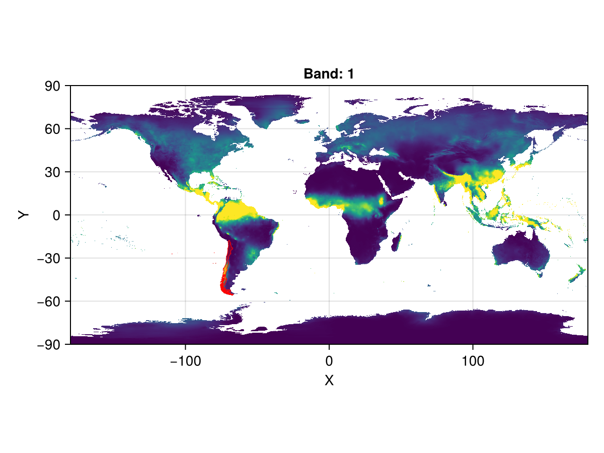
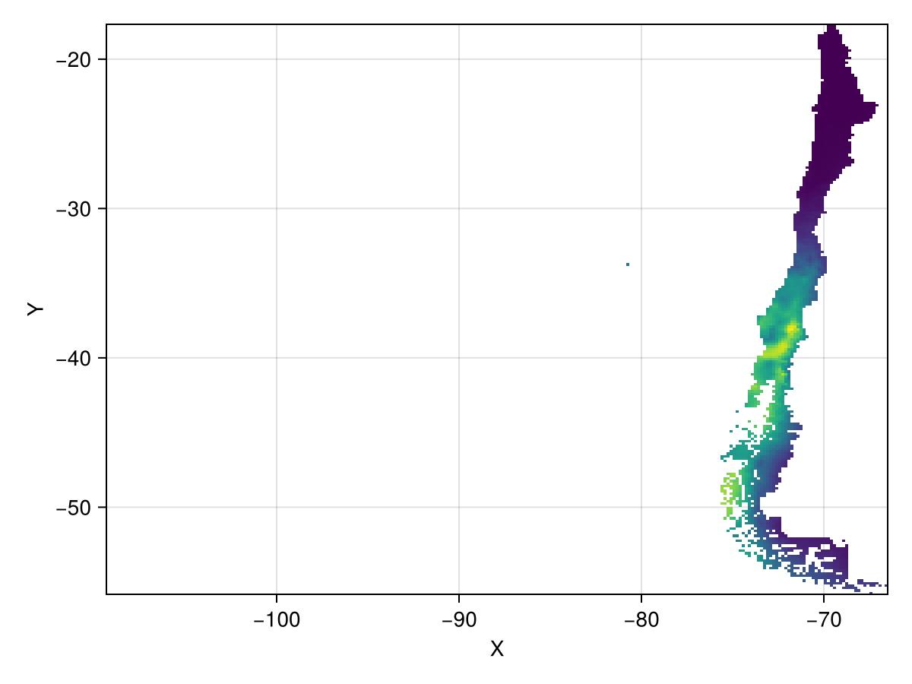
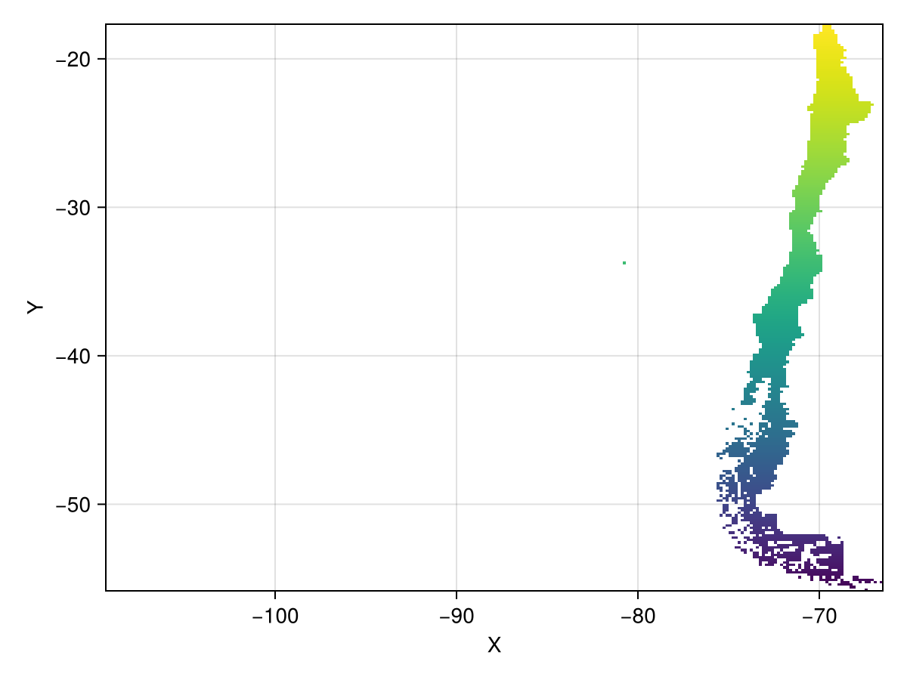

# Computing spatial means {#Computing-spatial-means}


It&#39;s very common to want to compute the mean of some value over some area of a raster.  The initial approach is to simply average the values, but this will give you the arithmetic mean, not the spatial mean.

The reason for this is that raster cells do not always have the same area, especially over a large region of the Earth where its curvature comes into play.

To compute the spatial mean, you need to weight the values by the area of each cell.  You can do this by multiplying the values by the cell area, then summing the values, and dividing that number by the total area.  That was the motivation for this example.

Let&#39;s get the rainfall over Chile, and compute the average rainfall across the country for the month of June.

## Acquiring the data {#Acquiring-the-data}

We&#39;ll get the precipitation data across the globe from [WorldClim](https://www.worldclim.org/data/index.html), via [RasterDataSources.jl](https://github.com/EcoJulia/RasterDataSources.jl), and use the `month` keyword argument to get the June data.

Then, we can get the geometry of Chile from [NaturalEarth.jl](https://github.com/JuliaGeo/NaturalEarth.jl), and use `Rasters.mask` to get the data just for Chile.

```julia
using Rasters
import Proj # to activate the spherical `cellarea` method

using ArchGDAL, RasterDataSources, NaturalEarth # purely for data loading

using CairoMakie # for plotting

precip = Raster(WorldClim{Climate}, :prec; month = 6)
```


```
┌ 2160×1080 Raster{Union{Missing, Int16}, 2} prec ┐
├─────────────────────────────────────────────────┴────────────────────── dims ┐
  ↓ X Projected{Float64} -180.0:0.16666666666666666:179.83333333333331 ForwardOrdered Regular Intervals{Start},
  → Y Projected{Float64} 89.83333333333333:-0.16666666666666666:-90.0 ReverseOrdered Regular Intervals{Start}
├──────────────────────────────────────────────────────────────────── metadata ┤
  Metadata{Rasters.GDALsource} of Dict{String, Any} with 1 entry:
  "filepath" => "./WorldClim/Climate/prec/wc2.1_10m_prec_06.tif"
├────────────────────────────────────────────────────────────────────── raster ┤
  missingval: missing
  extent: Extent(X = (-180.0, 179.99999999999997), Y = (-90.0, 90.0))
  crs: GEOGCS["WGS 84",DATUM["WGS_1984",SPHEROID["WGS 84",6378137,298.25722...
└──────────────────────────────────────────────────────────────────────────────┘
    ↓ →    89.8333    89.6667    …  -89.5  -89.6667  -89.8333  -90.0
 -180.0      missing    missing       0      0         0         0
 -179.833    missing    missing       0      0         0         0
    ⋮                            ⋱                               ⋮
  179.5      missing    missing       0      0         0         0
  179.667    missing    missing       0      0         0         0
  179.833    missing    missing  …    0      0         0         0
```


```julia
all_countries = naturalearth("admin_0_countries", 10)
chile = all_countries.geometry[findfirst(==("Chile"), all_countries.NAME)]
```


```
2D MultiPolygonwith 163 sub-geometries
```


Let&#39;s plot the precipitation on the world map, and highlight Chile:

```julia
f, a, p = heatmap(precip; colorrange = Makie.zscale(replace_missing(precip, NaN)), axis = (; aspect = DataAspect()))
p2 = poly!(a, chile; color = (:red, 0.3), strokecolor = :red, strokewidth = 0.5)
f
```

{width=600px height=450px}

You can see Chile highlighted in red, in the bottom left quadrant.

## Processing the data {#Processing-the-data}

First, let&#39;s make sure that we only have the data that we care about, and crop and mask the raster so it only has values in Chile. We can crop by the geometry, which really just generates a view into the raster that is bounded by the geometry&#39;s bounding box.

```julia
cropped_precip = crop(precip; to = chile)
```


```
┌ 257×229 Raster{Union{Missing, Int16}, 2} prec ┐
├───────────────────────────────────────────────┴──────────────────────── dims ┐
  ↓ X Projected{Float64} -109.33333333333334:0.16666666666666666:-66.66666666666667 ForwardOrdered Regular Intervals{Start},
  → Y Projected{Float64} -17.833333333333332:-0.16666666666666666:-55.833333333333336 ReverseOrdered Regular Intervals{Start}
├──────────────────────────────────────────────────────────────────── metadata ┤
  Metadata{Rasters.GDALsource} of Dict{String, Any} with 1 entry:
  "filepath" => "./WorldClim/Climate/prec/wc2.1_10m_prec_06.tif"
├────────────────────────────────────────────────────────────────────── raster ┤
  missingval: missing
  extent: Extent(X = (-109.33333333333334, -66.5), Y = (-55.833333333333336, -17.666666666666664))
  crs: GEOGCS["WGS 84",DATUM["WGS_1984",SPHEROID["WGS 84",6378137,298.25722...
└──────────────────────────────────────────────────────────────────────────────┘
    ↓ →     -17.8333    -18.0       …  -55.5       -55.6667    -55.8333
 -109.333      missing     missing        missing     missing     missing
 -109.167      missing     missing        missing     missing     missing
    ⋮                               ⋱                          
  -67.0       6           4         …   61            missing     missing
  -66.8333    7           6               missing   66          74
  -66.6667    6           5               missing     missing     missing
```


Now, we mask the data such that any data outside the geometry is set to `missing`.

```julia
masked_precip = mask(cropped_precip; with = chile)
heatmap(masked_precip)
```

{width=600px height=450px}

This is a lot of missing data, but that&#39;s mainly because the Chile geometry we have encompasses the Easter Islands as well, in the middle of the Pacific.
<details class='jldocstring custom-block' >
<summary><a id='Rasters.cellarea-tutorials-spatial_mean' href='#Rasters.cellarea-tutorials-spatial_mean'><span class="jlbinding">Rasters.cellarea</span></a> <Badge type="info" class="jlObjectType jlFunction" text="Function" /></summary>


```julia
cellarea([method], x)
```


Gives the approximate area of each gridcell of `x`. By assuming the earth is a sphere, it approximates the true size to about 0.1%, depending on latitude. 

Run `using ArchGDAL` or `using Proj` to make this method fully available.
- `method`: You can specify whether you want to compute the area in the plane of your projection `Planar()` or on a sphere of some radius `Spherical(; radius=...)`(the default).
  
- `Spherical` will compute cell area on the sphere, by transforming all points back to long-lat.  You can specify the radius by the `radius` keyword argument here.  By default, this is `6371008.8`, the mean radius of the Earth.
  
- `Planar` will compute cell area in the plane of the CRS you have chosen.  Be warned that this will likely be incorrect for non-equal-area projections.
  

Returns a Raster with the same x and y dimensions as the input,  where each value in the raster encodes the area of the cell (in meters by default).

**Example**

```julia
using Rasters, Proj, Rasters.Lookups
xdim = X(Projected(90.0:10.0:120; sampling=Intervals(Start()), crs=EPSG(4326)))
ydim = Y(Projected(0.0:10.0:50; sampling=Intervals(Start()), crs=EPSG(4326)))
myraster = rand(xdim, ydim)
cs = cellarea(myraster)

# output
╭───────────────────────╮
│ 4×6 Raster{Float64,2} │
├───────────────────────┴─────────────────────────────────────────────────── dims ┐
  ↓ X Projected{Float64} 90.0:10.0:120.0 ForwardOrdered Regular Intervals{Start},
  → Y Projected{Float64} 0.0:10.0:50.0 ForwardOrdered Regular Intervals{Start}
├───────────────────────────────────────────────────────────────────────── raster ┤
  extent: Extent(X = (90.0, 130.0), Y = (0.0, 60.0))

  crs: EPSG:4326
└─────────────────────────────────────────────────────────────────────────────────┘
   ↓ →  0.0        10.0        20.0        30.0            40.0      50.0
  90.0  1.23017e6   1.19279e6   1.11917e6   1.01154e6  873182.0  708290.0
 100.0  1.23017e6   1.19279e6   1.11917e6   1.01154e6  873182.0  708290.0
 110.0  1.23017e6   1.19279e6   1.11917e6   1.01154e6  873182.0  708290.0
 120.0  1.23017e6   1.19279e6   1.11917e6   1.01154e6  873182.0  708290.0
```


WARNING: This feature is experimental. It may change in future versions, and may not be 100% reliable in all cases. Please file github issues if problems occur.


<Badge type="info" class="source-link" text="source"><a href="https://github.com/rafaqz/Rasters.jl/blob/e21dbeaa6368c96cbd80ad39da2f44ca66031437/src/extensions.jl#L165-L209" target="_blank" rel="noreferrer">source</a></Badge>

</details>


`cellarea` computes the area of each cell in a raster. This is useful for a number of reasons - if you have a variable like population per cell, or elevation ([spatially extensive variables](https://r-spatial.org/book/05-Attributes.html#sec-extensiveintensive)), you&#39;ll want to account for the fact that different cells have different areas.

You can specify whether you want to compute the area in the plane of your projection (`Planar()`), or on a sphere of some radius (`Spherical(; radius=...)`).

Now, let&#39;s compute the average precipitation per square meter across Chile. First, we need to get the area of each cell in square meters.  We&#39;ll use the spherical method, since we&#39;re working with a geographic coordinate system.  This is the default.

```julia
areas = cellarea(masked_precip)
masked_areas = mask(areas; with = chile)
heatmap(masked_areas; axis = (; title = "Cell area in square meters"))
```

{width=600px height=450px}

You can see here that cells are largest towards the equator, and smallest away from it.  This means that cells away from the equator should have a smaller contribution to the average than cells nearer the equator.

## Computing the spatial mean {#Computing-the-spatial-mean}

Now we can compute the average precipitation per square meter. First, we compute total precipitation over each grid cell. (The units of this Raster will be m^2 * mm, which happens to be equal to liter.)

```julia
precip_per_area = masked_precip .* masked_areas
```


```
┌ 257×229 Raster{Union{Missing, Float64}, 2} ┐
├────────────────────────────────────────────┴─────────────────────────── dims ┐
  ↓ X Projected{Float64} -109.33333333333334:0.16666666666666666:-66.66666666666667 ForwardOrdered Regular Intervals{Start},
  → Y Projected{Float64} -17.833333333333332:-0.16666666666666666:-55.833333333333336 ReverseOrdered Regular Intervals{Start}
├────────────────────────────────────────────────────────────────────── raster ┤
  missingval: missing
  extent: Extent(X = (-109.33333333333334, -66.5), Y = (-55.833333333333336, -17.666666666666664))
  crs: GEOGCS["WGS 84",DATUM["WGS_1984",SPHEROID["WGS 84",6378137,298.25722...
└──────────────────────────────────────────────────────────────────────────────┘
    ↓ →     -17.8333    -18.0       …  -55.5       -55.6667    -55.8333
 -109.333      missing     missing        missing     missing     missing
 -109.167      missing     missing        missing     missing     missing
 -109.0        missing     missing        missing     missing     missing
 -108.833      missing     missing        missing     missing     missing
    ⋮                               ⋱                          
  -67.3333     missing     missing        missing     missing     missing
  -67.1667     missing     missing        missing     missing     missing
  -67.0        missing     missing  …     missing     missing     missing
  -66.8333     missing     missing        missing     missing     missing
  -66.6667     missing     missing        missing     missing     missing
```


We can sum this to get the total precipitation across Chile:

```julia
total_precip = sum(skipmissing(precip_per_area))
```


```
8.143158931480214e13
```


We can also sum the areas to get the total area of Chile (in this raster, at least).

```julia
total_area = sum(skipmissing(masked_areas))
```


```
7.344109655259728e11
```


And we can convert that to an average (in mm) by dividing by the total area:

```julia
avg_precip = total_precip / total_area
```


```
110.88013814783145
```


According to the internet, Chile gets about 100mm of rain per square meter in June, so our statistic seems pretty close.

Let&#39;s see what happens if we don&#39;t account for cell areas.  An equivalent assumption would be that all cells have the same area.

```julia
bad_total_precip = sum(skipmissing(masked_precip))
bad_avg_precip = bad_total_precip / length(collect(skipmissing(masked_precip)))
```


```
118.05119825708061
```


This is misestimated!  This is why it&#39;s important to account for cell areas when computing averages.

::: tip Note

If you made it this far, congratulations!

It&#39;s interesting to note that we&#39;ve replicated the workflow of `zonal` here. `zonal` is a more general function that can be used to compute any function over geometries, and it has multithreading built in.

But fundamentally, this is all that `zonal` is doing under the hood - masking and cropping the raster to the geometry, and then computing the statistic.

:::

## Summary {#Summary}

In this tutorial, we&#39;ve seen how to compute the spatial mean of a raster, and how to account for the fact that raster cells do not always have the same area.

We&#39;ve also seen how to use the `cellarea` function to compute the area of each cell in a raster, and how to use the `mask` function to get the data within a geometry.

We&#39;ve seen that the spatial mean is not the same as the arithmetic mean, and that we need to account for the area of each cell when computing the average.

## Bonus: Computing spatial means across dimensions {#Bonus:-Computing-spatial-means-across-dimensions}

As a next step, we would like to know how precipitation will change in Chile until the end of the 21st century. To do this, we can use climate model outputs. This is a bit more complicated than calculating historical precipitation, because the forecast data can come from multiple climate models (GCMs), which each can be run under different socio-economic scenarios (SSPs). Here, we&#39;ll show how to use additional dimensions to keep track of this type of data.

To start, we define a simple function that takes an SSP (socioeconomic scenario) and a GCM (climate model) as input, and return the appropriate climate data. 

```julia
using Dates
getfutureprec(ssp, gcm) = Raster(WorldClim{Future{Climate, CMIP6, gcm, ssp}}, :prec, date = Date(2090))
```


```
getfutureprec (generic function with 1 method)
```


Rather than having a seperate Raster object for each combination of GCM and SSP, we will do our analysis on a single Raster, which will have `gcm` and `ssp` as additional dimensions. In total, our Raster will have four dimensions: X, Y, gcm, and ssp. 

To accomplish this, we will leverage some tools from [DimensionalData](https://github.com/rafaqz/DimensionalData.jl), which is the package that underlies Rasters.jl. We start by defining two dimensions that correspond to the SSPs and GCMs we are interested in, then use the `@d` macro from [DimensionalData](https://github.com/rafaqz/DimensionalData.jl) to preserve these dimensions as we get the data, and then combine all Rasters into a single object using `Rasters.combine`.

```julia
SSPs = Dim{:ssp}([SSP126, SSP370]) # SSP126 is a low-emission scenario, SSP370 is a high-emission scenario
GCMs = Dim{:gcm}([GFDL_ESM4, IPSL_CM6A_LR]) # These are different general circulation (climate) models

precip_future = (@d getfutureprec.(SSPs, GCMs)) |> RasterSeries |> Rasters.combine
```


```
┌ 2160×1080×12×2×2 Raster{Union{Missing, Float32}, 5} prec ┐
├──────────────────────────────────────────────────────────┴───────────── dims ┐
  ↓ X    Projected{Float64} -180.0:0.16666666666666666:179.83333333333331 ForwardOrdered Regular Intervals{Start},
  → Y    Projected{Float64} 89.83333333333333:-0.16666666666666666:-90.0 ReverseOrdered Regular Intervals{Start},
  ↗ Band Categorical{String} [wc2.1_2.5m_prec_01, wc2.1_2.5m_prec_02, …, wc2.1_2.5m_prec_11, wc2.1_2.5m_prec_12] Unordered,
  ⬔ ssp  Sampled{DataType} [SSP126, SSP370] Unordered Irregular Points,
  ◩ gcm  Sampled{DataType} [GFDL_ESM4, IPSL_CM6A_LR] Unordered Irregular Points
├──────────────────────────────────────────────────────────────────── metadata ┤
  Metadata{Rasters.GDALsource} of Dict{String, Any} with 1 entry:
  "filepath" => "./WorldClim/Future/Climate/ssp126/GFDL-ESM4/wc2.1_10m_prec_GFD…
├────────────────────────────────────────────────────────────────────── raster ┤
  missingval: missing
  extent: Extent(X = (-180.0, 179.99999999999997), Y = (-90.0, 90.0), Band = (nothing, nothing), ssp = (nothing, nothing), gcm = (nothing, nothing))
  crs: GEOGCS["WGS 84",DATUM["WGS_1984",SPHEROID["WGS 84",6378137,298.25722...
└──────────────────────────────────────────────────────────────────────────────┘
[:, :, 1, 1, 1]
    ↓ →    89.8333    89.6667    …  -89.5  -89.6667  -89.8333  -90.0
 -180.0      missing    missing       0.0    0.0       0.0       0.0
    ⋮                            ⋱                               ⋮
  179.833    missing    missing  …    0.0    0.0       0.0       0.0
```


Since the format of WorldClim&#39;s datasets for future climate is slightly different from the dataset for the historical period, this actually returned a 5-dimensional raster, with a `Band` dimension that represents months. Here we&#39;ll just select the 6th month, matching the selection above (but note that the analysis would also work for all Bands simultaneously). We will also replace the `NaN` missing value by the more standard `missing` using [`replace_missing`](/tutorials/array_operations#replace_missing). 

```julia
precip_future = precip_future[Band = 6]
precip_future = replace_missing(precip_future)
```


```
┌ 2160×1080×2×2 Raster{Union{Missing, Float32}, 4} prec ┐
├───────────────────────────────────────────────────────┴──────────────── dims ┐
  ↓ X   Projected{Float64} -180.0:0.16666666666666666:179.83333333333331 ForwardOrdered Regular Intervals{Start},
  → Y   Projected{Float64} 89.83333333333333:-0.16666666666666666:-90.0 ReverseOrdered Regular Intervals{Start},
  ↗ ssp Sampled{DataType} [SSP126, SSP370] Unordered Irregular Points,
  ⬔ gcm Sampled{DataType} [GFDL_ESM4, IPSL_CM6A_LR] Unordered Irregular Points
├──────────────────────────────────────────────────────────────────── metadata ┤
  Metadata{Rasters.GDALsource} of Dict{String, Any} with 1 entry:
  "filepath" => "./WorldClim/Future/Climate/ssp126/GFDL-ESM4/wc2.1_10m_prec_GFD…
├────────────────────────────────────────────────────────────────────── raster ┤
  missingval: missing
  extent: Extent(X = (-180.0, 179.99999999999997), Y = (-90.0, 90.0), ssp = (nothing, nothing), gcm = (nothing, nothing))
  crs: GEOGCS["WGS 84",DATUM["WGS_1984",SPHEROID["WGS 84",6378137,298.25722...
└──────────────────────────────────────────────────────────────────────────────┘
[:, :, 1, 1]
    ↓ →    89.8333    89.6667    …  -89.5  -89.6667  -89.8333  -90.0
 -180.0      missing    missing       0.1    0.3       0.3       0.4
    ⋮                            ⋱                               ⋮
  179.667    missing    missing       0.0    0.0       0.0       0.0
  179.833    missing    missing  …    0.3    0.3       0.3       0.3
```


On our 4-dimensional raster, functions like `crop` and `mask`, as well as broadcasting, will still work.

Here we repeat the procedure from above to mask out areas so we only have data for Chile, and then multiply by the cell area. 

```julia
masked_precip_future = mask(crop(precip_future; to = chile); with = chile)

precip_litres_future = masked_precip_future .* areas
```


```
┌ 257×229×2×2 Raster{Union{Missing, Float64}, 4} ┐
├────────────────────────────────────────────────┴─────────────────────── dims ┐
  ↓ X   Projected{Float64} -109.33333333333334:0.16666666666666666:-66.66666666666667 ForwardOrdered Regular Intervals{Start},
  → Y   Projected{Float64} -17.833333333333332:-0.16666666666666666:-55.833333333333336 ReverseOrdered Regular Intervals{Start},
  ↗ ssp Sampled{DataType} [SSP126, SSP370] Unordered Irregular Points,
  ⬔ gcm Sampled{DataType} [GFDL_ESM4, IPSL_CM6A_LR] Unordered Irregular Points
├────────────────────────────────────────────────────────────────────── raster ┤
  missingval: missing
  extent: Extent(X = (-109.33333333333334, -66.5), Y = (-55.833333333333336, -17.666666666666664), ssp = (nothing, nothing), gcm = (nothing, nothing))
  crs: GEOGCS["WGS 84",DATUM["WGS_1984",SPHEROID["WGS 84",6378137,298.25722...
└──────────────────────────────────────────────────────────────────────────────┘
[:, :, 1, 1]
    ↓ →     -17.8333    -18.0       …  -55.5       -55.6667    -55.8333
 -109.333      missing     missing        missing     missing     missing
 -109.167      missing     missing        missing     missing     missing
 -109.0        missing     missing        missing     missing     missing
    ⋮                               ⋱                          
  -67.1667     missing     missing        missing     missing     missing
  -67.0        missing     missing  …     missing     missing     missing
  -66.8333     missing     missing        missing     missing     missing
  -66.6667     missing     missing        missing     missing     missing
```


Now we calculate the average precipitation for each SSP and each GCM. Annoyingly, the future WorldClim doesn&#39;t have data for all land pixels, so we have to re-calculate the total area.

```julia
masked_areas_future = mask(areas, with = masked_precip_future[ssp = 1, gcm = 1])
total_area_f = sum(skipmissing(masked_areas_future))

avg_prec_future = map(eachslice(precip_litres_future; dims = (:ssp, :gcm))) do slice
   sum(skipmissing(slice)) / total_area_f
end
```


```
┌ 2×2 DimArray{Float64, 2} ┐
├──────────────────────────┴───────────────────────────────────────────── dims ┐
  ↓ ssp Sampled{DataType} [SSP126, SSP370] Unordered Irregular Points,
  → gcm Sampled{DataType} [GFDL_ESM4, IPSL_CM6A_LR] Unordered Irregular Points
└──────────────────────────────────────────────────────────────────────────────┘
 ↓ →         GFDL_ESM4     IPSL_CM6A_LR
  SSP126  105.333       105.934
  SSP370   95.6973       98.3255
```


Which shows us that June rainfall in Chile will be slightly lower in the future, especially under the high-emission SSP370 scenario.
